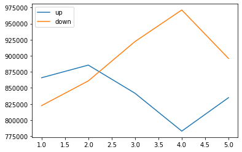
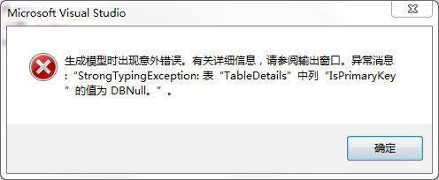

# 微积分总览

<table style="height: 192px; border-style: groove; width: 502px;" border="1"><tbody><tr style="height: 24px;"><td style="width: 49px; border-style: solid; height: 24px;">示意图</td><td style="width: 143px; border-style: solid; height: 24px;"><a href="http://127.0.0.1/wp-content/uploads/2019/03/下载.png"></a></td><td style="width: 143px; border-style: solid; height: 24px;"><a href="http://127.0.0.1/wp-content/uploads/2019/03/下载-1.png"></a></td><td style="width: 139px; border-style: solid;"></td></tr><tr style="height: 24px;"><td style="width: 49px; border-style: solid; height: 24px;">公式</td><td style="width: 143px; border-style: solid; height: 24px;">$latex Distance = \frac{1}{2}a t^2$</td><td style="width: 143px; border-style: solid; height: 24px;">$latex Speed = a t $</td><td style="width: 139px; border-style: solid;">$latex Acceleration =a $</td></tr><tr style="height: 24px;"><td style="width: 49px; border-style: solid; height: 24px;">解析</td><td style="width: 143px; border-style: solid; height: 24px;">匀加速中的距离公式</td><td style="width: 143px; border-style: solid; height: 24px;">匀加速中的速度公式</td><td style="width: 139px; border-style: solid;">匀加速中的加速度公式</td></tr><tr style="height: 24px;"><td style="width: 49px; border-style: solid; height: 24px;"></td><td style="border-style: solid; height: 24px; text-align: center; width: 292px;" colspan="3">这两个公式实际是表达一个意思，都是匀加速</td></tr><tr style="height: 72px;"><td style="width: 49px; border-style: solid; height: 72px;"></td><td style="width: 143px; border-style: solid; height: 72px;">如果已知这个距离公式，求速度，就是求导。</td><td style="width: 143px; border-style: solid; height: 72px;">如果已知这个速度公式，求距离，就是积分。</td><td style="width: 139px; border-style: solid;"></td></tr><tr style="height: 24px;"><td style="width: 49px; border-style: solid; height: 24px;"></td><td style="width: 143px; border-style: solid; height: 24px;">距离公式</td><td style="width: 143px; border-style: solid; height: 24px;">速度公式</td><td style="width: 139px; border-style: solid;">加速度公式</td></tr></tbody></table>

 

微积分分为：极限、微分、积分，大体介绍一下

1. 极限 ： 极限就是当一个有顺序的数列向前延伸时，如果存在一个有限数（非无限大的数），使这个序列可以无限的接近这个数，这个数就是这个数列的极限。表示是 $$ \\lim\_{x \\to \\infty} x\_n=L$$
    1. 例如 $latex x\_n=\\frac{1}{2n}$ ，这个会无限的趋近于0，也就是说0是这个函数的极限。
2. 导数 ：一个函数的自变量趋近某个极限时，其因变量的增量于自变量的增量之商的极限即为导数。
    1. 例如 ： 在速度问题上，距离是时间的因变量，随时间变化而变化，当时间趋近某个极限时，距离增量除以时间增量的极限即为距离对时间的导数。
    2. 导数的几何意义是该函数曲线在这一点上的切线斜率。
    3. 因变量（dependent variable）函数中的专业名词，也叫函数值。函数关系式中，某些特定的数会随另一个（或另几个）会变动的数的变动而变动，就称为因变量。如：Y=f(X)。此式表示为：Y随X的变化而变化。Y是因变量，X是自变量。另外“因变量”也特指心理实验中的专业名词。
3. 微分学 ： 在函数自变量变化时，如何确定函数值的瞬时变化率，计算导数的方法就叫微分学。
4. 积分学 ： 积分学是微分学的逆运算，即从导数推测出原函数。分为定积分和不定积分。
    1. 定积分 ：一个一元函数的定积分可以定义为无穷小矩形的面积和。约定于曲线函数下包含的实际面积。可以用积分来求得球体的表面积。
    2. 不定积分 ：用于微分方程的求解。

微积分的符号 ：

1. 微分 ： dx,dy等，其中d来源于“Differentia”,表示差值。
2. 积分 ： $latex \\int $ ，来源于"summa"，和 $latex \\sum$意义相同。

 

微分学 ：

1. 无限细分就是微分。
2. 无限求和就是积分。
3. 求不定积分和求导函数互为逆运算。
    1. 把上下限代入不定积分即可得到积分值。
    2. 而微分则是导数值于自变量增量的乘积
        1. 求导是，因变量的增值除以自变量增量的极限。

例子  ：

1. 求$latex sin(x)$的导函数，
    1. 直接求 $latex \\frac{d sin  θ}{d  θ}$
    2. ```
        (sinX)'=lim(△x→0)[sin(x+△x)-sinx]/(△x)
                  =lim(△x→0)[sinxcos(△x)+cosxsin(△x)-sinx]/(△x)
                  =lim(△x→0)[sinx*1+cosxsin(△x)-sinx]/(△x)
                  =lim(△x→0)[cosxsin(△x)]/(△x)
                  =[cosx*△x]/(△x)
                  =cosx，
        ```
        

是

# 微积分公式总结

## 基本公式

- 幂函数求导    $latex (x^n)'=n\\cdot x^{n-1} $
- 指数函数求导 $latex (a^x)’=a^{x}ln(a)$
- 对数函数求导
    - $latex \\left\[ln(y)\\right\]’ = \\frac{1}{y} y’$
    - $latex log\_a(x)'=\\frac{1}{x lna }$
- 三角函数求导
    - $latex \\left(sin(x)\\right)'=cos(x)$
    - $latex \\left(cos(x)\\right)'=-sin(x)$

## 基本法则

- 导数加减法 ： $latex \\lbrack f(x) \\pm g(x)\\rbrack' = f'(x) \\pm g'(x) $
- 倒数乘法 ：  $latex \\lbrack f(x)g(x)\\rbrack' = f'(x)g(x)+f(x)g'(x) $
- 导数除法 ： $latex \\left\[\\frac{f(x)}{g(x)}\\right\]' = \\frac {f'(x)g(x)-f(x)g'(x)}{g^2(x)} $
- 链式法则： $latex y=f(u),u=g(x);y=f\\left\[g(x)\\right\],则 y'=f'\[g(x)\]=f'(u)g'(x)$

 

 

- 对数 ： $latex \\lbrack ln(y) \\rbrack' = \\frac{1}{y} y' $ 对对数求导，永远是这个形式。
    - 证明 求 $latex y=ln (f(x))$的导数
    - 根据对数定义 ： $latex e^{y}=f(x) $
    - 两边对x求导   ： $latex \\frac{\\partial e^y}{\\partial x}=f'(x)$
    - 等同于这个     ： $latex \\frac {\\partial e^y}{\\partial y} \\frac{\\partial y}{\\partial x}=f'(x) $
    - 推导出这个     ： $latex e^y  \\frac{\\partial y}{\\partial x}=f'(x) $
    - 最后结果是     ： $latex \\frac{\\partial y}{\\partial x}= \\frac {f'(x)}{f(x)}$
- $latex (a^x)'=a^{x}ln(a) $
    - $latex y=a^x$
    - $latex ln(y)=ln(a^x)=x ln(a)$
    - $latex \\frac{1}{y}y'=ln(a)$
    - $latex y'=a^x ln(a) $
- 对数求导法 ，对数求导法可以将乘除的函数转化成加减的函数，将函数的幂运算转化成相乘的运算。
    - 对y=f(x)两边同时取对数。
    - 两边同时关于x求导数。
    - 移项，移成 y=y(x)的形式。
    - 例子 ：
        - 求 $latex y =  u(x)^{v(x)} $的导数，
        - 首先取两边对数 $latex y = ln (u(x)^{v(x)} = v(x)ln (u(x)) $
        - 求导数 $latex \\frac{1}{y}y'= v'(x)ln(u(x))+v(x)\\frac{1}{u(x)}u'(x) $
            - $latex \\lbrack ln(y) \\rbrack' = \\frac{1}{y} y' $ 对对数求导，永远是这个形式。
            - 如上的公式运用了对数乘法。
        - 解出 ：$latex y' = u(x)^{v(x)} \\lbrack v'(x)ln(u(x))+\\frac{v(x)u'(x)}{u(x)} \\rbrack $
- 指数求导法 $latex u^v=e^{v ln(u)}$
    - 例子 $latex (u^v)'=(e^{v ln(u)})' =e^{v ln(u)}(v ln(u))'=u^v(v'ln(u)+v\\cdot /frac{u'}{u}$
- 复合函数求导法则 ：
    - 若 已知函数  y=f(u) , u=g(x) ,则 y=f\[g(x)\]称y为x的复合函数，其中u为中间变量。
    - 若 u=g(x)在x处可导，y=f(u)在x的对应点u处可导，$latex y\_u'=f'(u) $ 则 y=f\[g(x)\] 在x处可导。
    - 且等于 $latex y=f'\[g(x)\]=f'(u)g'(x) $
    - $latex \\frac{\\partial y}{\\partial x}=\\frac{\\partial y}{\\partial u}\\frac{\\partial u}{\\partial x}$
    - 复合函数对自变量的导数等于，已知函数对中间变量的导数，再乘以中间变量对自变量的导数。

 

# 运算法则

## 基础函数的运算法则

### 幂函数法则

$$\\frac{\\mathrm{d}}{\\mathrm{d}x}x^{n}=n\*x^{n-1}$$

### 指数函数法则

$$\\frac{\\mathrm{d}}{\\mathrm{d}x}a^{x}=a^{x}\\cdot ln(a)$$

证明见文章：[指数函数求导证明](http://127.0.0.1/?p=2165)

$$\\frac{\\mathrm{d}}{\\mathrm{d}x}e^{x}=e^{x}$$

### 对数函数法则

$$\\frac{\\mathrm{d}}{\\mathrm{d}x}log\_a(x)=\\frac{1}{xln(a)}=\\frac{log\_a^e}{x}$$

如上利用换底公式证明的$latex (log\_ax)'=(\\frac{ln(x)}{ln(a)})'=\\frac{1}{ln(a)}\\cdot \\frac{1}{x}$

$$\\frac{\\mathrm{d}}{\\mathrm{d}x}ln(x)=\\frac{1}{x}$$

 

### 三角函数法则

$$\\frac{\\mathrm{d}}{\\mathrm{d}x}sin(x)=cos(x)$$

$$\\frac{\\mathrm{d}}{\\mathrm{d}x}cos(x)=-sin(x)$$

$$\\frac{\\mathrm{d}}{\\mathrm{d}x}tan(x)=sin^2(x)=\\frac{1}{cos^2(x)}=1+tan^2(x)$$

 

## 组合函数的运算法则

### 乘法法则

$$P(x)=f(x)\*f(x) \\Longrightarrow \\frac{\\mathrm{d}P(x)}{\\mathrm{d}x}=f'g+fg'$$

### 除法法则

$$Q(x)=\\frac{f(x)}{g(x)}\\Longrightarrow\\frac{\\mathrm{d}P(x)}{\\mathrm{d}x}=\\frac{f'g-fg'}{g^2}$$
