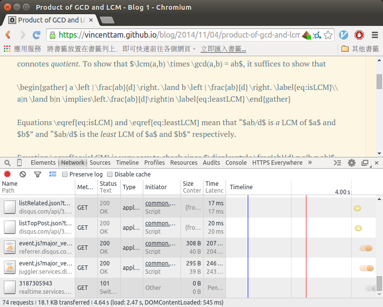
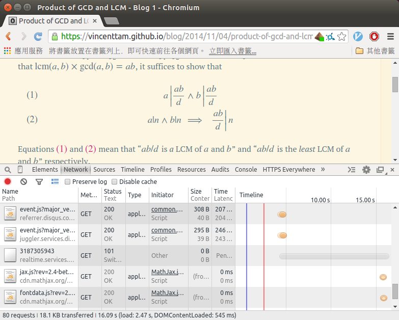
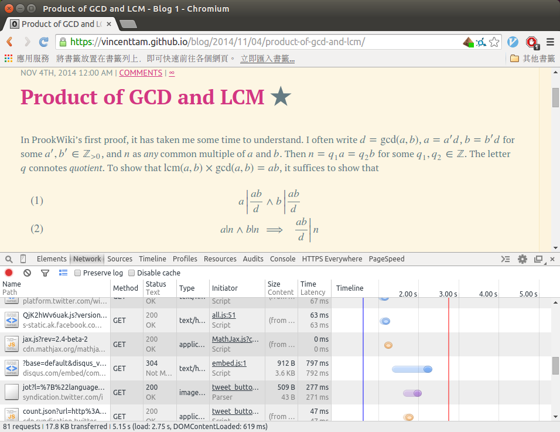

例子如下：

<table><tbody><tr><td class="gutter"><pre class="line-numbers"><span class="line-number">2</span>
<span class="line-number">3</span>
<span class="line-number">4</span>
<span class="line-number">5</span>
<span class="line-number">6</span>
<span class="line-number">7</span>
<span class="line-number">8</span>
<span class="line-number">9</span>
<span class="line-number">10</span>
<span class="line-number">11</span>
<span class="line-number">12</span>
<span class="line-number">13</span>
<span class="line-number">14</span>
<span class="line-number">15</span>
<span class="line-number">16</span>
<span class="line-number">17</span>
<span class="line-number">18</span>
<span class="line-number">19</span>
<span class="line-number">20</span>
<span class="line-number">21</span>
<span class="line-number">22</span>
<span class="line-number">23</span>
<span class="line-number">24</span>
<span class="line-number">25</span>
<span class="line-number">26</span>
<span class="line-number">27</span>
<span class="line-number">28</span>
<span class="line-number">29</span>
<span class="line-number">30</span>
<span class="line-number">31</span>
<span class="line-number">32</span>
<span class="line-number">33</span>
<span class="line-number">34</span>
<span class="line-number">35</span>
<span class="line-number">36</span>
<span class="line-number">37</span>
<span class="line-number">38</span>
<span class="line-number">39</span>
<span class="line-number">40</span>
<span class="line-number">41</span>
<span class="line-number">42</span>
<span class="line-number">43</span>
<span class="line-number">44</span>
<span class="line-number">45</span>
<span class="line-number">46</span>
<span class="line-number">47</span>
<span class="line-number">48</span>
<span class="line-number">49</span>
<span class="line-number">50</span>
<span class="line-number">51</span>
<span class="line-number">52</span>
<span class="line-number">53</span>
<span class="line-number">54</span>
<span class="line-number">55</span>
<span class="line-number">56</span>
<span class="line-number">57</span>
<span class="line-number">58</span>
<span class="line-number">59</span>
<span class="line-number">60</span>
<span class="line-number">61</span>
<span class="line-number">62</span>
<span class="line-number">63</span>
<span class="line-number">64</span>
<span class="line-number">65</span>
<span class="line-number">66</span>
<span class="line-number">67</span>
<span class="line-number">68</span>
<span class="line-number">69</span>
<span class="line-number">70</span>
<span class="line-number">71</span>
<span class="line-number">72</span>
<span class="line-number">73</span>
<span class="line-number">74</span>
<span class="line-number">75</span>
<span class="line-number">76</span>
</pre></td><td class="code"><pre><code class="html"><span class="line"><span class="cp">&lt;!DOCTYPE HTML PUBLIC "-//W3C//DTD HTML 4.01//EN" "http://www.w3.org/TR/html4/strict.dtd"&gt;</span>
</span><span class="line"><span class="nt">&lt;html</span> <span class="na">lang=</span><span class="s">"en"</span><span class="nt">&gt;</span>
</span><span class="line"><span class="nt">&lt;head&gt;</span>
</span><span class="line"><span class="nt">&lt;meta</span> <span class="na">http-equiv=</span><span class="s">"content-type"</span> <span class="na">content=</span><span class="s">"text/html; charset=utf-8"</span><span class="nt">&gt;</span>
</span><span class="line"><span class="nt">&lt;title&gt;</span>Don't delete!<span class="nt">&lt;/title&gt;</span>
</span><span class="line"><span class="nt">&lt;script </span><span class="na">type=</span><span class="s">"text/javascript"</span> <span class="na">charset=</span><span class="s">"utf-8"</span> <span class="na">src=</span><span class="s">"</span>
</span><span class="line"><span class="s">https://cdn.mathjax.org/mathjax/latest/MathJax.js?config=TeX-AMS-MML_HTMLorMML,</span>
</span><span class="line"><span class="s">https://vincenttam.github.io/javascripts/MathJaxLocal.js"</span><span class="nt">&gt;&lt;/script&gt;</span>
</span><span class="line"><span class="nt">&lt;/head&gt;</span>
</span><span class="line"><span class="nt">&lt;body&gt;</span>
</span>
<span class="line"><span class="nt">&lt;p&gt;</span>This page is for testing MathJax in my blog.  I wrote some custom
</span><span class="line">shorthand like $\zeros \in \R^n$.<span class="nt">&lt;/p&gt;</span>
</span>
<span class="line"><span class="nt">&lt;h2&gt;</span>Problem<span class="nt">&lt;/h2&gt;</span>
</span>
<span class="line"><span class="nt">&lt;p&gt;</span>For sequences of numbers, <span class="nt">&lt;em&gt;</span>limit inferior<span class="nt">&lt;/em&gt;</span> and <span class="nt">&lt;em&gt;</span>limit
</span><span class="line">superior<span class="nt">&lt;/em&gt;</span> are defined as $\liminf (a_n):=\sup\{\inf\{a_k:k \ge
</span><span class="line">n\}\}$ and $\limsup (a_n):=\inf\{\sup\{a_k:k \ge n\}\}$ respectively;
</span><span class="line">for sequences of sets, they are defined as $\displaystyle
</span><span class="line">\bigcup_{n=1}^{\infty} \bigcap_{k=n}^{\infty} A_k$ and $\displaystyle
</span><span class="line">\bigcap_{n=1}^{\infty} \bigcup_{k=n}^{\infty} A_k$ respectively.<span class="nt">&lt;/p&gt;</span>
</span>
<span class="line"><span class="nt">&lt;p&gt;&lt;strong&gt;</span>Why are they consistent?<span class="nt">&lt;/strong&gt;&lt;/p&gt;</span>
</span>
<span class="line"><span class="nt">&lt;h2&gt;</span>Discussion<span class="nt">&lt;/h2&gt;</span>
</span>
<span class="line"><span class="nt">&lt;p&gt;</span>It suffices to find a relation between '<span class="ni">&amp;lt;</span>' and '<span class="ni">&amp;sube;</span>': $\{x
</span><span class="line">\le a\} \subseteq \{x \le b\} \iff a \le b$.<span class="nt">&lt;/p&gt;</span>
</span>
<span class="line"><span class="nt">&lt;p&gt;</span>Claim: $\displaystyle \bigcup_{a \in A} \{x \le a\} = \{x \le \sup
</span><span class="line">A\}$.<span class="nt">&lt;/p&gt;</span>
</span>
<span class="line"><span class="nt">&lt;p&gt;&lt;em&gt;</span>Proof<span class="nt">&lt;/em&gt;</span>:<span class="nt">&lt;/p&gt;</span>
</span>
<span class="line"><span class="nt">&lt;div</span> <span class="na">class=</span><span class="s">"myeqn"</span><span class="nt">&gt;</span>
</span><span class="line">\[
</span><span class="line">  \begin{aligned}
</span><span class="line">    <span class="err">&amp;</span> x \in \bigcup_{a \in A} \{x \le a\} \\
</span><span class="line">    \iff<span class="err">&amp;</span> x \le a \;\forall a \in A \\
</span><span class="line">    \iff<span class="err">&amp;</span> x \text{ is a lower bound of } A \\
</span><span class="line">    \iff<span class="err">&amp;</span> x \le \inf A
</span><span class="line">  \end{aligned}
</span><span class="line">\]
</span><span class="line"><span class="nt">&lt;/div&gt;</span>
</span>
<span class="line"><span class="nt">&lt;p&gt;</span>The last step is due to the defintion of infimum (<span class="nt">&lt;em&gt;</span>greatest<span class="nt">&lt;/em&gt;</span>
</span><span class="line">lower bound).<span class="nt">&lt;/p&gt;</span>
</span>
<span class="line"><span class="nt">&lt;p&gt;</span>With the above claim, one has<span class="nt">&lt;/p&gt;</span>
</span>
<span class="line"><span class="nt">&lt;div</span> <span class="na">class=</span><span class="s">"myeqn"</span><span class="nt">&gt;</span>
</span><span class="line">\[
</span><span class="line">  \begin{aligned}
</span><span class="line">    <span class="err">&amp;</span> \bigcap_{n=1}^{\infty} \bigcup_{k=n}^{\infty} \{x \le a_k\} \\
</span><span class="line">    =<span class="err">&amp;</span> \bigcap_{n=1}^{\infty} \bigcup_{a \in \{a_k:k \ge n\}} \{x \le a\} \\
</span><span class="line">    =<span class="err">&amp;</span> \bigcap_{n=1}^{\infty} \{ x \le \sup \{a_k:k \ge n\}\} \\
</span><span class="line">    =<span class="err">&amp;</span> \{x \le \inf\sup \{a_k:k \ge n\}\}
</span><span class="line">  \end{aligned}
</span><span class="line">\]
</span><span class="line"><span class="nt">&lt;/div&gt;</span>
</span>
<span class="line"><span class="nt">&lt;p&gt;</span>Hence, one can see that $\sup\inf \{a_k:k \ge n\} \le \inf\sup
</span><span class="line">\{a_k:k \ge n\}$ and $\displaystyle \bigcup_{n=1}^{\infty}
</span><span class="line">\bigcap_{k=n}^{\infty} \{x \le a_k\} \subseteq \bigcap_{n=1}^{\infty}
</span><span class="line">\bigcup_{k=n}^{\infty} \{x \le a_k\}$ share something in common.<span class="nt">&lt;/p&gt;</span>
</span>
<span class="line"><span class="nt">&lt;p&gt;</span>
</span><span class="line"><span class="nt">&lt;a</span> <span class="na">href=</span><span class="s">"//validator.w3.org/check?uri=referer"</span><span class="nt">&gt;&lt;img</span>
</span><span class="line">  <span class="na">src=</span><span class="s">"/images/valid-html401.png"</span> <span class="na">alt=</span><span class="s">"Valid HTML 4.01 Strict"</span>
</span><span class="line">  <span class="na">height=</span><span class="s">"31"</span> <span class="na">width=</span><span class="s">"88"</span><span class="nt">&gt;&lt;/a&gt;</span>
</span><span class="line"><span class="nt">&lt;a</span> <span class="na">href=</span><span class="s">"//jigsaw.w3.org/css-validator/check/referer"</span><span class="nt">&gt;&lt;img</span>
</span><span class="line">  <span class="na">src=</span><span class="s">"/images/valid-css.png"</span> <span class="na">alt=</span><span class="s">"Valid CSS"</span> <span class="na">height=</span><span class="s">"31"</span> <span class="na">width=</span><span class="s">"88"</span><span class="nt">&gt;</span>
</span><span class="line"><span class="nt">&lt;/a&gt;&lt;/p&gt;</span>
</span><span class="line"><span class="nt">&lt;/body&gt;</span>
</span><span class="line"><span class="nt">&lt;/html&gt;</span></span></code></pre></td></tr></tbody></table>

原文如下：

## Motivation

Before I changed the HTML syntax for embedding MathJax with a local configuration file, I often encountered error while viewing the math rendered by MathJax.[1](https://vincenttam.github.io/blog/2014/11/09/mathjax-local-configuration-file/#fn:12d38c1) The custom commands defined in the local configuration file sometimes _wouldn’t_ be converted to mathematical expressions in a post while browsing the page for the first time. Though refreshing the page can get the math shown, it’s quite troublesome. Therefore, I searched for a better way in the official manual.

## Problem

I tried following the instructions in MathJax’s official Wiki for using a local configuration file.[2](https://vincenttam.github.io/blog/2014/11/09/mathjax-local-configuration-file/#fn:mathjax_doc)

<table><tbody><tr><td class="gutter"><pre class="line-numbers"><span class="line-number">1</span>
<span class="line-number">2</span>
<span class="line-number">3</span>
<span class="line-number">4</span>
<span class="line-number">5</span>
</pre></td><td class="code"><pre><code class="html"><span class="line"><span class="nt">&lt;script </span><span class="na">type=</span><span class="s">"text/javascript"</span>
</span><span class="line">	<span class="na">src=</span><span class="s">"//cdn.mathjax.org/mathjax/latest/MathJax.js?config=TeX-AMS_HTML,</span>
</span><span class="line"><span class="s">	/javascripts/MathJaxLocal.js</span>
</span><span class="line"><span class="s">"</span><span class="nt">&gt;</span>
</span><span class="line"><span class="nt">&lt;/script&gt;</span>
</span></code></pre></td></tr></tbody></table>

Things seems worked, but undesirably _slow_.





It took about _16 seconds_ for loading the math. **How can they load quicker with a local configuration file**, like [http://drz.ac](http://drz.ac/)?

## Cause

I googled “mathjax local config long”, and found a message from [this page](https://groups.google.com/forum/#!msg/mathjax-users/iIvf2RkNdF4/Bi_TFDR3AsUJ) extremely useful.

> You are missing the `loacComplete()` line in your configuration file, so MathJax waits 15 seconds before timing out and going on without it. Add
> 
> ```
> Mathjax.Ajax.loadComplete("[Mathjax]/config/local/font.js");
> ```
> 
> at the bottom of your font configuration file and that should take care of it for you.
> 
> **Davide P. Cervone** [Re: Local Configuration File Processing Is Extremely Slow (~15 Sec)](http://goo.gl/WzV2w3)

## Failed attempts

I tried using relative paths in `source/_includes/custom/head.html` , `{{ root_url }}` in the `<script>` tag that calls MathJax with a local configuration file and in the local configuration file `source/javascripts/MathJaxLocal.js`. Since this blog has more than 200 pages, it took about a minute for regeneration of contents after each slight modification in the code.

## Conclusion

I typed full paths manually for the above `<script>` tag in the custom head of a page and the local configuration file. To avoid loading “insecure contents”, I used full URLs instead of `{{ site.url }}` since the URL of this site _doesn’t_ start with “https” in `_config.yml`.[3](https://vincenttam.github.io/blog/2014/11/09/mathjax-local-configuration-file/#fn:https)[4](https://vincenttam.github.io/blog/2014/11/09/mathjax-local-configuration-file/#fn:config_yml) Then the equations should load quickly.



## Lessons learnt

If I could do the same job again, I’d first change the local configuration file and upload it to GitHub, so that I could test it in a local HTML file `file:///path/to/test-mathjax.html`

<figure>

<figcaption>

A local testing page for using the MathJax macros (test-mathjax.html)[download](https://vincenttam.github.io/downloads/code/test-mathjax.html)

</figcaption>

<table><tbody><tr><td class="gutter"><pre class="line-numbers"><span class="line-number">1</span>
<span class="line-number">2</span>
<span class="line-number">3</span>
<span class="line-number">4</span>
<span class="line-number">5</span>
<span class="line-number">6</span>
<span class="line-number">7</span>
<span class="line-number">8</span>
<span class="line-number">9</span>
<span class="line-number">10</span>
<span class="line-number">11</span>
<span class="line-number">12</span>
<span class="line-number">13</span>
<span class="line-number">14</span>
<span class="line-number">15</span>
<span class="line-number">16</span>
<span class="line-number">17</span>
<span class="line-number">18</span>
<span class="line-number">19</span>
<span class="line-number">20</span>
<span class="line-number">21</span>
<span class="line-number">22</span>
<span class="line-number">23</span>
<span class="line-number">24</span>
<span class="line-number">25</span>
<span class="line-number">26</span>
<span class="line-number">27</span>
<span class="line-number">28</span>
<span class="line-number">29</span>
<span class="line-number">30</span>
<span class="line-number">31</span>
<span class="line-number">32</span>
<span class="line-number">33</span>
<span class="line-number">34</span>
<span class="line-number">35</span>
<span class="line-number">36</span>
<span class="line-number">37</span>
<span class="line-number">38</span>
<span class="line-number">39</span>
<span class="line-number">40</span>
<span class="line-number">41</span>
<span class="line-number">42</span>
<span class="line-number">43</span>
<span class="line-number">44</span>
<span class="line-number">45</span>
<span class="line-number">46</span>
<span class="line-number">47</span>
<span class="line-number">48</span>
<span class="line-number">49</span>
<span class="line-number">50</span>
<span class="line-number">51</span>
<span class="line-number">52</span>
<span class="line-number">53</span>
<span class="line-number">54</span>
<span class="line-number">55</span>
<span class="line-number">56</span>
<span class="line-number">57</span>
<span class="line-number">58</span>
<span class="line-number">59</span>
<span class="line-number">60</span>
<span class="line-number">61</span>
<span class="line-number">62</span>
<span class="line-number">63</span>
<span class="line-number">64</span>
<span class="line-number">65</span>
<span class="line-number">66</span>
<span class="line-number">67</span>
<span class="line-number">68</span>
<span class="line-number">69</span>
<span class="line-number">70</span>
<span class="line-number">71</span>
<span class="line-number">72</span>
<span class="line-number">73</span>
<span class="line-number">74</span>
<span class="line-number">75</span>
<span class="line-number">76</span>
</pre></td><td class="code"><pre><code class="html"><span class="line"><span class="cp">&lt;!DOCTYPE HTML PUBLIC "-//W3C//DTD HTML 4.01//EN" "http://www.w3.org/TR/html4/strict.dtd"&gt;</span>
</span><span class="line"><span class="nt">&lt;html</span> <span class="na">lang=</span><span class="s">"en"</span><span class="nt">&gt;</span>
</span><span class="line"><span class="nt">&lt;head&gt;</span>
</span><span class="line"><span class="nt">&lt;meta</span> <span class="na">http-equiv=</span><span class="s">"content-type"</span> <span class="na">content=</span><span class="s">"text/html; charset=utf-8"</span><span class="nt">&gt;</span>
</span><span class="line"><span class="nt">&lt;title&gt;</span>Don't delete!<span class="nt">&lt;/title&gt;</span>
</span><span class="line"><span class="nt">&lt;script </span><span class="na">type=</span><span class="s">"text/javascript"</span> <span class="na">charset=</span><span class="s">"utf-8"</span> <span class="na">src=</span><span class="s">"</span>
</span><span class="line"><span class="s">https://cdn.mathjax.org/mathjax/latest/MathJax.js?config=TeX-AMS-MML_HTMLorMML,</span>
</span><span class="line"><span class="s">https://vincenttam.github.io/javascripts/MathJaxLocal.js"</span><span class="nt">&gt;&lt;/script&gt;</span>
</span><span class="line"><span class="nt">&lt;/head&gt;</span>
</span><span class="line"><span class="nt">&lt;body&gt;</span>
</span>
<span class="line"><span class="nt">&lt;p&gt;</span>This page is for testing MathJax in my blog.  I wrote some custom
</span><span class="line">shorthand like $\zeros \in \R^n$.<span class="nt">&lt;/p&gt;</span>
</span>
<span class="line"><span class="nt">&lt;h2&gt;</span>Problem<span class="nt">&lt;/h2&gt;</span>
</span>
<span class="line"><span class="nt">&lt;p&gt;</span>For sequences of numbers, <span class="nt">&lt;em&gt;</span>limit inferior<span class="nt">&lt;/em&gt;</span> and <span class="nt">&lt;em&gt;</span>limit
</span><span class="line">superior<span class="nt">&lt;/em&gt;</span> are defined as $\liminf (a_n):=\sup\{\inf\{a_k:k \ge
</span><span class="line">n\}\}$ and $\limsup (a_n):=\inf\{\sup\{a_k:k \ge n\}\}$ respectively;
</span><span class="line">for sequences of sets, they are defined as $\displaystyle
</span><span class="line">\bigcup_{n=1}^{\infty} \bigcap_{k=n}^{\infty} A_k$ and $\displaystyle
</span><span class="line">\bigcap_{n=1}^{\infty} \bigcup_{k=n}^{\infty} A_k$ respectively.<span class="nt">&lt;/p&gt;</span>
</span>
<span class="line"><span class="nt">&lt;p&gt;&lt;strong&gt;</span>Why are they consistent?<span class="nt">&lt;/strong&gt;&lt;/p&gt;</span>
</span>
<span class="line"><span class="nt">&lt;h2&gt;</span>Discussion<span class="nt">&lt;/h2&gt;</span>
</span>
<span class="line"><span class="nt">&lt;p&gt;</span>It suffices to find a relation between '<span class="ni">&amp;lt;</span>' and '<span class="ni">&amp;sube;</span>': $\{x
</span><span class="line">\le a\} \subseteq \{x \le b\} \iff a \le b$.<span class="nt">&lt;/p&gt;</span>
</span>
<span class="line"><span class="nt">&lt;p&gt;</span>Claim: $\displaystyle \bigcup_{a \in A} \{x \le a\} = \{x \le \sup
</span><span class="line">A\}$.<span class="nt">&lt;/p&gt;</span>
</span>
<span class="line"><span class="nt">&lt;p&gt;&lt;em&gt;</span>Proof<span class="nt">&lt;/em&gt;</span>:<span class="nt">&lt;/p&gt;</span>
</span>
<span class="line"><span class="nt">&lt;div</span> <span class="na">class=</span><span class="s">"myeqn"</span><span class="nt">&gt;</span>
</span><span class="line">\[
</span><span class="line">  \begin{aligned}
</span><span class="line">    <span class="err">&amp;</span> x \in \bigcup_{a \in A} \{x \le a\} \\
</span><span class="line">    \iff<span class="err">&amp;</span> x \le a \;\forall a \in A \\
</span><span class="line">    \iff<span class="err">&amp;</span> x \text{ is a lower bound of } A \\
</span><span class="line">    \iff<span class="err">&amp;</span> x \le \inf A
</span><span class="line">  \end{aligned}
</span><span class="line">\]
</span><span class="line"><span class="nt">&lt;/div&gt;</span>
</span>
<span class="line"><span class="nt">&lt;p&gt;</span>The last step is due to the defintion of infimum (<span class="nt">&lt;em&gt;</span>greatest<span class="nt">&lt;/em&gt;</span>
</span><span class="line">lower bound).<span class="nt">&lt;/p&gt;</span>
</span>
<span class="line"><span class="nt">&lt;p&gt;</span>With the above claim, one has<span class="nt">&lt;/p&gt;</span>
</span>
<span class="line"><span class="nt">&lt;div</span> <span class="na">class=</span><span class="s">"myeqn"</span><span class="nt">&gt;</span>
</span><span class="line">\[
</span><span class="line">  \begin{aligned}
</span><span class="line">    <span class="err">&amp;</span> \bigcap_{n=1}^{\infty} \bigcup_{k=n}^{\infty} \{x \le a_k\} \\
</span><span class="line">    =<span class="err">&amp;</span> \bigcap_{n=1}^{\infty} \bigcup_{a \in \{a_k:k \ge n\}} \{x \le a\} \\
</span><span class="line">    =<span class="err">&amp;</span> \bigcap_{n=1}^{\infty} \{ x \le \sup \{a_k:k \ge n\}\} \\
</span><span class="line">    =<span class="err">&amp;</span> \{x \le \inf\sup \{a_k:k \ge n\}\}
</span><span class="line">  \end{aligned}
</span><span class="line">\]
</span><span class="line"><span class="nt">&lt;/div&gt;</span>
</span>
<span class="line"><span class="nt">&lt;p&gt;</span>Hence, one can see that $\sup\inf \{a_k:k \ge n\} \le \inf\sup
</span><span class="line">\{a_k:k \ge n\}$ and $\displaystyle \bigcup_{n=1}^{\infty}
</span><span class="line">\bigcap_{k=n}^{\infty} \{x \le a_k\} \subseteq \bigcap_{n=1}^{\infty}
</span><span class="line">\bigcup_{k=n}^{\infty} \{x \le a_k\}$ share something in common.<span class="nt">&lt;/p&gt;</span>
</span>
<span class="line"><span class="nt">&lt;p&gt;</span>
</span><span class="line"><span class="nt">&lt;a</span> <span class="na">href=</span><span class="s">"//validator.w3.org/check?uri=referer"</span><span class="nt">&gt;&lt;img</span>
</span><span class="line">  <span class="na">src=</span><span class="s">"/images/valid-html401.png"</span> <span class="na">alt=</span><span class="s">"Valid HTML 4.01 Strict"</span>
</span><span class="line">  <span class="na">height=</span><span class="s">"31"</span> <span class="na">width=</span><span class="s">"88"</span><span class="nt">&gt;&lt;/a&gt;</span>
</span><span class="line"><span class="nt">&lt;a</span> <span class="na">href=</span><span class="s">"//jigsaw.w3.org/css-validator/check/referer"</span><span class="nt">&gt;&lt;img</span>
</span><span class="line">  <span class="na">src=</span><span class="s">"/images/valid-css.png"</span> <span class="na">alt=</span><span class="s">"Valid CSS"</span> <span class="na">height=</span><span class="s">"31"</span> <span class="na">width=</span><span class="s">"88"</span><span class="nt">&gt;</span>
</span><span class="line"><span class="nt">&lt;/a&gt;&lt;/p&gt;</span>
</span><span class="line"><span class="nt">&lt;/body&gt;</span>
</span><span class="line"><span class="nt">&lt;/html&gt;</span>
</span></code></pre></td></tr></tbody></table>


</figure>

* * *

1. Refer to commit [12d38c1](https://github.com/VincentTam/vincenttam.github.io/commit/12d38c1#diff-0). [↩](https://vincenttam.github.io/blog/2014/11/09/mathjax-local-configuration-file/#fnref:12d38c1)
2. [Using a local configuration file with the CDN](http://docs.mathjax.org/en/latest/configuration.html#using-a-local-configuration-file-with-the-cdn) in _MathJax Documentation_. [↩](https://vincenttam.github.io/blog/2014/11/09/mathjax-local-configuration-file/#fnref:mathjax_doc)
3. Refer to [_MathJax in Octopress via HTTPS_](https://vincenttam.github.io/blog/2014/06/05/mathjax-in-octopress-via-https/) in Blog 1 for details. [↩](https://vincenttam.github.io/blog/2014/11/09/mathjax-local-configuration-file/#fnref:https)
4. `_config.yml` at commit [71ff4fb](https://github.com/VincentTam/vincenttam.github.io/blob/71ff4fb/_config.yml). [↩](https://vincenttam.github.io/blog/2014/11/09/mathjax-local-configuration-file/#fnref:config_yml)

Posted by Vincent Tam Nov 9th, 2014 1:06 am  [mathjax](https://vincenttam.github.io/blog/categories/mathjax/)

参考：

- https://vincenttam.github.io/blog/2014/11/09/mathjax-local-configuration-file/
