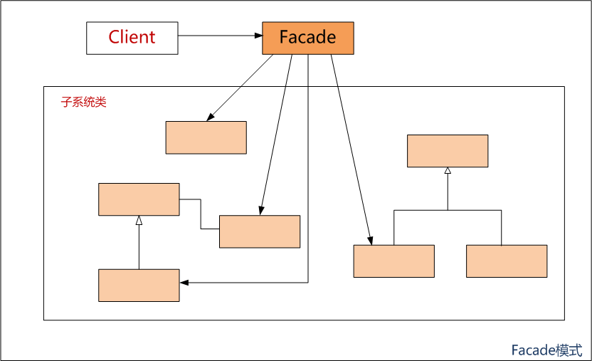
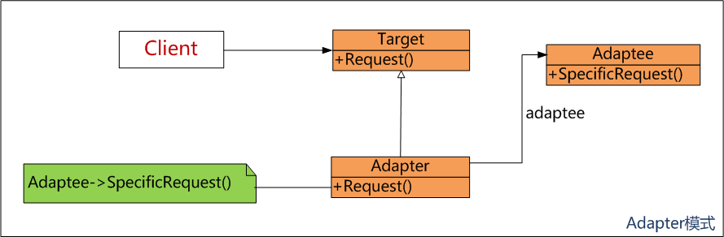
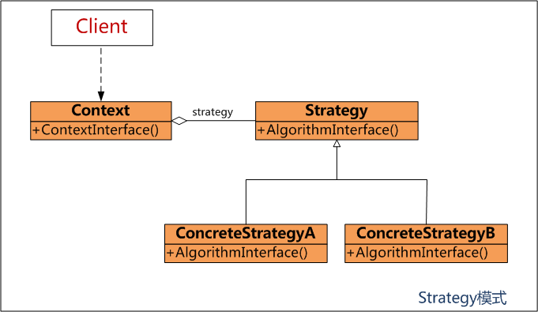
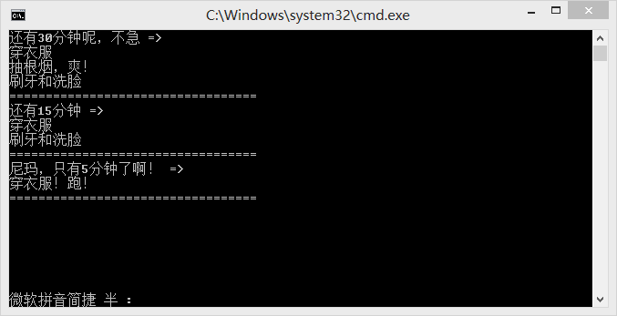
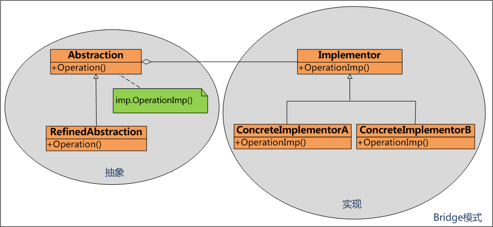

 

 

# 设计模式学习1-Facade模式

**背景描述：**

我们经常会碰到这样的情况：拿到一个别人开发的类库，需要在此基础上做二次开发，而这个类库因为包含所有可能用到的功能而过于复杂，而我们只需要其中一部分功能或者希望以比较简单的方式使用它，这时Facade模式就派上用场了。

**Facade模式：**

定义：为子系统中的一组接口提供一个统一接口，Facade模式定义了一个更高层的接口，使子系统更加容易使用。

实现：定义一个（或多个）具备所需接口的新类，让新的类使用原有的系统。

结构图：

            ****

 

说明：说白了Facade模式就是把原来复杂的接口变成简单统一的接口，方便Client使用。

**Facade模式变体：**

除了上述基本用法以外，Facade模式还有其他的应用场合：

1. 除了使用系统中的原有功能外还需要提供一些新功能，比如：记录对特定方法的调用等，新功能让Facade去做好了。
2. Facade模式可以用来隐藏或者封装系统，这样做的目的有两个：A.跟踪系统的使用情况：通过强制所有对系统的访问都必须经过Facade，可以很容易地监视系统的使用情况。B.改换系统：未来可能需要切换系统，通过将原系统作为Facade类的一个私有成员，可以最省力地切换到新的系统。
3. 减少Client必须处理的对象数量：每个Client只需要处理一个Facade对象就可以了。

 

# 设计模式学习2-Adapter模式

**背景描述：**

在日常生活中大家有没有碰到过这种情况：墙上的插座只有3孔的，可是电器的插头是2脚的，怎么办？我的做法是找把老虎钳将插头2脚拧斜然后就可以插到3孔的插座了，哈哈。能不能不要这么粗鲁啊，好吧，找一个2孔转3脚的转换器。这个转换器就是Adapter。

**Adapter模式：**

定义：将一个类的接口转换成Client希望的另外一个接口。Adapter模式使原来由于接口不兼容而不能一起工作的类可以一起工作。

实现：将原有类包含在另一个类之中。让包含类与需要的接口匹配，调用被包容类的方法。

结构图：

            ****

 

说明：

1. Adapter模式最常见的用途就是保持**多态性**。如结构图所示，Target接口有Request方法，它的子类需要实现Request方法，现在有个现成的类Adaptee类实现了此功能，但是它的方法名不叫Request，而是SpecificRequest，那么就在Adapter子类中包含Adaptee对象，在调用Adapter的Request方法时去调用Adaptee的SpecificRequest方法即可。
2. Adapter模式分为对象Adapter模式和类Adapter模式2种类型。结构图中的是对象Adapter模式，因为它是一个对象（Adapter）包含另一个对象（Adaptee）；类Adapter模式通过多重继承来实现。

**Facade模式和Adapter模式的区别：**

看起来Facade模式和Adapter模式很类似，它们都是包装，但是它们是不同类型的包装，它们的区别如下：

1. Facade模式目的是简化接口，Adapter模式则是将一个已有的接口转换成另一个接口。
2. Facade模式无需按某个接口进行设计，Adapter模式则必须按某个接口设计。
3. Facade模式不需要多态行为，而Adapter模式则可能需要多态行为。

# 设计模式学习3-Strategy模式

**场景描述：**

一觉醒来看下时间还有30分钟才上班呢，笃笃定定穿好衣服，先抽根烟，然后去刷牙洗脸，慢悠悠上班去了；如果一觉醒来还有15分钟就迟到了，算了不抽烟了，穿好衣服，刷牙洗脸，急匆匆上班去了；如果一觉醒来只有5分钟了，肿么办！先花5秒钟平复一下心情，赶紧穿好衣服冲出去了！

可以发现，对于不同的起床时间做了不同的事情，如果用程序实现，有什么合适的模式吗？嗯，Strategy模式

**Strategy模式（策略模式）：**

定义：定义一系列的算法，把它们一个个封装起来，并且使它们可相互替换。将对算法的选择和算法的实现相分离。

实现：让使用算法的类（Context）包含一个抽象类（Strategy），该抽象类有一个抽象方法指定如何调用算法。每个派生类按需要实现算法。

结构图：



**代码示例：**

根据上面的场景描述，我们来实现一下Strategy模式。

首先先定义抽象类（Strategy）：

```
1     public interface IStrategy {
2         void AlgorithmInterface();
3     }
```

 

然后定义子类并实现它们，这3个子类分别对应场景中的3种情况。可以看出子类封装了各自的算法（业务规则）。


```
 1     public class ConcreteStrategyA : IStrategy {
 2         public void AlgorithmInterface() {
 3             Console.WriteLine("穿衣服");
 4             Console.WriteLine("抽根烟，爽！");
 5             Console.WriteLine("刷牙和洗脸");
 6         }
 7     }
 8 
 9     public class ConcreteStrategyB : IStrategy {
10         public void AlgorithmInterface() {
11             Console.WriteLine("穿衣服");
12             Console.WriteLine("刷牙和洗脸");
13         }
14     }
15 
16     public class ConcreteStrategyC : IStrategy {
17         public void AlgorithmInterface() {
18             Console.WriteLine("穿衣服！跑！");
19         }
20     }
```


 

下面定义使用算法的类Context，从下面的代码中可以看出Context并不知道它使用的是哪个具体的IStrategy（这个就是类型封装），这样的好处是如果以后增加了新的算法不需要修改Context类。


```
 1 public class Context {
 2         public Context(IStrategy strategy) {
 3             this.strategy = strategy;
 4         }
 5 
 6         public void ContextInterface() {
 7             this.strategy.AlgorithmInterface();
 8         }
 9         
10         private IStrategy strategy;
11     }
```


 

最后是Client类，可以看出选择所用具体子类由Client承担，并转给Context对象，实现了算法的选择和算法的实现相分离。


```
 1 class Client {
 2         static void Main(string[] args) {
 3             Console.WriteLine("还有30分钟呢，不急 =>");
 4             Context context1 = new Context(new ConcreteStrategyA());
 5             context1.ContextInterface();
 6             Console.WriteLine("==================================");
 7 
 8             Console.WriteLine("还有15分钟 =>");
 9             Context context2 = new Context(new ConcreteStrategyB());
10             context2.ContextInterface();
11             Console.WriteLine("==================================");
12 
13             Console.WriteLine("尼玛，只有5分钟了啊！ =>");
14             Context context3 = new Context(new ConcreteStrategyC());
15             context3.ContextInterface();
16             Console.WriteLine("==================================");
17 
18             Console.ReadLine();
19         }
```


 

运行的结果：



 **总结：**

一般来说，只要在分析过程中需要在不同时间应用不同业务规则，就应该考虑使用Strategy模式处理这种变化的可能性。

# 设计模式学习4-Bridge模式

**Bridge模式（桥接模式）：**

定义：将抽象与其实现解耦，使它们都可以独立地变化。（注：这里的实现指抽象类及其派生类用来实现自己的对象）

实现：将实现封装在一个抽象类中。在要实现的抽象的基类中包含一个实现的句柄。

结构图：



其中Abstraction为要实现的对象接口，Implementor为具体的实现类接口。Abstraction的派生类使用Implementor的派生类，却无需知道自己具体使用哪一个ConcreteImplementor。

**代码示例：**

考虑这样的软件需求：需要编写一个程序，使用两个绘图程序（DP1和DP2）之一绘制矩形和圆形。

首先先定义实现，Drawing为实现的基类，V1Drawing和V2Drawing为Drawing的子类，V1Drawing使用绘图程序DP1画线和画圆，V2Drawing使用绘图程序DP2画线和画圆。


```
 1     public abstract class Drawing {
 2         public abstract void DrawLine(double x1, double y1, double x2, double y2);
 3         public abstract void DrawCircle(double x, double y, double r);
 4     }
 5 
 6     public class V1Drawing : Drawing {
 7         public override void DrawLine(double x1, double y1, double x2, double y2) {
 8             dp1.DrawLine(x1, y1, x2, y2);
 9         }
10 
11         public override void DrawCircle(double x, double y, double r) {
12             dp1.DrawCircle(x, y, r);
13         }
14 
15         private DP1 dp1 = new DP1();
16     }
17 
18     public class V2Drawing : Drawing {
19         public override void DrawLine(double x1, double y1, double x2, double y2) {
20             dp2.DrawLine(x1, y1, x2, y2);
21         }
22 
23         public override void DrawCircle(double x, double y, double r) {
24             dp2.DrawCircle(x, y, r);
25         }
26 
27         private DP2 dp2 = new DP2();
28     }
```


 

然后定义抽象，也就是使用实现的对象的基类，这里就是矩形和圆形的基类（Sharp），Sharp里有一个Drawing的句柄并由构造函数传进来，而Sharp并不知道Drawing具体的类型（V1Drawing还是V2Drawing），这样就是将抽象和实现隔离开来了（解耦）。


```
 1     public abstract class Sharp {
 2         public Sharp(Drawing drawing) {
 3             this.drawing = drawing;
 4         }
 5 
 6         public abstract void Draw();
 7 
 8         protected void DrawLine(double x1, double y1, double x2, double y2) {
 9             this.drawing.DrawLine(x1, y1, x2, y2);
10         }
11 
12         protected void DrawCircle(double x, double y, double r) {
13             this.drawing.DrawCircle(x, y, r);
14         }
15 
16         private Drawing drawing;
17     }
```


 

后面就是定义抽象的派生类，


```
 1     public class Rectangle : Sharp {
 2         public Rectangle(Drawing drawing, double x1, double y1, double x2, double y2)
 3             : base(drawing) {
 4                 this.x1 = x1;
 5                 this.y1 = y1;
 6                 this.x2 = x2;
 7                 this.y2 = y2;
 8             }
 9 
10         public override void Draw() {
11             DrawLine(x1, y1, x2, y1);
12             DrawLine(x2, y1, x2, y2);
13             DrawLine(x1, y1, x1, y2);
14             DrawLine(x1, y2, x1, y1);
15         }
16 
17         private double x1, y1, x2, y2;
18     }
19 
20     public class Circle : Sharp {
21         public Circle(Drawing drawing, double x, double y, double r)
22             : base(drawing) {
23                 this.x = x;
24                 this.y = y;
25                 this.r = r;
26         }
27 
28         public override void Draw() {
29             DrawCircle(x, y, r);
30         }
31 
32         private double x, y, r;
33     }
```


 

最后就是执行程序


```
1     public class Client {
2         static void Main(string[] args) {
3             List<Sharp> sharps = new Factory().GetSharps();
4             foreach(var each in sharps) {
5                 each.Draw();
6             }
7         }
8     }
```


 

 **总结：**

通过Bridge模式可以将抽象和实现解耦，可以独立地变化，比如增加一个椭圆形状或者多了一个绘图程序DP3，实现起来就变得容易了。

同时应该遵循应对变化的基本策略：找到变化并封装之；优先使用对象聚集而不是类继承。
