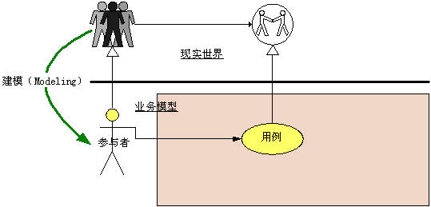
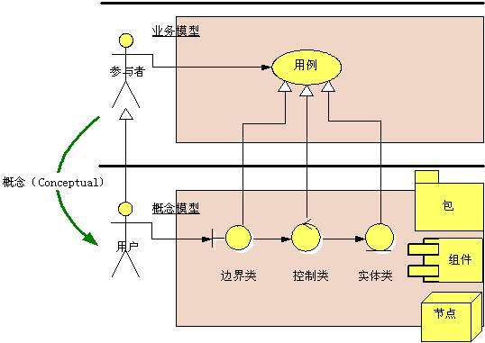
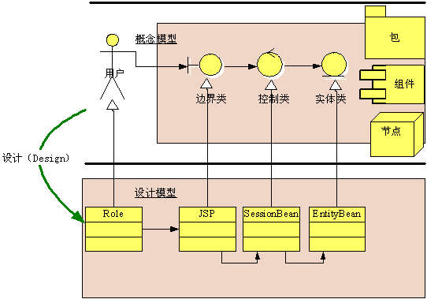
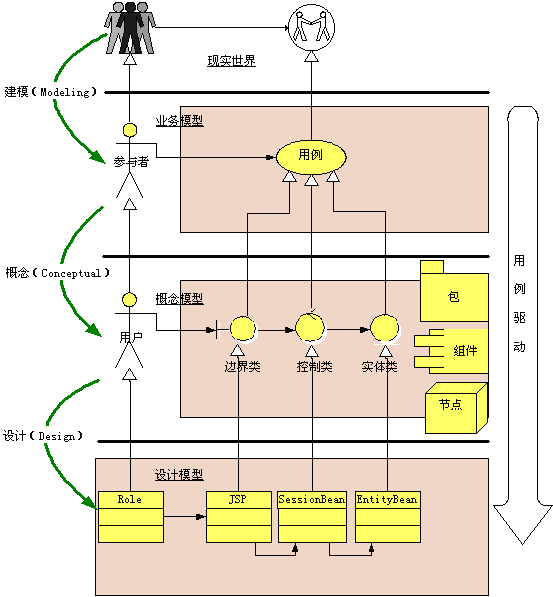
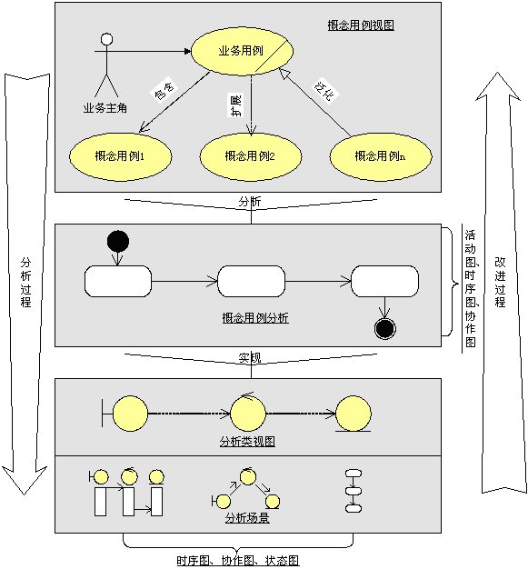

# 第一章 为什么需要UML

对象提供了处理复杂性问题的方式。

## 面向过程的方法

面向过程方法认为我们的世界是由一个个互相连接的小系统组成的，认为每个小系统都有着明确的开始和明确的结束，开始和结束之间存在严谨的因果关系，只要我们将这个小系统走向的所有因素都分析出来，我们就能完全的定义这个系统的行为。

## 面向对象的方法

面向对象方法将世界看作一个个相互独立的对象，相互之间并无因果关系，只有在某个外部力量的驱动下，对象之间才会一句某种规律相互传递信息，这些交互构成了这个生动世界的一个“过程”，在没有外力的情况下，对象则保持“精致”的状态。

## 面向对象的困难

- 一种将现实世界映射到对象世界的方法。
- 一种从对象世界描述现实世界的方法。
- 一种验证对象世界行为是否正确反应了现实世界的方法。

## UML模型

### 从现实世界到业务模型

建立模型，如果我们站在很高的抽象层次，以高度归纳的视角来看这个世界的运作，那么本质上无非是

- 人：是一切的中心。驱动系统
- 事：体现过程
- 物：记录结果
- 规则：就是控制
- 总结就是
    - 有什么人？
    - 什么人做什么事情？
    - 什么事产生什么物质？
    - 中间有什么规则是控制？
    - 再把人、事、物之间的关系定义出来，一个模型也就基本成型了。

建模，现实世界 ->  业务模型

### 从业务模型到概念模型

上边的建模仅仅是原始需求信息，必须将这些内容再换成一种可以指导开发的表达格式，UML通过称之为概念化的过程来建立适合计算机理解和实现的模型，这个模型称之为分析模型（analysis model）。分析模型介于原始需求和计算机时间之间，是一种过渡模型，

分析模型最主要的元模型是

- 边界类（Boundary）： 边界决定了外面能对里边做什么事。
- 实体类（entity） ：原始需求中领域模型中的业务实体映射了现实世界中参与者完成业务目标时所涉及的事务，UML采用实体类来重新表达业务实体。
- 控制类（control：边界和实体都是静态的，本身并不会动作，UML采用控制类来表达原始需求中的动态信息。即业务货用力场景中的步骤和活动。
    - 从UML的观点看来，边界类和实体类之间，边界类和边界类之间，实体类和实体类之间不能直接相互访问，他们需要通过控制类来代理访问需求，这样就吧动作和物体分开了。

### 从概念模型到设计模型

设计模型的工作就是构造零部件，组建汽车的过程。在大多数情况下，实现类可以简单的从分析类映射而来。

- 边界类可以转化为操作系统界面或者系统接口。
- 控制类可以转化为计算程序或控制程序，例如工作流、算法体等。
- 实体类可以转化为数据库表、XML文档或者其他带有持久特征的类。

 

总结就是如下：

现实世界 -> 业务模型 -> 概念模型 -> 设计模型

# 建模基础

- 一个问题是怎么建。
    - 首先要决定的是抽象的角度，即建立模型的目的是什么。
- 模是什么，则依赖于确定了抽象角度下的场景模拟。
    - 一个由抽象角度确定了的目标需要由静态的事物加上特定条件下产生的一个特定的场景来完成。
        - 即
            - 静态的事物（物）
            - 特定的条件（规则）
            - 特定的动作（参与者的驱动）
        - 等于特定的场景（事件）
- 建模公式
    - $latex 问题领域 = \\sum\_1^n 抽象角度 $
    - $latex 抽象角度 = 问题领域边界之外的参与者的业务目标 = 业务用力$
    - $latex 业务用力 = \\sum\_1^n 特定场景$
    - $latex 特定场景 = 静态的事务 + 特定的条件 + 特定的动作 或者 特定的事 $ $latex = 特定的事务 + 特定的规则 + 特定的人的行为 $

## 抽象层次

- 自顶向下。
    - 适用于从头开始认识一个事务。
- 自底向上。
    - 适用于从实践或者改进中提高认识。

 

 

## 对象分析方法

- 一切都是对象。
- 对象都是独立的
- 对象都具有原子性。
- 对象都是可抽象的。
- 对象都有层次性。
- 对象分析方法总结。

# UML核心元素

## 版型（stereotype）

对一个UML元素基础定义的扩展。

## 参与者（actor）

也叫主角。参与者位于边界之外，也可以非人。

寻找参与者，

- 谁对系统有着明确的目标和要求并且主动发出动作。
- 系统是为谁服务的。

发现参与者

- 谁负责提供、使用和删除信息。
- 谁将使用此功能。
- 谁对某个特定的功能感兴趣。
- 在组织中的什么地方使用系统。
- 谁负责支持和维护系统。
- 系统有那些外部资源。
- 其他还有那些系统将需要与该系统进行交互。

### 业务主角

业务主角是参与者的一个版型，特别用于定义业务的参与者，在需求阶段使用，业务主角的特殊性在于，他针对的是业务人员而分计算机用户，在查找业务主角的时候必须抛开计算机，没有计算机系统，这些业务人员也客观存在，在引入计算机系统之前，他们的业务也一直跑的很顺畅。我们需要获得的是客户的业务模型，根据业务模型构造计算机模型。

### 业务工人（business worker）

有些人员参与了业务，但不是主动参与的，是被动参与业务的，被称为业务工人。

## 用例（use case）

UML是面向对象的，除用例之外，其他所有的对象都是“封装”的，“独立”的，这些元素在没有外力的情况下，是不做什么事情的，而用例正是这个外力。

用例定义了一组用例实例，其中每个用例都是系统所执行的一系列动作，这些操作生成特定主角可以观测的值。

一个完整的用例由参与者、前置条件、场景、后置条件组成。

### 用例的特征

- 用例都是相对独立的。这意味着他不需要与其他用例交互，是独立完成参与者的目的。 
- 用例的执行结果对参与者来说是可观测和有意义的。
- 用例必须由一个参与者发起，不存在没有参与者的用例，用例不应该自动启动，也不应该主动启动另一个用例。 
- 用例必须是亿动宾短语的形式存在。动作+一个动作的受体。 
- 一个用例就是一个需求单元、分析单元、设计端元、开发单元、测试单元、甚至是部署单元。

### 用例的粒度

### 获得用例

我们知道用力的定义就是有参与者驱动的，并且给参与者提供可观测的有意义的结果的一系列活动的集合，用例的来源就是参与者对系统的期望，所以发现用例的前提条件是发现参与者，而确定参与者的同时就确定了系统的边界。

- 对系统有什么期望
- 打算在这个系统中做些什么事情。
- 做这件事情的目的是什么
- 做完这件事情希望有一个什么样的结果。

用例和功能的误区

在描述一个事务的时候，我们可以以如下3个观点出发

- 这个事物是什么
- 这个事物能做什么
- 人们能够用这个事物做什么。

### 业务用例（business use case）

业务用例是用例版型中的一种，专门用于需求阶段的业务建模。

### 业务用例实现（business use case realization）

 

### 概念用例

概念用例用来获取业务用理智那个的核心业务逻辑，这些核心业务逻辑解释了业务模式，称为业务架构的中药知道。

### 系统用例

系统用例是用来定义系统范围，获取功能性的需求的，系统用例的含义就是，系统用例是软件系统开发的全部范围，系统用例是我们得到的最终需求。

## 业务实体

业务实体是class的一种版型，特别用于业务建模阶段建立领域模型。

如果说参与者和用例描述了我们在这个问题领域中打倒什么样的目标，那么业务实体就描述了我们要用什么来打倒业务目标以及通过什么来记录这个业务目标。

官方定义：业务实体代表业务角色执行业务用例时所处理或使用的“事物”

### 业务实体的属性

用来保存业务实体特征的一个记录

### 业务实体的方法

是访问一个业务实体的句柄，他规定了外部可以怎样来使用他。

### 获得业务实体

- 首先我们建立业务用例场景。
- 从业务用例场景中逐个分析动词后边的名词，他们就是业务实体的备选对象。
- 根据对象对业务目标是否有贡献这一个筛选条件从备选对象中挑选出符合的对象。
- 最后分析这些业务实体之间的关系，并决定那些应当单独建模，那些应当作为属性。

## 包

包是一种容器，类似文件夹，将某些信息分类，形成逻辑单元。

包的指导性原则

- 高内聚
- 无依赖或者松耦合。
- 至少保证包之间的依赖不会被传递。例如B依赖A，C依赖B，当A修改导致B要做出修改的时候，C不会受到影响。
- 包之间的依赖关系应该是单向的。

包的一些版型

- 领域包（Domain Package）：用于分类业务领域中的业务单元，每个包代表一个领域。 
- 子系统（Subsystem）：用于分类系统内的逻辑对象并形成子系统。 
- 组织结构（Organization Unit）：用于分类业务领域中的组织结构，他可以直接用来表述企业的组织结构。 
- 层（layer）：分类软件中的层次。可用于展示软件的架构信息。 

## 分析类

分析类用于获取系统中的主要的“职责簇”，他们代表系统的原型类，是系统必须处理的主要抽象概念的“第一个关口”，如果期望获得系统的“高级”概念性简述，则客队分析类本身进行维护。分析类还可以产生系统设计的主要抽象-系统的射击类和子系统。

### 边界类（boundary）

边界类是一种用于对系统外部环境于其内部运作之间的交互进行建模的类。

- 参与者和用例之间应该建立边界类。
- 用例和用例之间如果有交互，应当为其建立边界类。
- 如果用例和系统边界之外的非人对象有交互，例如第三方系统，应当为其建立边界类。
- 在相关联的业务对象有明显的独立性要求，即他们在各自的领域中变化和发展，但又不希望互不影响时，也应当为他们建立边界类。

### 控制类（control）

控制类用于对一个或几个用例所特有的控制行为建模，控制对象通常控制其他对象，因此他们的行为具有协调性质，控制类将用例的特有行为进行封装。

控制类来源于对用例场景中行为的定义，换句话说，控制类来源于对用用例场景当中动词的分析和定义，包括限制动词的描述。

### 实体类（entity）

用于对必须存储的信息和相关行为建模的类。

## 设计类

设计类是系统实施中一个或者多个对象的抽象。

## 关系

抽象出对象之间的联系，让对象构成某个特定的结构。

### 关联关系 Association

$latex A \\rule\[1mm\]{10mm}{0.5mm}B $

- 直线表示
- 表示一种静态关系，通常与状态无关，而是有“常识”，“规则”，“法律”等因素决定的，是一种“强关系”的关系。
- 例如公司与员工之间的一对多关系就是哟中符合“常识”的关系，乘车人与车票。

### 依赖关系 Dependency

$latex A \\dashrightarrow  B $

- 虚线的箭头表示
- 描述一个对象在运行期间会使用到另一个对象的关系，与关联关系不同，依赖关系是一种临时性的关系，通常在运行期产生，并且随着运行场景的不同，依赖关系也可能发生变化。
- 例子，如果运行场景是开动轮船，那轮船依赖于人。

### 扩展关系 Extends

$latex A \\overset{<<extend>>} {\\dashrightarrow} B$

- 带箭头的虚线加版型
- 一般来说，扩展用例是带有抽象性质的，他表示了用例场景种的某个支流，由特定的扩展点触发而被启动。于包含关系不同的时候，扩展表示的是可选，而不是必需。
- 例子，通话过程中收到另一个呼叫，我们可以将当前通话保留而接收另一个通话，在这个场景中，保留通话用例就是打电话用例的一个扩展用例。

### 包含关系 Include

$latex A \\overset{<<include>>} {\\dashrightarrow} B$

- 带箭头的虚线加版型
- 包含用例总是带有抽象性质的，基本用例可控制于包含用例的关系，并可依赖于执行包含用例的结果，但基本用例和包含用例都不能访问对方的属性，从这个意义上讲，包含用例是被封装的，它代表可在各种不同基本用例中复用的行为。包含用例是必需。
- 例子，去银行办理业务，不管是取钱还是转账，等，我们都需要首先核对账号和密码，我们可以将核对账号作为上述业务的共有行为提取出来，作为一个包含用例。

### 实现关系 Realize

$latex A - - -\\triangleright B$

- 带空心箭头的虚线表示。
- 用于用例模型中实现用例和用例实现，实现所代表的含义是，基本用例描述了一个业务目标，但是该业务目标有多种可能的实现途径，每一种实现途径都可以用用例实现来表示。
- 交纳电话费是一个业务目标，实现途径是营业厅交费，银行交费，预存话费。

### 精化关系 Refine

$latex A \\overset{<<refine>>} {\\dashrightarrow} B$

- 带箭头的虚线加版型来表示
- 特别用于用例模型，一个基本用例可以分解出许多更小的关键精化用例，这些更小的精化用例更细致的展现了基本用例的核心业务。与泛化关系不同，精化关系表示由基本对象可以分解为更明确、精细的子对象。这些子对象并没有增加、减少、改变基本对象的行为和属性，仅仅是更加细致和明确化了。
- 例子，预存话费，可以精化城，开立账户、存入先进、转账和支付转账4个精化

### 泛化关系 Generalization

$latex A  ---\\triangleright B$

- 带空心箭头的直线表示。
- 说明2个对象之间的继承关系，泛化关系表示类的继承。

### 聚合关系 Aggregation

$latex A ---\\lozenge B$

- 带空心菱形的直线表示
- A聚合到B上，或者说B由A组成，用于类图，特别用于表示实体对象之间的关系，表达整体由部分构成的语义。
- 例子，一个部分由很多人员构成，与组合关系不同的是，部分不存在，人员也不会因此消失。

### 组合关系 Composition

$latex A ---\\blacklozenge B$

- 带实心菱形箭头的直线表示
- 特别用于表示实体对象关系，表达整体拥有部分的语义。
- 例子，母公司和子公司，整体不存在，则部分也消失了。

各种关系总结

- 泛化关系 ： 表示继承，类的继承之类的。
- 实现关系 ： 类与接口的关系，类是接口所有特征和行为的实现
- 关联关系 ： 是一种拥有关系，一个类知道另一个类的属性和方法，代码体现在是成员变量。
- 聚合关系 ： 整体与部分的关系，且部分离开整体而单独存在，是关联关系的一种。
- 组合关系 ： 整体与部分的关系，且部分离开整体不能存在。
- 依赖关系 ： 是一种使用关系，即一个类的实现需要另一个类的协助。代码体现是局部变量、方法的参数或者对静态方法的调用
- 精化关系 ： 一个基本用例可以分解成几个小用例。
- 扩展关系 ：  用例场景中的某个支流。
- 包含关系 ：

在staruml中有如下几种关系

- Association ： 关联关系，
- Directed Association ： 有方向的关联关系。
- Aggregation ： 聚合关系
- Composition ： 组合关系。
- Dependency ： 依赖关系
- Generalization： 泛化关系，也就是类继承之类的。
- Interface Realization ： 实现关系，也就是实现接口之类的。

我的分类

- 继承
    - 泛化关系
    - 实现关系
- 关联关系
    - 其关系强度为 组合>聚合>关联>依赖
    - 依赖关系，临时性的关联关系。

# UML核心视图

上一章的元素是UML的基本词汇，视图就是语法。

UML可视化的特性是由各种视图来展现的，每一种视图都从不同的角度对同一个软件产品的方方面面进行展示，说明将要开发的软件是什么样子。

## 静态视图

静态视图用来表达静态的事物，只描述事物的静态结构，而不描述其动态行为。

### 用例图

用例图采用参与者和用例作为基本元素，以不同的视角展现系统的功能性需求。

#### 业务用例视图

##### 业务主角视角

从业务主角视角来展示业务主角在业务中使用哪些业务用例来达成业务目标。这个视角有利于向业务主角确认其业务目标是否都已经齐全，以此来检查是否有遗漏的业务用例还没有发现。

下边是展示了借书管理系统中的借阅人业务用例视角，

 

##### 业务模块视角

展示业务领域的业务目标，将参与了达成这一业务目标的业务主角与业务用例展现在这个视角中，这个视角有利于从业务的完整性角度处罚，检查完成某个业务的所有业务主角和业务用例是否已经齐全，以此来检查是否有遗漏的业务用例没有发现。

 

##### 其他视角

例如从一个部门的视角绘制一个部门所参与的全部业务用例视图。

#### 业务用例实现视图

业务用例实现视图展现业务用例有哪些实现途径。

业务用例是业务需求，而业务用例实现则是业务的实现途径。从软件工成的角度说，这个视图展示了需求的可追朔特点。

 

#### 概念用例视图

概念用例视图用于展现从业务用例中经过分析分解出来的关键概念用例，并表示概念用例和业务用例之间的关系

 

#### 系统用例视图

用于展现系统范围，将对业务用例进行分析以后得到的系统用例展现出来。

 

检查借阅证可能是人工检查，所以这里不列入。

#### 系统用例实现视图

 

### 类图

概念层->说明层->实现层

#### 概念层类图

描述的是现实世界中问题领域的概念理解，类图中表达的类与现实世界的问题领域有着明显的对应关系，类之间的关系也与问题领域中实际事物的关系有着明显的对应关系。

概念层类图着重于对问题领域的概念化理解，而不是实现，因此类名通常都是问题领域中实际事物的名称。概念层的类图是独立于实现语言和实现方式的。

 

#### 说明层类图

在这个层次上的类图考虑的是类的接口，而不是实现。类图中表达的类和类之间的关系应当是对问题领域在接口层次抽象的描述，我们不关心实现，而只是关心这样的一些类，他们通过接口进行交互，进而完成问题领域中的业务目标。

 

#### 实现层类图

可以映射为可执行代码。

### 包图

包图一般用来展示高层次的观点

## 动态视图

### 活动图

描述为了完成某一给目标需要做的活动以及这些活动的执行顺序。

#### 用例活动图

用例表达了参与者的一个目标，用例场景则描述了如何来表达到这个目标。

#### 对象活动图

#### 泳道

### 状态图

状态图是一个状态机，用于对模型元素的动态行为进行建模，更具体的说，就是对系统行为中受事件驱动的方向进行建模。

 

 

### 时序图

用于描述按事件顺序排列的对象之间的交互关系。

#### 业务模型时序图

 

#### 概念模型时序图

概念用例时序图通常是依据业务模型场景来绘制的，它将业务模型场景用分析类重新绘制一遍，这样，既保留了实际业务需求，又得到了计算机实现的基本概念。

如下，我们可以看到其中的计算机实现理念的引入。

 

#### 设计模型时序图

使用设计类为对象绘制，目标是实现概念模型中的某个事件流，一般以一个完整交互为单位，消息细致到方法级别。

### 协作图

协作图描述了对象间交互的一种模式，它通过对象之间的连接和他们相互发送的消息来显示参与交互的对象。

 

协作图和时序图是可以互换的。协作图展示对象之间的关系，而时序图是用例之间的关系吧。

#### 业务模型协作图

业务模型协作图同样采用业务实体来绘制，目标也是实现用例场景，不过有时候协作图并不要求完成的业务场景，指需要将影响对象的关键消息绘制出来己可。

#### 概念模型协作图

#### 设计模型协作图

# UML核心模型

## 用例模型概述

用例模型即为需求工作流程的结果，可当作分析设计工作流程以及测试工作流程的输入使用。

## 业务用例模型

业务用例模型描述的是业务范围，与系统用例模型讲述的系统范围是不同的。建立业务 用例模型是为了理解客户业务，相当于对客户业务的整理和重现。它必须尊重事实，不要带有计算机实际的思考在里边。

业务用例模型采用业务用例来绘制，表达业务的观点。

 

### 业务用例模型主要内容

- 业务用例视图
    - 业务用例视图包括业务主角和业务用例，它是业务的高层和概要视
- 业务用例场景
    - 说明业务用例的执行过程，说明业务主角是如何使用业务用例来完成业务目标的。
- 业务用例规约。
    - 说明业务用例的使用者、目标、场景、相关业务规则、相关业务实体等。
- 业务规则
    - 必须遵守的法律法规、惯例、各种规定、客户的操作规范、约束机制等。
- 业务对象模型
    - 描述业务模型种关键的业务对象，以及他们是如何贡献于业务目标的。
- 业务用例实现视图
    - 将业务实现用例用实现管理连接到业务用例，每一个业务用例实现代表了业务用例目标的一种实现方式。
- 业务用例实现场景
    - 针对每一个业务用例实现，说明该实现方式的步骤。
- 包图
    - 包图组织业务用例。

### 业务用例模型工作的取舍

我这里尽量全部使用吧。

## 概念用例模型

 

### 概念用例视图的主要内容

- 概念用例视图
    - 概念用例视图将得到的概念用例用包含、泛化、扩展关系连接到基本业务用例，表示这些概念用例的来源以及他们服务于哪个或哪些业务用例
- 概念用例分析
    - 从业务用例模型种挑选出重要和典型的业务用例场景，可能只是部分场景，也可能是跨多个业务用例，然后将得到的概念用例集中起来，绘制这些概念用例如何贡献或者如何实现这些业务用例场景。
- 分析类视图
    - 绘制出从概念用例分析过程中的分析类的静态关系。分析类得到我们理解系统实现的第一个关口。
- 分析场景
    - 分析场景使用分析类绘制对象交互图，从对象的角度去实现概念用例分析场景，

### 获得概念用例

- 观察现有的业务用例场景，发现哪些有着相似名称，在不同的业务用例场景中多次出现，或者位于不同的泳道中的活动。这些活动很可能就是关键的工作单元，以此来获得备选的概念用例。
- 通过对客户业务的分析，或者咨询业务专家，得知对客户来说最为重要的一些业务实体，然后了解对这些业务实体可能进行的主要操作来获得备选的概念用例。

## 系统用例模型

 

### 系统用例模型的主要内容

- 业务用例
- 概念用例
    - 只是起指导作用。
- 用例视图
    - 包括参与者和用例，是系统功能性需求的高层视图。
- 用例规约
    - 采用文档刑事描述参与者如何启动和终止用例，参与者如何使用用例完成目标，用例的执行事件流，相应的规则等内容。
- 补充规约
    - 补充规约应说明于用例相关的非功能性需求，例如响应时间、可靠性、可用性。
- 业务规则
    - 法律法规、惯例、各种规定等等啦。
- 用例实现
- 代表用例的一种实现方式。
- 用例场景
    - 说明参与者如何于计算机之间交互以达成目的，可以使用任何一种交互图来描述。
- 分析对象
    - 代表计算机逻辑的概念化产物。

## 领域模型

领域模型是采用业务对象建立起来的一种模型。

领域模型建立方法

可以采用CRC(class-Responsibilities-Collaboration）方法，用一个小卡片来表示一个对象，每个项目组成员手持一张小卡片来扮演这个对象，然后这些项目组成员举行头脑风暴讨论会，针对问题领域相互询问，被问到需要向对方提供服务的队员在卡片上记录一下职责，直到大家认为整个问题领域中没有可以被遗漏的内容，每一个人的问题都得到解决，并且明确的知道谁提供该服务。

例如一个即时战斗游戏由哪些关键部分组成？大致有控制、场景、声效、装备、战斗模式等等，我们可以针对每一个部分建立一个领域模型，通过解决每一个问题进而完成整个游戏模型的建立。

## 分析模型

- 人 -> 参与者
- 事 -> 边界类
- 物 -> 实体类
- 规则 -> 控制类

如果使用分析模型

推荐采用时序图，在用例场景中的参与者和系统之间加入一个边界类代表操作界面，在边界类和实体交互之间加入一个控制类代表业务逻辑，然后对照用例场景，一步一步忠实的吧用例场景用分析类实现出来，

 

绘制时序图的同时顺便得到了备选的分析类，获得分析类之后就可以来定义分析类之间的关系

 

MVC模式，定义分析类之间的关系时，应该注意以下几个原则

- 边界类不应当于实体类之间有依赖关系，边界类只能通过控制类于实体类交互。
- 实体类和实体类之间可以有聚合或者组合关系，但不应当有依赖关系。他们不应当直接交互，而只能通过控制类间接交互。
- 控制类和控制类之间不应当有聚合或者组合关系，如有可能，应当尽量减少依赖关系。
- 正确的依赖关系应当是边界类依赖于控制类，控制类依赖于实体类，而不能反过来。

## 设计模型

设计模型是一个描述用例实现的对象模型，它客作为对实施模型及其源代码的抽象，实际模型用作实施和测试活动的输入。

# 统一过程核心工作流简介

## 业务建模工作流程

### 工作流程

 

## 系统建模工作流程

 

## 分析设计建模工作流程

 

## 实施建模工作流程

