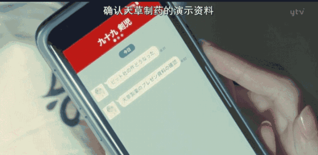
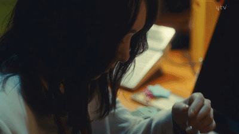
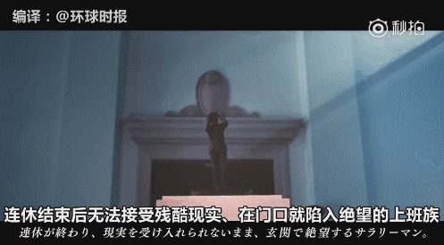
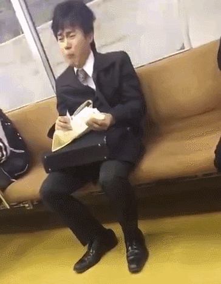
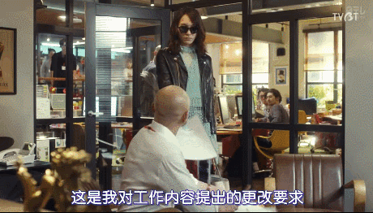

“任何善良都要有底线，任何忍耐都应有锋芒。”

****本文系网易沸点工作室《槽值》栏目（公众号：caozhi163）出品。****

“PPT太丑，重新做，明晚之前我要看到新版。”

“XX请假，你替他做一下这个表。”

“方案不行，今天下班前再拿一版出来。”

……

听到这些熟悉的话，大概许多人都会嘴角一撇，想起被工作支配的恐惧。

**日语中有个词，叫做“社畜”。**

用来形容那些被公司疯狂压榨，又不得不顺从的上班族。

在最近播出的日剧《无法成为野兽的我们》中，新垣结衣就扮演了这样一个角色。

有观众说：“简直就是在翻拍我的生活，真实到不敢看。”

**_1_**

**即使筋疲力尽**

**也要假装微笑**

剧中，新垣结衣饰演的深海晶是东京一家IT企业的职员。

她一直被周围的人评价为：一个笑容明朗且亲切的人。

**但爱笑的女孩，运气真不一定很好。**

老板知道她脾气好，每天吆五喝六地塞过来一堆不该她负责的工作。

同事知道她不懂拒绝，也把烂摊子统统甩给她。

**他们的说辞都是：“你能者多劳。”**

每天最早到公司，最晚离开公司。

叫醒她的不是闹钟，是老板的连环夺命信息。

在地铁里收到老板布置的任务，面对周围人的侧目，只能尴尬又无奈地赔礼道歉。

到了公司，立刻马不停蹄地开始准备工作。

抬头给老板做好现磨咖啡，低头替同事修改策划案。

她也试图反抗过：暗示老板，这些工作超出了自己的职责范围。

“社长，新的秘书呢？”

没等话说完，老板几句呵斥，她就再不敢吭声：

“我正在找，你就不能再等等吗？”

**“年轻人对公司要忠诚！这么自私的话，是不会有进步的！”**

一个人干着全小组的事，连句感谢和一个笑脸都换不回。

同事什么都不会，深海晶替他给客户端茶倒水赔笑脸，力求事事完美。

上司依旧有可以挑刺的理由：为什么没把新人教好。

**领导凶，同事坑。**

公司项目负责人玩忽职守，没有按时提交样稿。

深海晶替他承受责难，对方不依不饶。

但为了帮同事挽回机会，当众下跪这种屈辱的事，她照办不误。

**不是没有自尊心，只是想做到让人无可挑剔。**

面对什么也没做，就每天都在喊累的同事，只能在心里暗暗抱怨。

在办公室加班到深夜，发完最后一封工作邮件。

收到客户的骚扰电话，为了合作能达成，不能拒绝，必须小心翼翼“说好话”。

下班回家路上还得拿着电脑，查找资料。

拥挤的电车里被人撞得歪歪倒倒，站稳后立刻小心翼翼擦干净被脸蹭脏的玻璃，生怕给人添了麻烦。

终于可以结束一天的工作休息，突然收到老板的新消息，就要立马离开被窝，爬回电脑前开始改方案。

可是第二天回到职场，依然要挂上最得体的笑容。

对每一个拜托自己的人说：“好的。”

 图源：豆瓣剧照

**工作上不顺，感情也糟心。**

未来婆婆咄咄逼人；男朋友的前女友，堂而皇之住在男友买的房子里。

一地鸡毛的生活已经超过了她能负荷的极限，无法自我排解的时候，她甚至想到了死。

然而还是要挂起最擅长的假笑，告诉其他人“我很好”。

男主角根元恒星一眼看穿她的伪装：“她的微笑很恶心、很虚伪，那张完美的笑脸让人感觉很不爽。”

又有什么办法呢？

毕竟不可能真的喊一句“我不干了”，然后抛下一切走人。

《无法成为野兽的我们》目前豆瓣评分8.7，评论里许多人被**“细枝末节戳中了生活最疲惫不堪的部分”。**

深海晶就像每一个普通的职场人。

有点能力也有点野心，想要成为“野兽”，但却因为各种原因“不得志”。

**一无所有的人只能强颜欢笑，迎合他人，忽视内心真实的想法。**

压力、委屈、难过，全都要独自承受，到了人前，就得“永远微笑，永远没脾气”。

**_2_**

**想活成野兽**

**却只能向现实低头**

剧中的深海晶，是很多职场“老好人”的真实写照：

“我是一块砖，哪里需要哪里搬。”

拿着一份工资，干着好几个人的活。

领导的话必须执行，客户的要求难以推脱，同事的忙不好意思不帮。

**“职场哪有分内分外，只要是公司的事，那就是你的事。”**

深海晶的老板同事交待事情给他时总是说：你能者多劳、能者多劳。

但多劳从不多得。

 图片来源：微博

况且，这也只是无情职场的冰山一角。

日本某公司拍摄了一支短片，用油画道出了上班族的共同心酸。

在睡眠时间上，没有最短，只有更短。

“昨晚我只睡了三小时。”

“那不好意思你输了哦，我只睡了两小时。”

 图片来源：@环球时报

领导不加班，员工要加班。

领导加班，员工更没理由不加班。

明明很多事情不用今天干完，可谁都不敢做第一个走的人。

 图片来源：@环球时报

好不容易熬到周末。

可快乐一开始，悲伤就在倒计时。

最痛苦的，永远是周日晚上……

 图片来源：@环球时报

可是，面对种种职场压力，多数人都一致选择了忍耐。

**不是不懂拒绝，而是“拒绝并且可以自保的前提是你足够强大，无可替代。”**

显然，大多数人都不具备这个能力。

有人面对工作压力，毅然辞职。

四个月后，没找到工作，才开始不知所措。

**想享受安逸的美好，又承担不起安逸的代价。**

 图片来源：网友评论

没了工作，就没了收入。

对中年人来说，敢逃离的，更是少数。

正如网上流传的一段话：“不要大声责骂年轻人，他们会立刻辞职的。

**但是你可以往死里骂那些中年人，尤其是有房有车有娃的那些。”**

因为知道，他们不敢稍不顺心就辞职，一点困难就叫苦。

他们有房贷车贷要还，有父母要养老，有孩子要上学、上辅导班……再艰难他们都得咬牙忍受。

图片来源：网友评论

蔡康永在《奇葩说》里说，“拿到钱之后，才有资格体会到钱对人生的意义。”

图片来源：奇葩说

看过太多为了工作筋疲力尽，还是要拼尽全力的人。

在地铁上抱着公文包，一边哭一边吃饭。

 图片来源：微博

加班到凌晨，干脆睡在公司。

 睡在公司的日子 / 视觉中国

穿了一整天高跟鞋，回家路上顾不得形象也要放松一下。

 图片来源：微博

**生存面前，哪有体面可言。**

都说人生不止眼前的苟且，还有诗和远方。

现实是连眼前都很难“苟且住”。

谁都希望自己可以像“野兽”一样强大、无所畏惧、随心所欲。

但有这份底气的寥寥无几，被“摁着脖子”向现实低头的，才是多数。

**_3_**

**生活残酷**

**但可以对自己好一点**

深海晶的挣扎，让很多人“感同身受”。

可不得不承认，她的痛苦很大一部分源于她“太好说话了”。

太宰治的小说《人间失格》里有这么一句话：我的不幸，恰恰在于我缺乏拒绝的能力。

**职场上，拖垮一个人的可能不是工作，而是“低能队友”和“不懂拒绝”。**

蒋方舟曾经在节目中袒露，自己是绝对的“讨好型人格”：不敢和任何人产生矛盾，不管对错只会“好好好，是是是”。

 图片来源：《奇葩大会》

养成这种人格，下场就是生活中受委屈，职场上更“要命”。

就像永远无法开口说“不”的深海晶，时间久了，别人就会习惯性地来“麻烦你”。

事情办好了是理所应当，办不好就是一顿抱怨。

**况且，始终做个职场“老好人”也并不会对工作有太多实质帮助。**

2012年，“人格与社会心理学杂志”刊登的一项研究显示：职场中的“老好人”，都有比其他人工资更少的倾向。

哥本哈根大学经济学助理教授 Miriam Gensowski 一项针对1500名美国人的研究，也再次印证了这个事实：

**职场中最受欢迎的前20％ 男性，一生总收入要平均少 270,000美元左右。**

这种差距 30 岁开始才开始显现，在 40 至 60 岁之间最为明显。

在担任领导职位和主持工作时，过于柔和的性格反而是一种劣势。

**除此之外，“能者多劳”，“劳”的却常常是一些对自我提升没有帮助的琐事。**

花费了大量时间精力，把同一件事重复一百遍，看似忙碌勤奋，其实都在做“无用功”。

到头来，自己没空去学习充电，因为琐事缠身；

没有精力进行深度思考或者规划未来，因为一天的工作结束已经是筋疲力竭，只想倒头就睡……

**你原本可以活得不那么辛苦，原本可能有更大的发展空间，但都毁在“能者多劳”上。**

职场不需要尔虞我诈，但你必须学会在该说“不”的时候大声说出来。

美国心理学家莱斯·巴巴内尔表示：善良的人害怕敌意，于是用“不拒绝”来获得他人的认可。

一再隐忍退让、为难自己，对别人有求必应。

**到头来，快乐给了别人，委屈全留给自己。**

“乐于助人”，换不回他人真心的欣赏和认同，反而可能变成纵容他人自私的筹码。

何炅曾在节目中表达过自己对“讨好型人格”的解释：

讨好别人的过程不是把“让别人开心”当做唯一准则，应该是自己不觉得辛苦的同时，还能照顾好他人的情绪。

**“永远不要说自己别无选择，珍惜每一次说不的权利。”**

职场上，绝不要做没有立场的老好人，不是分内的工作，大可直说无妨。

《无法成为野兽的我们》第一集末尾，深海晶终于爆发了：

她把《工作内容调整建议书》拍在老板桌子上，一脸决绝。

并不是鼓励每个人都在遭遇职场不公正、背负巨大压力时候果断拒绝或走人，而是有些时候，我们可以让自己看起来“不好惹”一些。

人生在世，不可能也做不到让每个人都喜欢自己。

生活已经够艰难了，就不要再为了别人一直委屈自己。

正如蒋方舟在节目中所说：“愧疚是最大的负能量，任性是最被低估的美德”。

**“任何善良都要有底线，任何忍耐都应有锋芒。”**

给文章点个赞，愿每一个挣扎在职场中的“深海晶”，不要认输，自由地活着。

