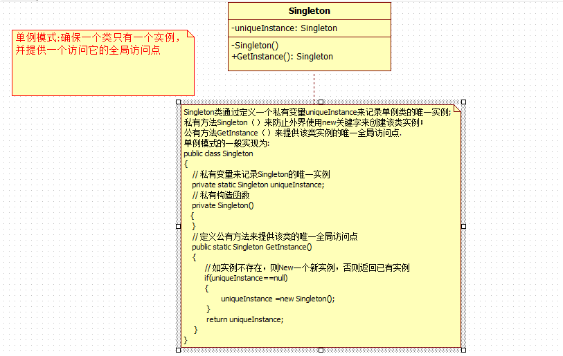
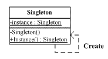

# 意图

> **保证一个类仅有一个实例，并提供一个访问它的全局访问点**

# 核心思想

确保某个类只有一个实例（**类的静态成员变量**），而且自行实例化并向整个系统提供这个实例单例模式。

**直接将类的构造方法改成私有的**（所有类都有构造方法，不编码则系统默认生成空的构造方法，若有显示定义的构造方法，默认的构造方法就会失效），然后在一个public的实例化函数中调用私有构造函数，完成仅有的一次实例化。

# 优缺点分析

GOOD:单例模式只应在有真正的“单一实例”的需求时才可使用。

**单例模式因为Singleton类封装它的唯一实例，这样它可以严格地控制客户怎样访问它以及何时访问它，简单的说就是对唯一实例的受控访问。**

# 剖析单例模式的实现思路

了解完了一些关于单例模式的基本概念之后，下面就为大家剖析单例模式的实现思路的，因为在我自己学习单例模式的时候，咋一看单例模式的实现代码确实很简单，也很容易看懂，但是我还是觉得它很陌生（这个可能是看的少的，或者自己在写代码中也用的少的缘故），而且心里总会这样一个疑问——为什么前人会这样去实现单例模式的呢？他们是如何思考的呢？后面经过自己的琢磨也就慢慢理清楚单例模式的实现思路了，并且此时也不再觉得单例模式陌生了，下面就分享我的一个剖析过程的：

我们从单例模式的概念（确保一个类只有一个实例,并提供一个访问它的全局访问点）入手，可以把概念进行拆分为两部分：（1）确保一个类只有一个实例；（2）提供一个访问它的全局访问点；下面通过采用两人对话的方式来帮助大家更快掌握分析思路：

菜鸟：怎样确保一个类只有一个实例了？

老鸟：那就让我帮你分析下，你创建类的实例会想到用什么方式来创建的呢？

新手：用new关键字啊，只要new下就创建了该类的一个实例了，之后就可以使用该类的一些属性和实例方法了

老鸟：那你想过为什么可以使用new关键字来创建类的实例吗？

菜鸟：这个还有条件的吗？........., 哦，我想起来了，如果类定义私有的构造函数就不能在外界通过new创建实例了（注：有些初学者就会问，有时候我并没有在类中定义构造函数为什么也可以使用new来创建对象，那是因为编译器在背后做了手脚了，当编译器看到我们类中没有定义构造函数，此时编译器会帮我们生成一个公有的无参构造函数）

老鸟：不错，回答的很对，这样你的疑惑就得到解答了啊

菜鸟：那我要在哪里创建类的实例了？

老鸟：你傻啊，当然是在类里面创建了（注：这样定义私有构造函数就是上面的一个思考过程的，要创建实例，自然就要有一个变量来保存该实例把，所以就有了私有变量的声明,但是实现中是定义静态私有变量,朋友们有没有想过——这里为什么定义为静态的呢?对于这个疑问的解释为：每个线程都有自己的线程栈，定义为静态主要是为了在多线程确保类有一个实例）

菜鸟：哦，现在完全明白了，但是我还有另一个疑问——现在类实例创建在类内部，那外界如何获得该的一个实例来使用它了？

老鸟：这个，你可以定义一个公有方法或者属性来把该类的实例公开出去了（注：这样就有了公有方法的定义了，该方法就是提供方法问类的全局访问点）

通过上面的分析，相信大家也就很容易写出单例模式的实现代码了，下面就看看具体的实现代码（看完之后你会惊讶道：真是这样的！）：

# UML图

[](http://127.0.0.1/?attachment_id=3976)

# 代码实现

```
/// <summary>
    /// 单例模式的实现
    /// </summary>
    public class Singleton
    {
        // 定义一个静态变量来保存类的实例
        private static Singleton uniqueInstance;

        // 定义私有构造函数，使外界不能创建该类实例
        private Singleton()
        {
        }

        /// <summary>
        /// 定义公有方法提供一个全局访问点,同时你也可以定义公有属性来提供全局访问点
        /// </summary>
        /// <returns></returns>
        public static Singleton GetInstance()
        {
            // 如果类的实例不存在则创建，否则直接返回
            if (uniqueInstance == null)
            {
                uniqueInstance = new Singleton();
            }
            return uniqueInstance;
        }
    }
```

面的单例模式的实现在单线程下确实是完美的,然而在多线程的情况下会得到多个Singleton实例,因为在两个线程同时运行GetInstance方法时，此时两个线程判断(uniqueInstance ==null)这个条件时都返回真，此时两个线程就都会创建Singleton的实例，这样就违背了我们单例模式初衷了，既然上面的实现会运行多个线程执行，那**我们对于多线程的解决方案自然就是使GetInstance方法在同一时间只运行一个线程运行就好了**，也就是我们线程同步的问题了(对于线程同步大家也可以参考我[线程同步](http://www.cnblogs.com/zhili/archive/2012/07/21/ThreadsSynchronous.html)的文章),具体的解决多线程的代码如下:

```
/// <summary>
    /// 单例模式的实现
    /// </summary>
    public class Singleton
    {
        // 定义一个静态变量来保存类的实例
        private static Singleton uniqueInstance;

        // 定义一个标识确保线程同步
        private static readonly object locker = new object();

        // 定义私有构造函数，使外界不能创建该类实例
        private Singleton()
        {
        }

        /// <summary>
        /// 定义公有方法提供一个全局访问点,同时你也可以定义公有属性来提供全局访问点
        /// </summary>
        /// <returns></returns>
        public static Singleton GetInstance()
        {
            // 当第一个线程运行到这里时，此时会对locker对象 "加锁"，
            // 当第二个线程运行该方法时，首先检测到locker对象为"加锁"状态，该线程就会挂起等待第一个线程解锁
            // lock语句运行完之后（即线程运行完之后）会对该对象"解锁"
            lock (locker)
            {
                // 如果类的实例不存在则创建，否则直接返回
                if (uniqueInstance == null)
                {
                    uniqueInstance = new Singleton();
                }
            }

            return uniqueInstance;
        }
    }
```

上面这种解决方案确实可以解决多线程的问题,但是**上面代码对于每个线程都会对线程辅助对象locker加锁之后再判断实例是否存在，对于这个操作完全没有必要的，因为当第一个线程创建了该类的实例之后，后面的线程此时只需要直接判断（uniqueInstance==null）为假，此时完全没必要对线程辅助对象加锁之后再去判断，所以上面的实现方式增加了额外的开销，损失了性能，为了改进上面实现方式的缺陷，我们只需要在lock语句前面加一句（uniqueInstance==null）的判断就可以避免锁所增加的额外开销，这种实现方式我们就叫它 “双重锁定”**，下面具体看看实现代码的：

```
/// <summary>
    /// 单例模式的实现
    /// </summary>
    public class Singleton
    {
        // 定义一个静态变量来保存类的实例
        private static Singleton uniqueInstance;

        // 定义一个标识确保线程同步
        private static readonly object locker = new object();

        // 定义私有构造函数，使外界不能创建该类实例
        private Singleton()
        {
        }

        /// <summary>
        /// 定义公有方法提供一个全局访问点,同时你也可以定义公有属性来提供全局访问点
        /// </summary>
        /// <returns></returns>
        public static Singleton GetInstance()
        {
            // 当第一个线程运行到这里时，此时会对locker对象 "加锁"，
            // 当第二个线程运行该方法时，首先检测到locker对象为"加锁"状态，该线程就会挂起等待第一个线程解锁
            // lock语句运行完之后（即线程运行完之后）会对该对象"解锁"
            // 双重锁定只需要一句判断就可以了
            if (uniqueInstance == null)
            {
                lock (locker)
                {
                    // 如果类的实例不存在则创建，否则直接返回
                    if (uniqueInstance == null)
                    {
                        uniqueInstance = new Singleton();
                    }
                }
            }
            return uniqueInstance;
        }
    }
```
