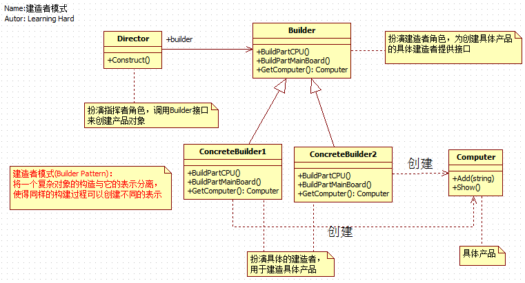

# 引言

在软件系统中，有时需要创建一个复杂对象，并且这个复杂对象由其各部分子对象通过一定的步骤组合而成。例如一个采购系统中，如果需要采购员去采购一批电脑时，在这个实际需求中，电脑就是一个复杂的对象，它是由CPU、主板、硬盘、显卡、机箱等组装而成的，如果此时让采购员一台一台电脑去组装的话真是要累死采购员了，这里就可以采用建造者模式来解决这个问题，我们可以把电脑的各个组件的组装过程封装到一个建造者类对象里，建造者只要负责返还给客户端全部组件都建造完毕的产品对象就可以了。然而现实生活中也是如此的，如果公司要采购一批电脑，此时采购员不可能自己去买各个组件并把它们组织起来，此时采购员只需要像电脑城的老板说自己要采购什么样的电脑就可以了，电脑城老板自然会把组装好的电脑送到公司。下面就以这个例子来展开建造者模式的介绍。

# 建造者模式的详细介绍

## 建筑者模式的具体实现

在这个例子中，电脑城的老板是直接与客户（也就是指采购员）联系的，然而电脑的组装是由老板指挥装机人员去把电脑的各个部件组装起来，真真负责创建产品（这里产品指的就是电脑）的人就是电脑城的装机人员。理清了这个逻辑过程之后，下面就具体看下如何用代码来表示这种现实生活中的逻辑过程：

```
using System;
using System.Collections.Generic;
using System.Linq;
using System.Text;


/// <summary>
/// 以组装电脑为例子
/// 每台电脑的组成过程都是一致的，但是使用同样的构建过程可以创建不同的表示(即可以组装成不一样的电脑，配置不一样)
/// 组装电脑的这个场景就可以应用建造者模式来设计
/// </summary>
namespace 设计模式之建造者模式
{
    /// <summary>
    /// 客户类
    /// </summary>
    class Customer
    {
        static void Main(string[] args)
        {
            // 客户找到电脑城老板说要买电脑，这里要装两台电脑
            // 创建指挥者和构造者
            Director director = new Director();
            Builder b1 = new ConcreteBuilder1();
            Builder b2 = new ConcreteBuilder2();

            // 老板叫员工去组装第一台电脑
            director.Construct(b1);

            // 组装完，组装人员搬来组装好的电脑
            Computer computer1 = b1.GetComputer();
            computer1.Show();

            // 老板叫员工去组装第二台电脑
            director.Construct(b2);
            Computer computer2 = b2.GetComputer();
            computer2.Show();

            Console.Read();
        }
    }

    /// <summary>
    /// 小王和小李难道会自愿地去组装嘛，谁不想休息的，这必须有一个人叫他们去组装才会去的
    /// 这个人当然就是老板了，也就是建造者模式中的指挥者
    /// 指挥创建过程类
    /// </summary>
    public class Director
    {
        // 组装电脑
        public void Construct(Builder builder)
        {
            builder.BuildPartCPU();
            builder.BuildPartMainBoard();
        }
    }

    /// <summary>
    /// 电脑类
    /// </summary>
    public class Computer
    {
        // 电脑组件集合
        private IList<string> parts = new List<string>();

        // 把单个组件添加到电脑组件集合中
        public void Add(string part)
        {
            parts.Add(part);
        }

        public void Show()
        {
            Console.WriteLine("电脑开始在组装.......");
            foreach (string part in parts)
            {
                Console.WriteLine("组件"+part+"已装好");
            }

            Console.WriteLine("电脑组装好了");
        }
    }

    /// <summary>
    /// 抽象建造者，这个场景下为 "组装人" ，这里也可以定义为接口
    /// </summary>
    public abstract class Builder
    {
        // 装CPU
        public abstract void BuildPartCPU();
        // 装主板
        public abstract void BuildPartMainBoard();
        
        // 当然还有装硬盘，电源等组件，这里省略

        // 获得组装好的电脑
        public abstract Computer GetComputer();
    }

    /// <summary>
    /// 具体创建者，具体的某个人为具体创建者，例如：装机小王啊
    /// </summary>
    public class ConcreteBuilder1 : Builder
    {
        Computer computer = new Computer();
        public override void BuildPartCPU()
        {
            computer.Add("CPU1");
        }

        public override void BuildPartMainBoard()
        {
            computer.Add("Main board1");
        }

        public override Computer GetComputer()
        {
            return computer;
        }
    }

    /// <summary>
    /// 具体创建者，具体的某个人为具体创建者，例如：装机小李啊
    /// 又装另一台电脑了
    /// </summary>
    public class ConcreteBuilder2 : Builder
    {
        Computer computer = new Computer();
        public override void BuildPartCPU()
        {
            computer.Add("CPU2");
        }

        public override void BuildPartMainBoard()
        {
            computer.Add("Main board2");
        }

        public override Computer GetComputer()
        {
            return computer;
        }
    }
}
```

## 建造者模式的定义和类图

介绍完了建造者模式的具体实现之后，下面具体看下建造者模式的具体定义是怎样的。

建造者模式（Builder Pattern）:将一个复杂对象的构建与它的表示分离，使得同样的构建过程可以创建不同的表示。

建造者模式使得建造代码与表示代码的分离，可以使客户端不必知道产品内部组成的细节，从而降低了客户端与具体产品之间的耦合度，下面通过类图来帮助大家更好地理清建造者模式中类之间的关系。

[](http://127.0.0.1/?attachment_id=3979)

# 建造者模式的分析

介绍完了建造者模式的具体实现之后，让我们总结下建造模式的实现要点：

1. 在建造者模式中，指挥者是直接与客户端打交道的，指挥者将客户端创建产品的请求划分为对各个部件的建造请求，再将这些请求委派到具体建造者角色，具体建造者角色是完成具体产品的构建工作的，却不为客户所知道。
2. 建造者模式主要用于“分步骤来构建一个复杂的对象”，其中“分步骤”是一个固定的组合过程，而复杂对象的各个部分是经常变化的（也就是说电脑的内部组件是经常变化的，这里指的的变化如硬盘的大小变了，CPU由单核变双核等）。
3. 产品不需要抽象类，由于建造模式的创建出来的最终产品可能差异很大，所以不大可能提炼出一个抽象产品类。
4. 在前面文章中介绍的抽象工厂模式解决了“系列产品”的需求变化，而建造者模式解决的是 “产品部分” 的需要变化。
5. 由于建造者隐藏了具体产品的组装过程，所以要改变一个产品的内部表示，只需要再实现一个具体的建造者就可以了，从而能很好地应对产品组成组件的需求变化。

# .NET 中建造者模式的实现

前面的设计模式在.NET类库中都有相应的实现，那在.NET 类库中，是否也存在建造者模式的实现呢？ 然而对于疑问的答案是肯定的，在.NET 类库中，System.Text.StringBuilder(存在mscorlib.dll程序集中)就是一个建造者模式的实现。不过它的实现属于建造者模式的演化，此时的建造者模式没有指挥者角色和抽象建造者角色，StringBuilder类即扮演着具体建造者的角色，也同时扮演了指挥者和抽象建造者的角色，此时建造模式的实现如下：

```
/// <summary>
    /// 建造者模式的演变
    /// 省略了指挥者角色和抽象建造者角色
    /// 此时具体建造者角色扮演了指挥者和建造者两个角色
    /// </summary>
    public class Builder
    {
        // 具体建造者角色的代码
        private Product product = new Product();
        public void BuildPartA()
        {
            product.Add("PartA");
        }
        public void BuildPartB()
        {
            product.Add("PartB");
        }
        public Product GetProduct()
        {
            return product;
        }
        // 指挥者角色的代码
        public void Construct()
        {
            BuildPartA();
            BuildPartB();
        }
    }

    /// <summary>
    /// 产品类
    /// </summary>
    public class Product
    {
        // 产品组件集合
        private IList<string> parts = new List<string>();

        // 把单个组件添加到产品组件集合中
        public void Add(string part)
        {
            parts.Add(part);
        }

        public void Show()
        {
            Console.WriteLine("产品开始在组装.......");
            foreach (string part in parts)
            {
                Console.WriteLine("组件" + part + "已装好");
            }

            Console.WriteLine("产品组装完成");
        }
    }

    // 此时客户端也要做相应调整
    class Client 
    {
        private static Builder builder;
        static void Main(string[] args)
        {
            builder = new Builder();
            builder.Construct();
            Product product = builder.GetProduct();
            product.Show();
            Console.Read();
        }
    }
```
