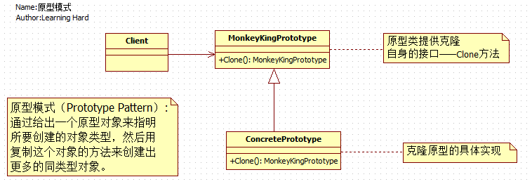

# 引言

在软件系统中，当创建一个类的实例的过程很昂贵或很复杂，并且我们需要创建多个这样类的实例时，如果我们用new操作符去创建这样的类实例，这未免会增加创建类的复杂度和耗费更多的内存空间，因为这样在内存中分配了多个一样的类实例对象，然后如果采用工厂模式来创建这样的系统的话，随着产品类的不断增加，导致子类的数量不断增多，反而增加了系统复杂程度，所以在这里使用工厂模式来封装类创建过程并不合适，然而原型模式可以很好地解决这个问题，因为每个类实例都是相同的，当我们需要多个相同的类实例时，没必要每次都使用new运算符去创建相同的类实例对象，此时我们一般思路就是想——只创建一个类实例对象，如果后面需要更多这样的实例，可以通过对原来对象拷贝一份来完成创建，这样在内存中不需要创建多个相同的类实例，从而减少内存的消耗和达到类实例的复用。 然而这个思路正是原型模式的实现方式。下面就具体介绍下设计模式中的原型设计模式。

# 原型模式的详细介绍

在现实生活中，也有很多原型设计模式的例子，例如，细胞分裂的过程，一个细胞的有丝分裂产生两个相同的细胞；还有西游记中孙悟空变出后孙的本领和火影忍者中鸣人的隐分身忍术等。下面就以孙悟空为例子来演示下原型模式的实现。具体的实现代码如下：

```
///火影忍者中鸣人的影分身和孙悟空的的变都是原型模式
    class Client
    {
        static void Main(string[] args)
        {
            // 孙悟空 原型
            MonkeyKingPrototype prototypeMonkeyKing = new ConcretePrototype("MonkeyKing");

            // 变一个
            MonkeyKingPrototype cloneMonkeyKing = prototypeMonkeyKing.Clone() as ConcretePrototype;
            Console.WriteLine("Cloned1:\t"+cloneMonkeyKing.Id);

            // 变两个
            MonkeyKingPrototype cloneMonkeyKing2 = prototypeMonkeyKing.Clone() as ConcretePrototype;
            Console.WriteLine("Cloned2:\t" + cloneMonkeyKing2.Id);
            Console.ReadLine();
        }
    }

    /// <summary>
    /// 孙悟空原型
    /// </summary>
    public  abstract class MonkeyKingPrototype
    {
        public string Id { get; set; }
        public MonkeyKingPrototype(string id)
        {
            this.Id = id;
        }

        // 克隆方法，即孙大圣说“变”
        public abstract MonkeyKingPrototype Clone();
    }

    /// <summary>
    /// 创建具体原型
    /// </summary>
    public class ConcretePrototype : MonkeyKingPrototype
    {
        public ConcretePrototype(string id)
            : base(id)
        { }

        /// <summary>
        /// 浅拷贝
        /// </summary>
        /// <returns></returns>
        public override MonkeyKingPrototype Clone()
        {
            // 调用MemberwiseClone方法实现的是浅拷贝，另外还有深拷贝
            return (MonkeyKingPrototype)this.MemberwiseClone();
        }
    }
```

上面原型模式的运行结果为（从运行结果可以看出，创建的两个拷贝对象的ID属性都是与原型对象ID属性一样的）

上面代码实现的浅拷贝的方式，浅拷贝是指当对象的字段值被拷贝时，字段引用的对象不会被拷贝。例如，如果一个对象有一个指向字符串的字段，并且我们对该对象做了一个浅拷贝，那么这两个对象将引用同一个字符串，而深拷贝是对对象实例中字段引用的对象也进行拷贝，如果一个对象有一个指向字符串的字段，并且我们对该对象进行了深拷贝的话，那么我们将创建一个对象和一个新的字符串，新的对象将引用新的字符串。也就是说，执行深拷贝创建的新对象和原来对象不会共享任何东西，改变一个对象对另外一个对象没有任何影响，而执行浅拷贝创建的新对象与原来对象共享成员，改变一个对象，另外一个对象的成员也会改变。

介绍完原型模式的实现代码之后，下面看下原型模式的类图，通过类图来理清原型模式实现中类之间的关系。具体类图如下：

[](http://127.0.0.1/?attachment_id=3980)

# 原型模式的优缺点

## 原型模式的优点

1. 原型模式向客户隐藏了创建新实例的复杂性
2. 原型模式允许动态增加或较少产品类。
3. 原型模式简化了实例的创建结构，工厂方法模式需要有一个与产品类等级结构相同的等级结构，而原型模式不需要这样。
4. 产品类不需要事先确定产品的等级结构，因为原型模式适用于任何的等级结构

## 原型模式的缺点

1. 每个类必须配备一个克隆方法
2. 配备克隆方法需要对类的功能进行通盘考虑，这对于全新的类不是很难，但对于已有的类不一定很容易，特别当一个类引用不支持串行化的间接对象，或者引用含有循环结构的时候。

# .NET中原型模式的实现

在.NET中可以很容易地通过实现ICloneable接口（这个接口就是原型，提供克隆方法，相当于与上面代码中MonkeyKingPrototype抽象类）中Clone()方法来实现原型模式，如果我们想我们自定义的类具有克隆的功能，首先定义类继承与ICloneable接口并实现Clone方法
