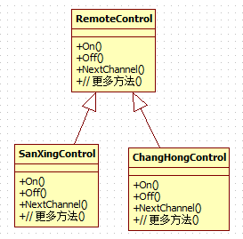

# 引言

这里以电视遥控器的一个例子来引出桥接模式解决的问题，首先，我们每个牌子的电视机都有一个遥控器，此时我们能想到的一个设计是——把遥控器做为一个抽象类，抽象类中提供遥控器的所有实现，其他具体电视品牌的遥控器都继承这个抽象类，具体设计类图如下：

[](http://127.0.0.1/?attachment_id=4017)

这样的实现使得每部不同型号的电视都有自己遥控器实现，这样的设计对于电视机的改变可以很好地应对，只需要添加一个派生类就搞定了，但随着时间的推移，用户需要改变遥控器的功能，如：用户可能后面需要对遥控器添加返回上一个台等功能时，此时上面的设计就需要修改抽象类RemoteControl的提供的接口了，此时可能只需要向抽象类中添加一个方法就可以解决了，但是这样带来的问题是我们改变了抽象的实现，如果用户需要同时改变电视机品型号和遥控器功能时，上面的设计就会导致相当大的修改，显然这样的设计并不是好的设计。然而使用桥接模式可以很好地解决这个问题，下面让我具体看看桥接模式是如何实现的。

# 桥接模式的详细介绍

## 定义

桥接模式即将抽象部分与实现部分脱耦，使它们可以独立变化。对于上面的问题中，抽象化也就是RemoteControl类，实现部分也就是On()、Off()、NextChannel()等这样的方法（即遥控器的实现），上面的设计中，抽象化和实现部分在一起，桥接模式的目的就是使两者分离，根据面向对象的封装变化的原则，我们可以把实现部分的变化（也就是遥控器功能的变化）封装到另外一个类中，这样的一个思路也就是桥接模式的实现，大家可以对照桥接模式的实现代码来解决我们的分析思路。

## 桥接模式实现

上面定义部分已经给出了我们桥接模式的目的以及实现思路了，下面让我们具体看看桥接模式是如何解决引言部分设计的不足。

抽象化部分的代码：

```
/// <summary>
    /// 抽象概念中的遥控器，扮演抽象化角色
    /// </summary>
    public class RemoteControl
    {
        // 字段
        private TV implementor;

        // 属性
        public TV Implementor
        {
            get { return implementor; }
            set { implementor = value; }
        }

        /// <summary>
        /// 开电视机，这里抽象类中不再提供实现了，而是调用实现类中的实现
        /// </summary>
        public virtual void On()
        {
            implementor.On();
        }

        /// <summary>
        /// 关电视机
        /// </summary>
        public virtual void Off()
        {
            implementor.Off();
        }

        /// <summary>
        /// 换频道
        /// </summary>
        public virtual void SetChannel()
        {
            implementor.tuneChannel();
        }
    }

    /// <summary>
    /// 具体遥控器
    /// </summary>
    public class ConcreteRemote : RemoteControl
    {
        public override void SetChannel()
        {
            Console.WriteLine("---------------------");
            base.SetChannel();
            Console.WriteLine("---------------------");
        }
    }
```

遥控器的实现方法部分代码，即实现化部分代码，此时我们用另外一个抽象类TV封装了遥控器功能的变化，具体实现交给具体型号电视机去完成：

```
/// <summary>
    /// 电视机，提供抽象方法
    /// </summary>
    public abstract class TV
    {
        public abstract void On();
        public abstract void Off();
        public abstract void tuneChannel();
    }

    /// <summary>
    /// 长虹牌电视机，重写基类的抽象方法
    /// 提供具体的实现
    /// </summary>
    public class ChangHong : TV
    {
        public override void On()
        {
            Console.WriteLine("长虹牌电视机已经打开了");
        }

        public override void Off()
        {
            Console.WriteLine("长虹牌电视机已经关掉了");
        }

        public override void tuneChannel()
        {
            Console.WriteLine("长虹牌电视机换频道");
        }
    }

    /// <summary>
    /// 三星牌电视机，重写基类的抽象方法
    /// </summary>
    public class Samsung : TV
    {
        public override void On()
        {
            Console.WriteLine("三星牌电视机已经打开了");
        }

        public override void Off()
        {
            Console.WriteLine("三星牌电视机已经关掉了");
        }

        public override void tuneChannel()
        {
            Console.WriteLine("三星牌电视机换频道");
        }
    }
```

采用桥接模式的客户端调用代码：

```
/// <summary>
    /// 以电视机遥控器的例子来演示桥接模式
    /// </summary>
    class Client
    {
        static void Main(string[] args)
        {
            // 创建一个遥控器
            RemoteControl remoteControl = new ConcreteRemote();
            // 长虹电视机
            remoteControl.Implementor = new ChangHong();
            remoteControl.On();
            remoteControl.SetChannel();
            remoteControl.Off();
            Console.WriteLine();

            // 三星牌电视机
            remoteControl.Implementor = new Samsung();
            remoteControl.On();
            remoteControl.SetChannel();
            remoteControl.Off();
            Console.Read();
        }
    }
```

上面桥接模式的实现中，遥控器的功能实现方法不在遥控器抽象类中去实现了，而是把实现部分用来另一个电视机类去封装它，然而遥控器中只包含电视机类的一个引用，同时这样的设计也非常符合现实生活中的情况（我认为的现实生活中遥控器的实现——遥控器中并不包含换台，打开电视机这样的功能的实现，遥控器只是包含了电视机上这些功能的引用，然后红外线去找到电视机上对应功能的的实现）。通过桥接模式，我们把抽象化和实现化部分分离开了，这样就可以很好应对这两方面的变化了。

## 桥接模式的类图

看完桥接模式的实现后，为了帮助大家理清对桥接模式中类之间关系，这里给出桥接模式的类图结构：

[](http://127.0.0.1/?attachment_id=4019)

# 桥接模式的优缺点

- 优点
    - 把抽象接口与其实现解耦。
    - 抽象和实现可以独立扩展，不会影响到对方。
    - 实现细节对客户透明，对用于隐藏了具体实现细节。
- 缺点
    - 增加了系统的复杂度

# 使用场景

我们再来看看桥接模式的使用场景，在以下情况下应当使用桥接模式：

- 如果一个系统需要在构件的抽象化角色和具体化角色之间添加更多的灵活性，避免在两个层次之间建立静态的联系。
- 设计要求实现化角色的任何改变不应当影响客户端，或者实现化角色的改变对客户端是完全透明的。
- 需要跨越多个平台的图形和窗口系统上。
- 一个类存在两个独立变化的维度，且两个维度都需要进行扩展。

# 一个实际应用桥接模式的例子

桥接模式也经常用于具体的系统开发中，对于三层架构中就应用了桥接模式，三层架构中的业务逻辑层BLL中通过桥接模式与数据操作层解耦（DAL），其实现方式就是在BLL层中引用了DAL层中一个引用。这样数据操作的实现可以在不改变客户端代码的情况下动态进行更换，下面看一个简单的示例代码：

```
// 客户端调用
    // 类似Web应用程序
    class Client
    {
        static void Main(string[] args)
        {
            BusinessObject customers = new CustomersBusinessObject("ShangHai");
            customers.Dataacces = new CustomersDataAccess();

            customers.Add("小六");
            Console.WriteLine("增加了一位成员的结果：");
            customers.ShowAll();
            customers.Delete("王五");
            Console.WriteLine("删除了一位成员的结果：");
            customers.ShowAll();
            Console.WriteLine("更新了一位成员的结果：");
            customers.Update("Learning_Hard");
            customers.ShowAll();

            Console.Read();
        }
    }

    // BLL 层
    public class BusinessObject
    {
        // 字段
        private DataAccess dataacess;
        private string city;

        public BusinessObject(string city)
        {
            this.city = city;
        }

        // 属性
        public DataAccess Dataacces
        {
            get { return dataacess; }
            set { dataacess = value; }
        }

        // 方法
        public virtual void Add(string name)
        {
            Dataacces.AddRecord(name);
        }

        public virtual void Delete(string name)
        {
            Dataacces.DeleteRecord(name);
        }

        public virtual void Update(string name)
        {
            Dataacces.UpdateRecord(name);
        }

        public virtual string Get(int index)
        {
            return Dataacces.GetRecord(index);
        }
        public virtual void ShowAll()
        {
            Console.WriteLine();
            Console.WriteLine("{0}的顾客有：", city);
            Dataacces.ShowAllRecords();
        }
    }

    public class CustomersBusinessObject : BusinessObject
    {
        public CustomersBusinessObject(string city) 
            : base(city) { }

        // 重写方法
        public override void ShowAll()
        {
            Console.WriteLine("------------------------");
            base.ShowAll();
            Console.WriteLine("------------------------");
        }
    }

    /// <summary>
    /// 相当于三层架构中数据访问层（DAL）
    /// </summary>
    public abstract class DataAccess
    {
        // 对记录的增删改查操作
        public abstract void AddRecord(string name);
        public abstract void DeleteRecord(string name);
        public abstract void UpdateRecord(string name);
        public abstract string GetRecord(int index);
        public abstract void ShowAllRecords();
    }

    public class CustomersDataAccess:DataAccess
    {
        // 字段
        private List<string> customers =new List<string>();

        public CustomersDataAccess()
        {
            // 实际业务中从数据库中读取数据再填充列表
            customers.Add("Learning Hard");
            customers.Add("张三");
            customers.Add("李四");
            customers.Add("王五");
        }
        // 重写方法
        public override void AddRecord(string name)
        {
            customers.Add(name);
        }

        public override void DeleteRecord(string name)
        {
            customers.Remove(name);
        }

        public override void UpdateRecord(string updatename)
        {
            customers[0] = updatename;
        }

        public override string GetRecord(int index)
        {
            return customers[index];
        }

        public override void ShowAllRecords()
        {
            foreach (string name in customers)
            {
                Console.WriteLine(" " + name);
            }
        }
        
    }
```
