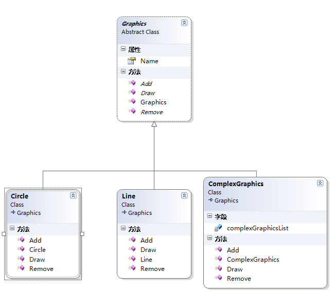
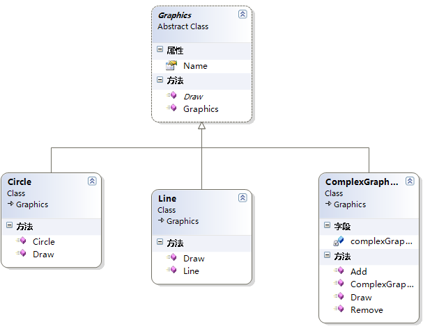

# 引言

在软件开发过程中，我们经常会遇到处理简单对象和复合对象的情况，例如对操作系统中目录的处理就是这样的一个例子，因为目录可以包括单独的文件，也可以包括文件夹，文件夹又是由文件组成的，由于简单对象和复合对象在功能上区别，导致在操作过程中必须区分简单对象和复合对象，这样就会导致客户调用带来不必要的麻烦，然而作为客户，它们希望能够始终一致地对待简单对象和复合对象。然而组合模式就是解决这样的问题。下面让我们看看组合模式是怎样解决这个问题的。

# 组合模式的详细介绍

## 定义

组合模式允许你将对象组合成树形结构来表现”部分-整体“的层次结构，使得客户以一致的方式处理单个对象以及对象的组合。下面我们用绘制的例子来详细介绍组合模式，图形可以由一些基本图形元素组成（如直线，圆等），也可以由一些复杂图形组成（由基本图形元素组合而成），为了使客户对基本图形和复杂图形的调用保持一致，我们使用组合模式来达到整个目的。

组合模式实现的最关键的地方是——简单对象和复合对象必须实现相同的接口。这就是组合模式能够将组合对象和简单对象进行一致处理的原因。

## 实现

```
// 通过一些简单图形以及一些复杂图形构建图形树来演示组合模式
    // 客户端调用
    class Client
    {
        static void Main(string[] args)
        {
            ComplexGraphics complexGraphics = new ComplexGraphics("一个复杂图形和两条线段组成的复杂图形");
            complexGraphics.Add(new Line("线段A"));
            ComplexGraphics CompositeCG = new ComplexGraphics("一个圆和一条线组成的复杂图形");
            CompositeCG.Add(new Circle("圆"));
            CompositeCG.Add(new Circle("线段B"));
            complexGraphics.Add(CompositeCG);
            Line l = new Line("线段C");
            complexGraphics.Add(l);

            // 显示复杂图形的画法
            Console.WriteLine("复杂图形的绘制如下：");
            Console.WriteLine("---------------------");
            complexGraphics.Draw();
            Console.WriteLine("复杂图形绘制完成");
            Console.WriteLine("---------------------");
            Console.WriteLine();

            // 移除一个组件再显示复杂图形的画法
            complexGraphics.Remove(l);
            Console.WriteLine("移除线段C后，复杂图形的绘制如下：");
            Console.WriteLine("---------------------");
            complexGraphics.Draw();
            Console.WriteLine("复杂图形绘制完成");
            Console.WriteLine("---------------------");
            Console.Read();
        }
    }

    /// <summary>
    /// 图形抽象类，
    /// </summary>
    public abstract class Graphics
    {
        public string Name { get; set; }
        public Graphics(string name)
        {
            this.Name = name;
        }

        public abstract void Draw();
        public abstract void Add(Graphics g);
        public abstract void Remove(Graphics g);
    }

    /// <summary>
    /// 简单图形类——线
    /// </summary>
    public class Line : Graphics
    {
        public Line(string name)
            : base(name)
        { }

        // 重写父类抽象方法
        public override void Draw()
        {
            Console.WriteLine("画  " + Name);
        }
        // 因为简单图形在添加或移除其他图形，所以简单图形Add或Remove方法没有任何意义
        // 如果客户端调用了简单图形的Add或Remove方法将会在运行时抛出异常
        // 我们可以在客户端捕获该类移除并处理
        public override void Add(Graphics g)
        {
            throw new Exception("不能向简单图形Line添加其他图形");
        }
        public override void Remove(Graphics g)
        {
            throw new Exception("不能向简单图形Line移除其他图形");
        }
    }

    /// <summary>
    /// 简单图形类——圆
    /// </summary>
    public class Circle : Graphics
    {
        public Circle(string name)
            : base(name)
        { }

        // 重写父类抽象方法
        public override void Draw()
        {
            Console.WriteLine("画  " + Name);
        }

        public override void Add(Graphics g)
        {
            throw new Exception("不能向简单图形Circle添加其他图形");
        }
        public override void Remove(Graphics g)
        {
            throw new Exception("不能向简单图形Circle移除其他图形");
        }
    }

    /// <summary>
    /// 复杂图形，由一些简单图形组成,这里假设该复杂图形由一个圆两条线组成的复杂图形
    /// </summary>
    public class ComplexGraphics : Graphics
    {
        private List<Graphics> complexGraphicsList = new List<Graphics>();

        public ComplexGraphics(string name)
            : base(name)
        { }

        /// <summary>
        /// 复杂图形的画法
        /// </summary>
        public override void Draw()
        {          
            foreach (Graphics g in complexGraphicsList)
            {
                g.Draw();
            }
        }

        public override void Add(Graphics g)
        {
            complexGraphicsList.Add(g);
        }
        public override void Remove(Graphics g)
        {
            complexGraphicsList.Remove(g);
        }
    }
```

 

由于基本图形对象不存在Add和Remove方法，上面实现中直接通过抛出一个异常的方式来解决这样的问题的，但是我们想以一种更安全的方式来解决——因为基本图形根本不存在这样的方法，我们是不是可以移除这些方法呢？为了移除这些方法，我们就不得不修改Graphics接口，我们把管理子对象的方法声明放在复合图形对象里面，这样简单对象Line、Circle使用这些方法时在编译时就会出错，这样的一种实现方式我们称为安全式的组合模式，然而上面的实现方式称为透明式的组合模式，下面让我们看看安全式的组合模式又是怎样实现的，具体实现代码如下：

```
/// 安全式的组合模式
    /// 此方式实现的组合模式把管理子对象的方法声明在树枝构件ComplexGraphics类中
    /// 这样如果叶子节点Line、Circle使用了Add或Remove方法时，就能在编译期间出现错误
    /// 但这种方式虽然解决了透明式组合模式的问题，但是它使得叶子节点和树枝构件具有不一样的接口。
    /// 所以这两种方式实现的组合模式各有优缺点，具体使用哪个，可以根据问题的实际情况而定
    class Client
    {
        static void Main(string[] args)
        {
            ComplexGraphics complexGraphics = new ComplexGraphics("一个复杂图形和两条线段组成的复杂图形");
            complexGraphics.Add(new Line("线段A"));
            ComplexGraphics CompositeCG = new ComplexGraphics("一个圆和一条线组成的复杂图形");
            CompositeCG.Add(new Circle("圆"));
            CompositeCG.Add(new Circle("线段B"));
            complexGraphics.Add(CompositeCG);
            Line l = new Line("线段C");
            complexGraphics.Add(l);

            // 显示复杂图形的画法
            Console.WriteLine("复杂图形的绘制如下：");
            Console.WriteLine("---------------------");
            complexGraphics.Draw();
            Console.WriteLine("复杂图形绘制完成");
            Console.WriteLine("---------------------");
            Console.WriteLine();

            // 移除一个组件再显示复杂图形的画法
            complexGraphics.Remove(l);
            Console.WriteLine("移除线段C后，复杂图形的绘制如下：");
            Console.WriteLine("---------------------");
            complexGraphics.Draw();
            Console.WriteLine("复杂图形绘制完成");
            Console.WriteLine("---------------------");
            Console.Read();
        }
    }

    /// <summary>
    /// 图形抽象类，
    /// </summary>
    public abstract class Graphics
    {
        public string Name { get; set; }
        public Graphics(string name)
        {
            this.Name = name;
        }

        public abstract void Draw();
        // 移除了Add和Remove方法
        // 把管理子对象的方法放到了ComplexGraphics类中进行管理
        // 因为这些方法只在复杂图形中才有意义
    }

    /// <summary>
    /// 简单图形类——线
    /// </summary>
    public class Line : Graphics
    {
        public Line(string name)
            : base(name)
        { }

        // 重写父类抽象方法
        public override void Draw()
        {
            Console.WriteLine("画  " + Name);
        }
    }

    /// <summary>
    /// 简单图形类——圆
    /// </summary>
    public class Circle : Graphics
    {
        public Circle(string name)
            : base(name)
        { }

        // 重写父类抽象方法
        public override void Draw()
        {
            Console.WriteLine("画  " + Name);
        }
    }

    /// <summary>
    /// 复杂图形，由一些简单图形组成,这里假设该复杂图形由一个圆两条线组成的复杂图形
    /// </summary>
    public class ComplexGraphics : Graphics
    {
        private List<Graphics> complexGraphicsList = new List<Graphics>();
        public ComplexGraphics(string name)
            : base(name)
        { }

        /// <summary>
        /// 复杂图形的画法
        /// </summary>
        public override void Draw()
        {
            foreach (Graphics g in complexGraphicsList)
            {
                g.Draw();
            }
        }

        public void Add(Graphics g)
        {
            complexGraphicsList.Add(g);
        }
        public void Remove(Graphics g)
        {
            complexGraphicsList.Remove(g);
        }
    }
```

## 组合模式的类图

看完了上面两者方式的实现之后，让我们具体看看组合模式的类图来理清楚组合模式中类之间的关系。

透明式的组合模式类图：

[](http://127.0.0.1/?attachment_id=4021)

安全式组合模式的类图：

[](http://127.0.0.1/?attachment_id=4022)

组合模式中涉及到三个角色：

- 抽象构件（Component）角色：这是一个抽象角色，上面实现中Graphics充当这个角色，它给参加组合的对象定义出了公共的接口及默认行为，可以用来管理所有的子对象（在透明式的组合模式是这样的）。在安全式的组合模式里，构件角色并不定义出管理子对象的方法，这一定义由树枝结构对象给出。
- 树叶构件（Leaf）角色：树叶对象时没有下级子对象的对象，上面实现中Line和Circle充当这个角色，定义出参加组合的原始对象的行为
- 树枝构件（Composite）角色：代表参加组合的有下级子对象的对象，上面实现中ComplexGraphics充当这个角色，树枝对象给出所有管理子对象的方法实现，如Add、Remove等。

# 组合模式的优缺点

- 优点
    - 组合模式使得客户端代码可以一致地处理对象和对象容器，无需关系处理的单个对象，还是组合的对象容器。
    - 将”客户代码与复杂的对象容器结构“解耦。
    - 可以更容易地往组合对象中加入新的构件。
- 缺点
    - 使得设计更加复杂。客户端需要花更多时间理清类之间的层次关系。（这个是几乎所有设计模式所面临的问题）。
- 注意的问题
    - 客户端尽量不要直接调用树叶类中的方法（在我上面实现就是这样的，创建的是一个树枝的具体对象，应该使用Graphics complexGraphics = new ComplexGraphics("一个复杂图形和两条线段组成的复杂图形");），而是借用其父类（Graphics）的多态性完成调用，这样可以增加代码的复用性。

# 使用场景

在以下情况下应该考虑使用组合模式：

1. 需要表示一个对象整体或部分的层次结构。
2. 希望用户忽略组合对象与单个对象的不同，用户将统一地使用组合结构中的所有对象。

# 组合模式在.NET中的应用

组合模式在.NET 中最典型的应用就是应用与WinForms和Web的开发中，在.NET类库中，都为这两个平台提供了很多现有的控件，然而System.Windows.Forms.dll中System.Windows.Forms.Control类就应用了组合模式，因为控件包括Label、TextBox等这样的简单控件，同时也包括GroupBox、DataGrid这样复合的控件，每个控件都需要调用OnPaint方法来进行控件显示，为了表示这种对象之间整体与部分的层次结构，微软把Control类的实现应用了组合模式（确切地说应用了透明式的组合模式）。
