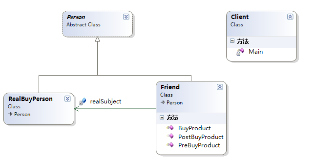

# 引言

在软件开发过程中，有些对象有时候会由于网络或其他的障碍，以至于不能够或者不能直接访问到这些对象，如果直接访问对象给系统带来不必要的复杂性，这时候可以在客户端和目标对象之间增加一层中间层，让代理对象代替目标对象，然后客户端只需要访问代理对象，由代理对象去帮我们去请求目标对象并返回结果给客户端，这样的一个解决思路就是今天要介绍的代理模式。

# 详细介绍

代理模式按照使用目的可以分为以下几种：

- 远程（Remote）代理：为一个位于不同的地址空间的对象提供一个局域代表对象。这个不同的地址空间可以是本电脑中，也可以在另一台电脑中。最典型的例子就是——客户端调用Web服务或WCF服务。
- 虚拟（Virtual）代理：根据需要创建一个资源消耗较大的对象，使得对象只在需要时才会被真正创建。
- Copy-on-Write代理：虚拟代理的一种，把复制（或者叫克隆）拖延到只有在客户端需要时，才真正采取行动。
- 保护（Protect or Access）代理：控制一个对象的访问，可以给不同的用户提供不同级别的使用权限。
- 防火墙（Firewall）代理：保护目标不让恶意用户接近。
- 智能引用（Smart Reference）代理：当一个对象被引用时，提供一些额外的操作，比如将对此对象调用的次数记录下来等。
- Cache代理：为某一个目标操作的结果提供临时的存储空间，以便多个客户端可以这些结果。

在哦上面所有种类的代理模式中，虚拟代理、远程代理、智能引用代理和保护代理较为常见的代理模式。下面让我们具体看看代理模式的具体定义。

## 定义

代理模式——就是给某一个对象提供一个代理，并由代理对象控制对原对象的引用。在一些情况下，一个客户不想或者不能直接引用一个对象，而代理对象可以在客户端和目标对象之间起到中介的作用。例如电脑桌面的快捷方式就是一个代理对象，快捷方式是它所引用的程序的一个代理。

## 实现

看完代理模式的描述之后，下面以一个生活中的例子来解释下代理模式，在现实生活中，如果有同事出国或者朋友出国的情况下，我们经常会拖这位朋友帮忙带一些电子产品或化妆品等东西，这个场景中，出国的朋友就是一个代理，他（她）是他（她）朋友的一个代理，由于他朋友不能去国外买东西，他却可以，所以朋友们都托他帮忙带一些东西的。下面就以这个场景来实现下代理模式，具体代码如下：

```
// 客户端调用
    class Client
    {
        static void Main(string[] args)
        {
            // 创建一个代理对象并发出请求
            Person proxy = new Friend();
            proxy.BuyProduct();
            Console.Read();
        }
    }

    // 抽象主题角色
    public abstract class Person
    {
        public abstract void BuyProduct();
    }

    //真实主题角色
    public class RealBuyPerson : Person
    {
        public override void BuyProduct()
        {
            Console.WriteLine("帮我买一个IPhone和一台苹果电脑");
        }
    }

    // 代理角色
    public class Friend:Person
    {
        // 引用真实主题实例
        RealBuyPerson realSubject;

        public override void BuyProduct()
        {
            Console.WriteLine("通过代理类访问真实实体对象的方法");
            if (realSubject == null)
            {
                realSubject = new RealBuyPerson();
            }

            this.PreBuyProduct();
            // 调用真实主题方法
            realSubject.BuyProduct();
            this.PostBuyProduct();
        }

        // 代理角色执行的一些操作
        public void PreBuyProduct()
        {
            // 可能不知一个朋友叫这位朋友带东西，首先这位出国的朋友要对每一位朋友要带的东西列一个清单等
            Console.WriteLine("我怕弄糊涂了，需要列一张清单，张三：要带相机，李四：要带Iphone...........");
        }
        
        // 买完东西之后，代理角色需要针对每位朋友需要的对买来的东西进行分类
        public void PostBuyProduct()
        {
            Console.WriteLine("终于买完了，现在要对东西分一下，相机是张三的；Iphone是李四的..........");
        }
    }
```

## 类图结构

看完代理模式的实现之后，下面就以上面的例子来分析下代理模式的类图结构。具体的类图如下所示：

[](http://127.0.0.1/?attachment_id=4034)

在上面类图中，代理模式所涉及的角色有三个：

- 抽象主题角色（Person）：声明了真实主题和代理主题的公共接口，这样一来在使用真实主题的任何地方都可以使用代理主题。
- 代理主题角色（Friend）：代理主题角色内部含有对真实主题的引用，从而可以操作真实主题对象；代理主题角色负责在需要的时候创建真实主题对象；代理角色通常在将客户端调用传递到真实主题之前或之后，都要执行一些其他的操作，而不是单纯地将调用传递给真实主题对象。例如这里的PreBuyProduct和PostBuyProduct方法就是代理主题角色所执行的其他操作。
- 真实主题角色（RealBuyPerson）：定义了代理角色所代表的真是对象。

附：在实际开发过程中，我们在客户端添加服务引用的时候，在客户程序中会添加一些额外的类，在客户端生成的类扮演着代理主题角色，我们客户端也是直接调用这些代理角色来访问远程服务提供的操作。这个是远程代理的一个典型例子。

# 优缺点

- 优点
    - 代理模式能够将调用用于真正被调用的对象隔离，在一定程度上降低了系统的耦合度；
    - 代理对象在客户端和目标对象之间起到一个中介的作用，这样可以起到对目标对象的保护。代理对象可以在对目标对象发出请求之前进行一个额外的操作，例如权限检查等。
- 缺点
    - 由于在客户端和真实主题之间增加了一个代理对象，所以会造成请求的处理速度变慢
    - 实现代理类也需要额外的工作，从而增加了系统的实现复杂度。
