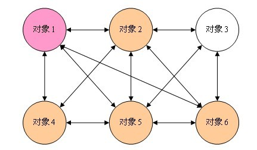
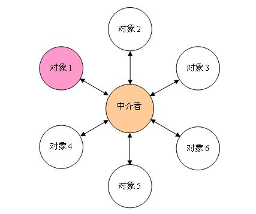

# 引言

在现实生活中，有很多中介者模式的身影，例如QQ游戏平台，聊天室、QQ群和短信平台，这些都是中介者模式在现实生活中的应用，下面就具体分享下我对中介者模式的理解。

# 介绍

## 定义

从生活中的例子可以看出，不论是QQ游戏还是QQ群，它们都是充当一个中间平台，QQ用户可以登录这个中间平台与其他QQ用户进行交流，如果没有这些中间平台，我们如果想与朋友进行聊天的话，可能就需要当面才可以了。电话、短信也同样是一个中间平台，有了这个中间平台，每个用户都不要直接依赖与其他用户，只需要依赖这个中间平台就可以了，一切操作都由中间平台去分发。了解完中介模式在生活中的模型后，下面给出中介模式的正式定义。

中介者模式，定义了一个中介对象来封装一系列对象之间的交互关系。中介者使各个对象之间不需要显式地相互引用，从而使耦合性降低，而且可以独立地改变它们之间的交互行为。

## 结构

从生活中例子自然知道，中介者模式设计两个具体对象，一个是用户类，另一个是中介者类，根据针对接口编程原则，则需要把这两类角色进行抽象，所以中介者模式中就有了4类角色，它们分别是：抽象中介者角色，具体中介者角色、抽象同事类和具体同事类。中介者类是起到协调各个对象的作用，则抽象中介者角色中则需要保存各个对象的引用。有了上面的分析，则就不难理解中介者模式的结构图了，具体结构图如下所示：

[](http://127.0.0.1/?attachment_id=4046)

## 为什么要使用中介者模式

在现实生活中，中介者的存在是不可缺少的，如果没有了中介者，我们就不能与远方的朋友进行交流了。而在软件设计领域，为什么要使用中介者模式呢？如果不使用中介者模式的话，各个同事对象将会相互进行引用，如果每个对象都与多个对象进行交互时，将会形成如下图所示的网状结构。

[](http://127.0.0.1/?attachment_id=4063)

从上图可以发现，如果不使用中介者模式的话，每个对象之间过度耦合，这样的既不利于类的复用也不利于扩展。如果引入了中介者模式，那么对象之间的关系将变成星型结构，采用中介者模式之后会形成如下图所示的结构：

[](http://127.0.0.1/?attachment_id=4064)

从上图可以发现，使用中介者模式之后，任何一个类的变化，只会影响中介者和类本身，不像之前的设计，任何一个类的变化都会引起其关联所有类的变化。这样的设计大大减少了系统的耦合度。

## 实现

介绍完中介者模式的定义和存在的必要性后，下面就以现实生活中打牌的例子来实现下中介者模式。在现实生活中，两个人打牌，如果某个人赢了都会影响到对方状态的改变。如果此时不采用中介者模式实现的话，则上面的场景的实现如下所示：

```
// 抽象牌友类
    public abstract class AbstractCardPartner
    {
        public int MoneyCount { get; set; }

        public AbstractCardPartner()
        {
            MoneyCount = 0;
        }

        public abstract void ChangeCount(int Count, AbstractCardPartner other);
    }

    // 牌友A类
    public class ParterA : AbstractCardPartner
    {
        public override void ChangeCount(int Count, AbstractCardPartner other)
        {
            this.MoneyCount += Count;
            other.MoneyCount -= Count;
        }
    }

    // 牌友B类
    public class ParterB : AbstractCardPartner
    {
        public override void ChangeCount(int Count, AbstractCardPartner other)
        {
            this.MoneyCount += Count;
            other.MoneyCount -= Count;
        }
    }

    class Program
    {
        // A,B两个人打牌
        static void Main(string[] args)
        {
            AbstractCardPartner A = new ParterA();
            A.MoneyCount = 20;
            AbstractCardPartner B = new ParterB();
            B.MoneyCount = 20;

            // A 赢了则B的钱就减少
            A.ChangeCount(5, B);
            Console.WriteLine("A 现在的钱是：{0}", A.MoneyCount);// 应该是25
            Console.WriteLine("B 现在的钱是：{0}", B.MoneyCount); // 应该是15
            
            // B赢了A的钱也减少
            B.ChangeCount(10, A);
            Console.WriteLine("A 现在的钱是：{0}", A.MoneyCount); // 应该是15
            Console.WriteLine("B 现在的钱是：{0}", B.MoneyCount); // 应该是25
            Console.Read();        
        }
    }
```

上面确实完美解决了上面场景中的问题，并且使用了抽象类使具体牌友A和牌友B都依赖于抽象类，从而降低了同事类之间的耦合度。但是这样的设计，如果其中牌友A发生变化时，此时就会影响到牌友B的状态，如果涉及的对象变多的话，这时候某一个牌友的变化将会影响到其他所有相关联的牌友状态。例如牌友A算错了钱，这时候牌友A和牌友B的钱数都不正确了，如果是多个人打牌的话，影响的对象就会更多。这时候就会思考——能不能把算钱的任务交给程序或者算数好的人去计算呢，这时候就有了我们QQ游戏中的欢乐斗地主等牌类游戏了。所以上面的设计，我们还是有进一步完善的方案的，即加入一个中介者对象来协调各个对象之间的关联，这也就是中介者模式的应用了，具体完善后的实现代码如下所示：

```
namespace MediatorPattern
{
    // 抽象牌友类
    public abstract class AbstractCardPartner
    {
        public int MoneyCount { get; set; }

        public AbstractCardPartner()
        {
            MoneyCount = 0;
        }

        public abstract void ChangeCount(int Count, AbstractMediator mediator);
    }

    // 牌友A类
    public class ParterA : AbstractCardPartner
    {
        // 依赖与抽象中介者对象
        public override void ChangeCount(int Count, AbstractMediator mediator)
        {
            mediator.AWin(Count);
        }
    }

    // 牌友B类
    public class ParterB : AbstractCardPartner
    {
        // 依赖与抽象中介者对象
        public override void ChangeCount(int Count, AbstractMediator mediator)
        {
            mediator.BWin(Count);
        }
    }

    // 抽象中介者类
    public abstract class AbstractMediator
    {
        protected AbstractCardPartner A;
        protected AbstractCardPartner B;
        public AbstractMediator(AbstractCardPartner a, AbstractCardPartner b)
        {
            A = a;
            B = b;
        }

        public abstract void AWin(int count);
        public abstract void BWin(int count);
    }

    // 具体中介者类
    public class MediatorPater : AbstractMediator
    {
        public MediatorPater(AbstractCardPartner a, AbstractCardPartner b)
            : base(a, b)
        {
        }

        public override void AWin(int count)
        {
            A.MoneyCount += count;
            B.MoneyCount -= count;
        }

        public override void BWin(int count)
        {
            B.MoneyCount += count;
            A.MoneyCount -= count;
        }
    }

    class Program
    {
        static void Main(string[] args)
        {
            AbstractCardPartner A = new ParterA();
            AbstractCardPartner B = new ParterB();
            // 初始钱
            A.MoneyCount = 20;
            B.MoneyCount = 20;

            AbstractMediator mediator = new MediatorPater(A, B);

            // A赢了
            A.ChangeCount(5, mediator);
            Console.WriteLine("A 现在的钱是：{0}", A.MoneyCount);// 应该是25
            Console.WriteLine("B 现在的钱是：{0}", B.MoneyCount); // 应该是15

            // B 赢了
            B.ChangeCount(10, mediator);
            Console.WriteLine("A 现在的钱是：{0}", A.MoneyCount);// 应该是15
            Console.WriteLine("B 现在的钱是：{0}", B.MoneyCount); // 应该是25
            Console.Read();
        }
    }
}
```

在上面的实现代码中，抽象中介者类保存了两个抽象牌友类，如果新添加一个牌友类似时，此时就不得不去更改这个抽象中介者类。可以结合观察者模式来解决这个问题，即抽象中介者对象保存抽象牌友的类别，然后添加Register和UnRegister方法来对该列表进行管理，然后在具体中介者类中修改AWin和BWin方法，遍历列表，改变自己和其他牌友的钱数。这样的设计还是存在一个问题——即增加一个新牌友时，此时虽然解决了抽象中介者类不需要修改的问题，但此时还是不得不去修改具体中介者类，即添加CWin方法，我们可以采用状态模式来解决这个问题，关于状态模式的介绍将会在下一专题进行分享。

# 适用场景

一般在以下情况下可以考虑使用中介者模式：

- 一组定义良好的对象，现在要进行复杂的相互通信。
- 想通过一个中间类来封装多个类中的行为，而又不想生成太多的子类。

# 优缺点

## 优点

- 简化了对象之间的关系，将系统的各个对象之间的相互关系进行封装，将各个同事类解耦，使得系统变为松耦合。
- 提供系统的灵活性，使得各个同事对象独立而易于复用。

## 缺点

- 中介者模式中，中介者角色承担了较多的责任，所以一旦这个中介者对象出现了问题，整个系统将会受到重大的影响。例如，QQ游戏中计算欢乐豆的程序出错了，这样会造成重大的影响。
- 新增加一个同事类时，不得不去修改抽象中介者类和具体中介者类，此时可以使用观察者模式和状态模式来解决这个问题。

# 总结

中介者模式，定义了一个中介对象来封装系列对象之间的交互。中介者使各个对象不需要显式地相互引用，从而使其耦合性降低，而且可以独立地改变它们之间的交互。中介者模式一般应用于一组定义良好的对象之间需要进行通信的场合以及想定制一个分布在多个类中的行为，而又不想生成太多的子类的情形下。
