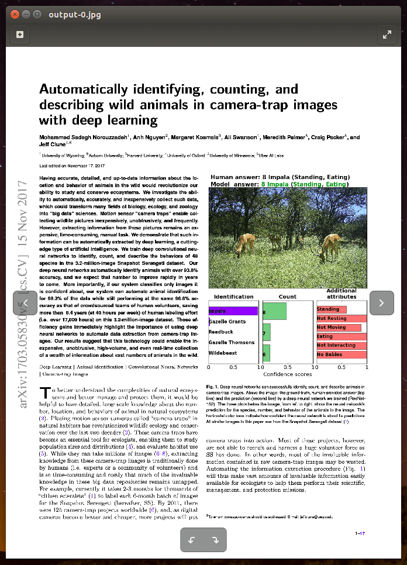
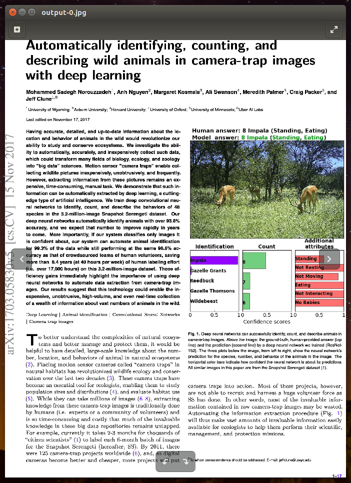
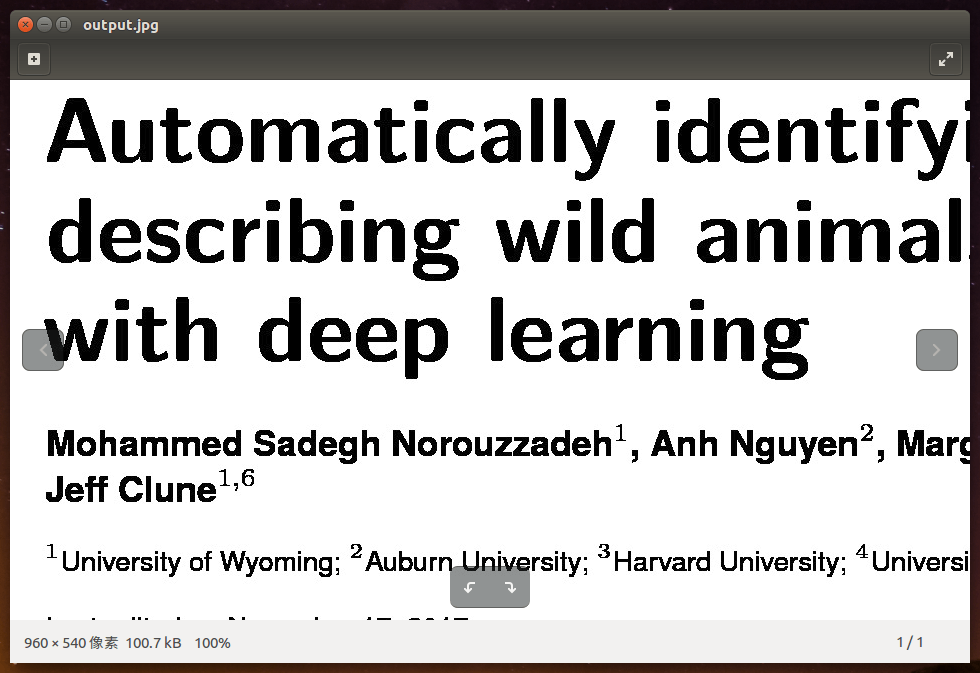
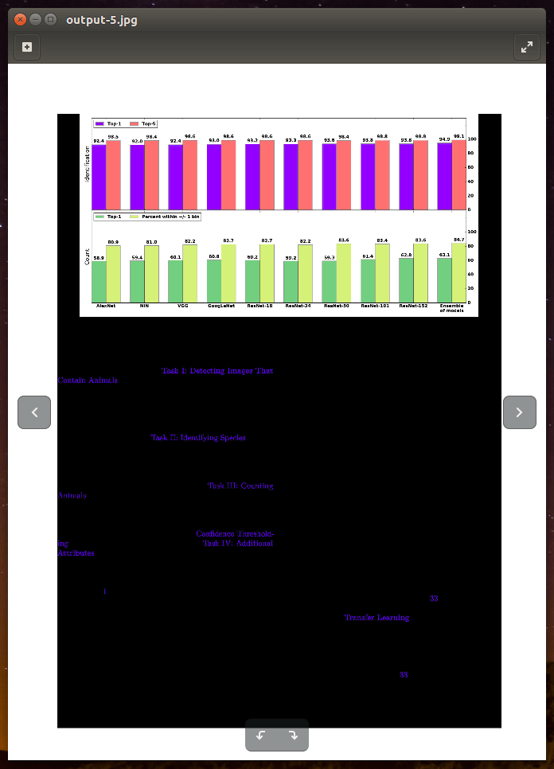
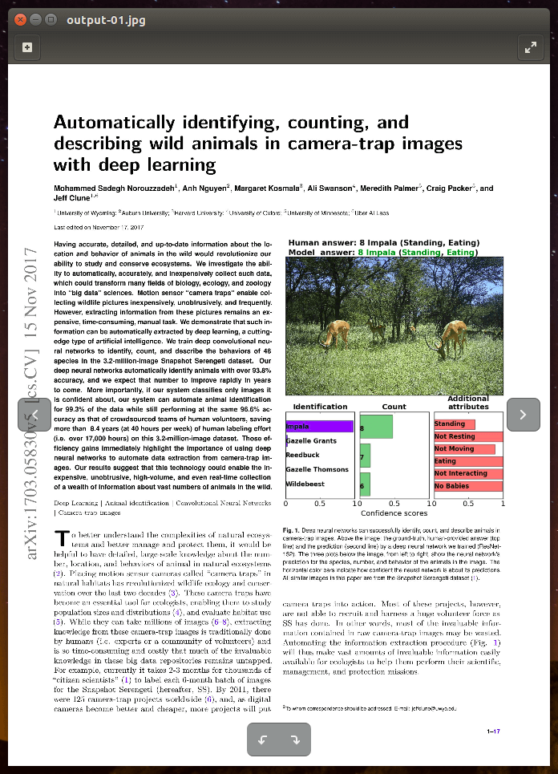
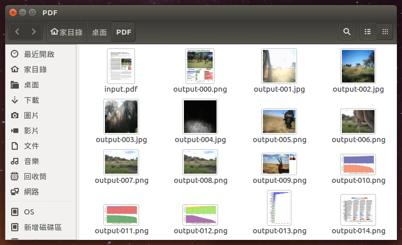
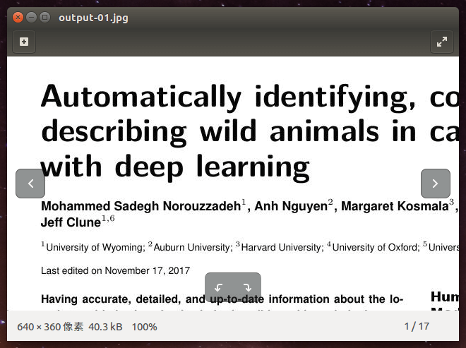

原文 ： [https://blog.gtwang.org/linux/linux-convert-pdf-to-image-commands-tutorial-examples/](https://blog.gtwang.org/linux/linux-convert-pdf-to-image-commands-tutorial-examples/)

這裡介紹各種在 Linux 下將 PDF 檔轉為圖片檔的指令工具，並提供實用的自動化指令稿，解決大量轉檔問題。

最近我手上有非常大量的 PDF 檔案需要放在網頁上讓人瀏覽，但是因為有些 PDF 檔案非常大，如果直接放在網頁上觀看的話，使用者會需要等待整個 PDF 檔都下載完成後，才能觀看，效率不是很好。

另外我也希望的這些 PDF 檔案有基本的防拷保護，讓人可以自由觀看，但不要輕易就全部下載回去。

考量效率以及防考功能，最簡單的作法應該就是把 PDF 的每一頁都轉成圖片檔，放在網頁中使用一般的 JavaScript 圖庫工具來處理，這樣使用者每次只需要下載單頁的圖檔，速度會比較快，若使用者要下載，就只能下載單頁的圖片（雖然對於高手沒差，不過至少有基本的防護）。

以下我整理了幾種 Linux 系統上可以把 PDF 檔轉為圖片檔的指令工具，並且提供自動化的指令稿，可以自動處理大量的 PDF 轉檔工作。

## ImageMagick

[ImageMagick](https://www.imagemagick.org/) 是一套功能強大的圖片處理工具箱，若要將 PDF 檔案轉為圖檔，可以使用其 `convert` 轉檔指令：

```
# 使用 ImageMagick 將 PDF 檔轉為 JPG 圖片檔
convert -density 300 input.pdf -quality 90 output.jpg
```

這裡的 `-density` 參數是指定輸出圖檔的[每英寸點數（dpi）](https://zh.wikipedia.org/wiki/%E6%AF%8F%E8%8B%B1%E5%AF%B8%E7%82%B9%E6%95%B0)，`300` 是普通的品質，若想要解析度高一點，可以設定為 `400` 或 `600`。而 `-quality` 參數是指定圖片壓縮層級。

執行後，ImageMagick 就會以使用者指定的輸出檔名，再加上自動的編號來產生每一頁的圖檔名稱，把 PDF 的每一頁各儲存成一張圖檔。轉出來的結果會像這樣：

[](https://blog.gtwang.org/wp-content/uploads/2018/02/linux-convert-pdf-to-image-commands-tutorial-examples-20180207-2.png)

ImageMagick 將 PDF 轉 JPG 圖檔

### 輸出圖檔格式

ImageMagick 支援許多種輸出圖檔格式，若要輸出其他格式的圖檔，就直接更改輸出檔名的副檔名即可：

```
# 將 PDF 檔轉為 PNG 圖片檔案
convert -density 300 input.pdf -quality 90 output.png
```

### 選擇部分頁面

如果只想要轉換 PDF 檔中的部分頁面，可以使用中括號來指定頁碼（從 `0` 開始算起）：

```
# 只抽取 input.pdf 的第五頁，轉為 JPG 檔
convert -density 300 input.pdf[4] -quality 90 output.jpg

# 只抽取 input.pdf 的前三頁，轉為 JPG 檔
convert -density 300 input.pdf[0-2] -quality 90 output.jpg
```

### 去除白色邊緣

一般的 PDF 文件一定都會有周圍的白邊，如果不想讓周圍的空白區域佔去太多版面，可以加上 `-trim` 讓 ImageMagick 自動把白邊去除：

```
# 自動去除白色邊緣
convert -density 300 input.pdf -quality 90 -trim output.jpg
```

產生的結果會類似這樣：

[](https://blog.gtwang.org/wp-content/uploads/2018/02/linux-convert-pdf-to-image-commands-tutorial-examples-20180207-3.png)

去除圖片白邊

ImageMagick 去除白邊的方法是以最角落的像素顏色為準，凡是跟最角落像素的顏色相同的邊緣就自動去除，如果想要放寬判斷邊緣的標準，可以使用 [`-fuzz`](https://www.imagemagick.org/script/command-line-options.php#fuzz) 來指定放寬的門檻值。

### 裁切區域

若要將轉出來的圖片進行裁切，取出部份的區域，可以加上 `-extract` 參數，並指定區域的大小與位置，以下是一個範例：

```
# 裁切一個寬度為 960 像素、高度為 540 像素的區域，
# 此區域距離左邊界 180 像素、距離上邊界 220 像素
convert -density 300 -extract 960x540+180+220 input.pdf output.jpg
```

輸出的結果會像這樣：

[](https://blog.gtwang.org/wp-content/uploads/2018/02/linux-convert-pdf-to-image-commands-tutorial-examples-20180207-7.png)

裁切的區域

### 黑色背景問題

有時候使用 `convert` 將 PDF 文件轉為 JPG 圖檔時，會產生黑色的背景，類似這樣：

[](https://blog.gtwang.org/wp-content/uploads/2018/02/linux-convert-pdf-to-image-commands-tutorial-examples-20180207-1.png)

ImageMagick 將 PDF 轉 JPG 產生黑色背景

若遇到這樣的問題，可以加上 `-alpha remove` 或是 `-alpha flatten` 參數即可解決：

```
# 解決 PDF 轉 JPG 產生黑色背景問題（方法一）
convert -density 300 input.pdf -quality 90 -alpha remove output.jpg

# 解決 PDF 轉 JPG 產生黑色背景問題（方法二）
convert -density 300 input.pdf -quality 90 -alpha flatten output.jpg
```

ImageMagick 雖然功能相當齊全，不過它的處理速度非常慢，若有處理速度上的考量，可以考慮下面要介紹的幾種轉換工具，請繼續閱讀下一頁。

 

## pdftoppm

`pdftoppm` 是 Linux 系統上專門用來將 PDF 檔案轉為圖檔的工具，轉檔速度比 ImageMagick 更快，效果也很相當不錯。其基本使用方式為：

```
# 使用 pdftoppm 將 PDF 檔轉為 JPG 圖片檔
pdftoppm -r 300 -jpeg input.pdf output
```

其中 `-r` 參數可用來指定每英寸點數（dpi），而 `-jpeg` 是指定輸出圖檔格式為 JPG，這裡的輸出檔名不需要寫副檔名，`pdftoppm` 會以使用者指定的輸出檔名，再加上自動的編號與副檔名來產生每一頁的圖檔名稱，把 PDF 的每一頁各儲存成一張圖檔。轉出來的結果會像這樣：

[](https://blog.gtwang.org/wp-content/uploads/2018/02/linux-convert-pdf-to-image-commands-tutorial-examples-20180207-4.png)

`pdftoppm` 將 PDF 轉 JPG 圖檔

### 輸出圖檔格式

`pdftoppm` 這個工具在轉換 PDF 檔案時，若不指定輸出檔案格式的話，它會將 PDF 的頁面轉為 PPM 這種圖檔格式：

```
# 預設會轉換為 PPM 圖片檔
pdftoppm -r 300 input.pdf output
```

但 PPM 這種圖檔格式比較不常用，通常我們都會加上一些參數，輸出比較常用的圖檔格式，除了 JPG 之外，它還支援 PNG 與 TIFF 等格式：

```
# 轉換為 PNG 圖片檔
pdftoppm -png -r 300 input.pdf output

# 轉換為 TIFF 圖片檔
pdftoppm -tiff -r 300 input.pdf output
```

### 選擇部分頁面

`pdftoppm` 支援好幾種頁面選擇方式。`-f` 參數與 `-l` 參數可以分別用來指定開始的頁碼與結束的頁碼（頁碼從 `1` 開始），例如：

```
# 只抽取 input.pdf 的第二頁到第五頁，轉為 JPG 檔
pdftoppm -jpeg -r 300 -f 2 -l 5 input.pdf output
```

也可以使用 `-o` 與 `-e` 參數分別指定奇數頁與偶數頁：

```
# 只抽取 input.pdf 的奇數頁，轉為 JPG 檔
pdftoppm -jpeg -r 300 -o input.pdf output

# 只抽取 input.pdf 的偶數頁，轉為 JPG 檔
pdftoppm -jpeg -r 300 -e input.pdf output
```

若只需要轉換 PDF 檔的單一頁，可以加上 `-singlefile` 參數，這樣的話輸出檔名就不會加上任何編號：

```
# 只轉換第一頁，輸出檔名不加編號
pdftoppm -jpeg -r 300 -singlefile input.pdf output

# 只轉換第三頁，輸出檔名不加編號
pdftoppm -jpeg -r 300 -f 3 -singlefile input.pdf output
```

### 指定解析度

若要直接指定輸出圖檔的解析度，可以使用 `-scale-to` 參數，它可以讓使用者指定輸出圖檔的長邊長度，而比較短的那一邊的長度，則會依照比例自動計算：

```
# 讓輸出圖檔的長邊長度為 640 像素
pdftoppm -jpeg -scale-to 640 input.pdf output
```

若要直接指定寬度或高度，可以用 `-scale-to-x` 或 `-scale-to-y` 參數，通常建議的作法是只指定寬度或高度，另一個數值設定為 `-1`，讓程式自動依比例計算，這樣輸出的圖檔才不會變形：

```
# 讓輸出圖檔的寬度為 640 像素，高度依比例調整
pdftoppm -jpeg -scale-to-x 640 -scale-to-y -1 input.pdf output

# 讓輸出圖檔的高度為 640 像素，寬度依比例調整
pdftoppm -jpeg -scale-to-x -1 -scale-to-y 640 input.pdf output
```

### 裁切區域

若要裁切輸出的圖形，只留下部份的區域，可以使用 `-W` 與 `-H` 指定區域的大小，並以 `-x` 與 `-y` 指定區域的位置，例如：

```
# 裁切一個寬度為 640 像素、高度為 360 像素的區域，
# 此區域距離左邊界 60 像素、距離上邊界 80 像素
pdftoppm -jpeg -x 60 -y 80 -W 640 -H 360 input.pdf output
```

輸出的結果會像這樣：

## pdfimages

前面介紹的 ImageMagick 與 `pdftoppm` 是將 PDF 檔案的整張頁面轉換為圖檔，但是如果我們想要把 PDF 檔案中所含有的圖片抽取出來，就必須改用 `pdfimages` 這個指令。

`pdfimages` 會以 PDF 檔案中的圖片為單位（一張頁面可能會包含好多張圖片），將每一張圖片抽取出來，儲存成個別的圖片檔。基本的使用方式如下：

```
# 以 pdfimages 抽取 PDF 檔中的圖片
pdfimages -all input.pdf output
```

轉換出來的結果就會是一張一張個別的圖檔，沒有文字的部份：

[](https://blog.gtwang.org/wp-content/uploads/2018/02/linux-convert-pdf-to-image-commands-tutorial-examples-20180207-6.png)

抽取的圖檔

`pdfimages` 預設也是會將圖片儲存成 PPM 圖檔格式，而加上 `-all` 可以盡量讓圖片儲存成其原始的格式。

### 選擇部分頁面

如果只想要抽取部分頁面中的圖片，可以使用 `-f` 參數與 `-l` 參數分別指定開始的頁碼與結束的頁碼（頁碼從 `1` 開始），例如：

```
# 只抽取 PDF 檔中第一頁至第三頁的圖片
pdfimages -f 1 -l 3 -all input.pdf output
```

### 列出圖片清單

如果想要先查詢 PDF 檔案中所有的圖片清單，不要馬上輸出圖檔，可以使用 `-list` 參數：

```
# 列出圖片清單
pdfimages -list input.pdf
```

```
page   num  type   width height color comp bpc  enc interp  object ID x-ppi y-ppi size ratio
--------------------------------------------------------------------------------------------
   1     0 image     600   750  index   1   8  image  no        57  0   172   172  192K  44%
   2     1 image     256   256  rgb     3   8  jpeg   no        60  0   153   153 16.1K 8.4%
   2     2 image     256   256  rgb     3   8  jpeg   no        61  0   153   153 29.2K  15%
   2     3 image     256   256  rgb     3   8  jpeg   no        62  0   153   153 30.6K  16%
   2     4 image     256   256  rgb     3   8  jpeg   no        63  0   153   153 16.5K 8.6%
   2     5 image     600   421  icc     3   8  image  yes      149  0   540   539  581K  78%
   4     6 image     449   316  index   1   8  image  no       199  0   214   214 95.4K  69%
   4     7 image     450   316  index   1   8  image  no       200  0   215   215 91.8K  66%
   4     8 image     448   316  index   1   8  image  no       201  0   214   214 90.7K  66%
   8     9 image    1272   768  index   1   8  image  no       411  0   364   364  476K  50%
```

### 檔名加上頁碼

由於抽取出來的圖片會以圖片的順序來編號，若想要加上頁碼的資訊，可以使用 `-p`：

```
# 讓圖片檔名加上頁碼
pdfimages -all -p input.pdf output
```

## GhostScript

GhostScript 也可以將 PDF 檔轉逐頁換為圖片檔，不過它的語法較複雜，我只列出範例給大家參考：

```
# 使用 GhostScript 將 PDF 檔轉為 JPG 圖片檔
gs -dNOPAUSE -dBATCH -sDEVICE=jpeg -r300 -sOutputFile='page-%00d.jpg' input.pdf

# 使用 GhostScript 將 PDF 檔轉為支援透明度的 PNG 圖片檔
gs -dNOPAUSE -dBATCH -sDEVICE=pngalpha -r300 -sOutputFile='page-%00d.png' input.pdf
```

在 GNOME 桌面環境中，還有一個 [PdfMod](https://wiki.gnome.org/Apps/PdfMod) 應用程式，也可以將 PDF 檔轉為圖檔，不過他是圖形化介面的程式，有興趣的人可以參考看看。

[](https://blog.gtwang.org/wp-content/uploads/2018/02/linux-convert-pdf-to-image-commands-tutorial-examples-20180207-5.png)
