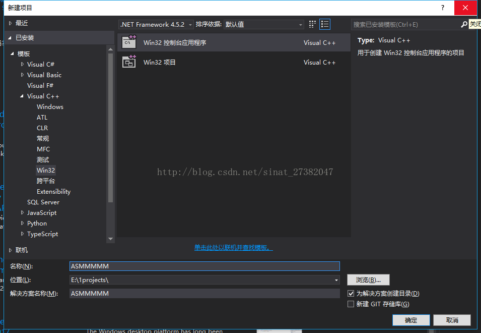
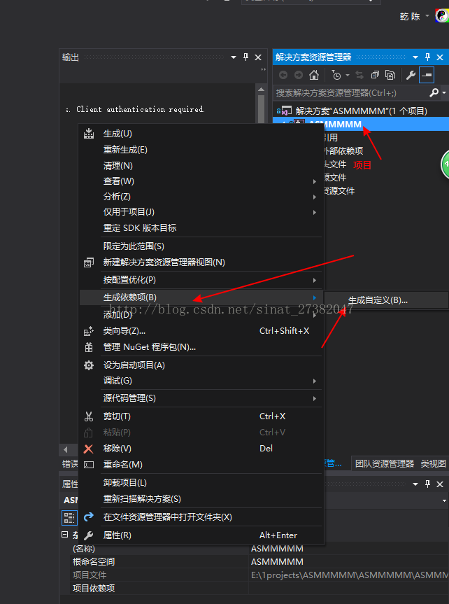
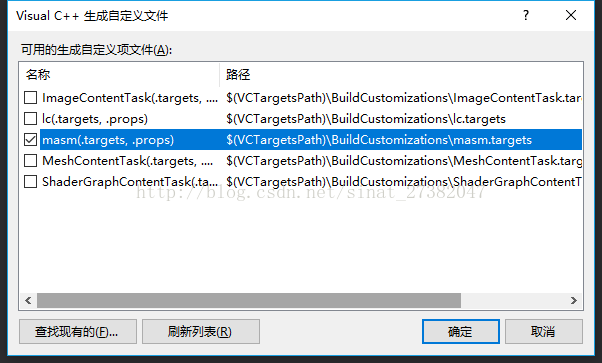
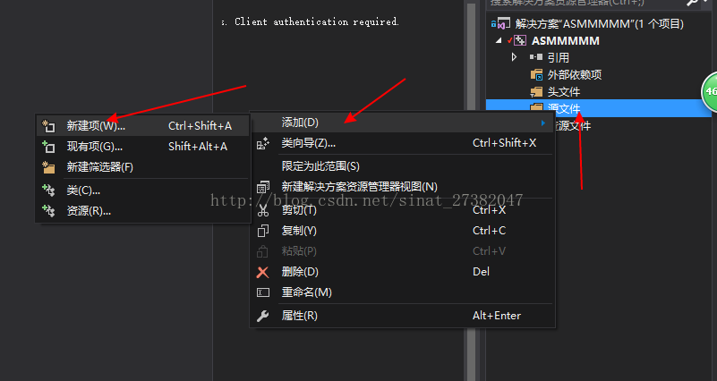
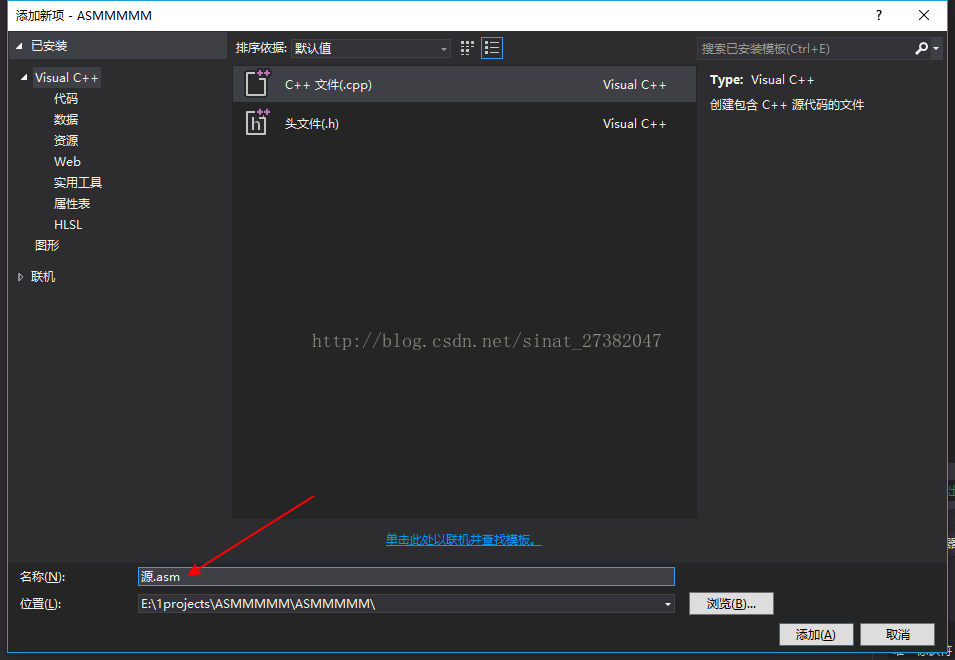
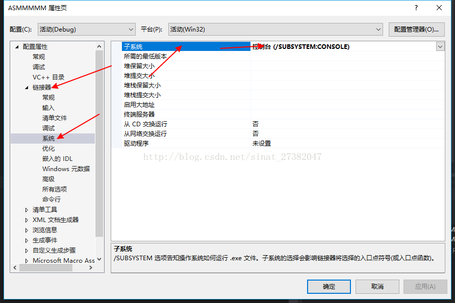
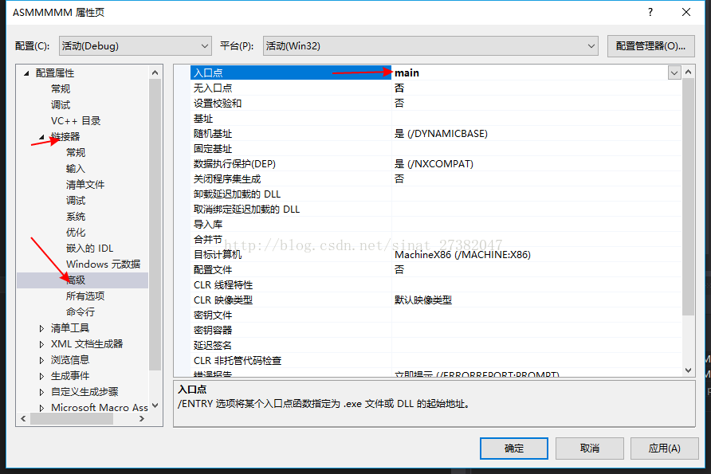
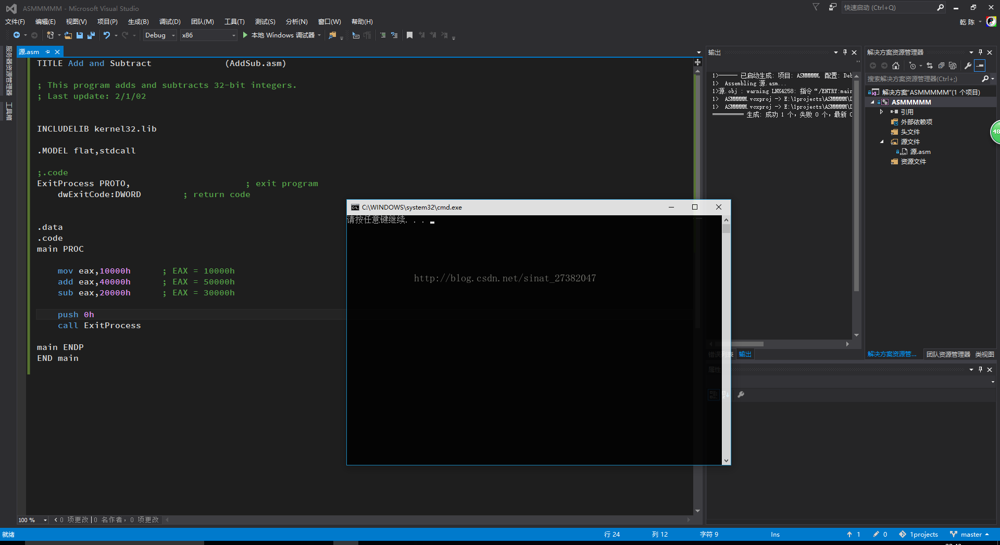
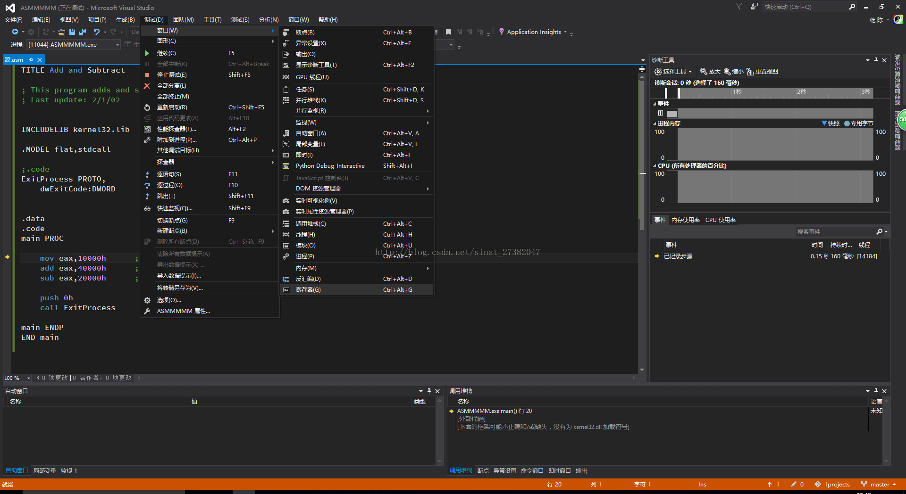

# 建立项目

## 建立一个空项目

## 选中项目右键 “生成自定义”,选择MASM生成规则

 

# 添加及设定源文件

## 选中源文件右键-》添加-》新建项

此处后缀名是汇编的.asm

## 选中项目右键-》属性-》链接器-》系统-》 子系统选 “控制台(SUBSYSTEM:CONSOLE)”

这步仅仅是我要控制台界面的情况下设置的，如果是要视窗界面，则需要设置窗口。

## 选中项目右键-》属性-》链接器-》高级-》 入口点 填 "main"

# 测试代码编译运行:

## 最后，输出,_调试时_选择菜单 调试-》窗口-》寄存器 就能看到寄存器值。（这样，就不至于苦逼地用指令-ip一步步看了吧~）

# 使用masm

我只要将masm32位的include目录和lib目录添加进去就可以了。

# 引用

[https://www.cnblogs.com/heben/p/7653067.html](https://www.cnblogs.com/heben/p/7653067.html)
