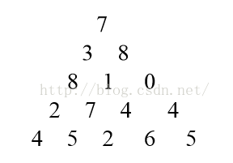
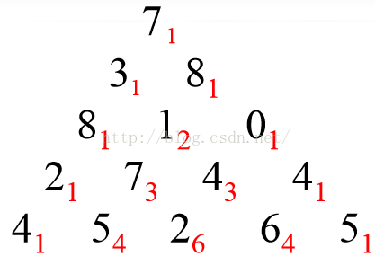
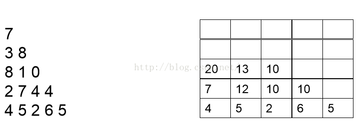

动态规划相信大家都知道，动态规划算法也是新手在刚接触算法设计时很苦恼的问题，有时候觉得难以理解，但是真正理解之后，就会觉得动态规划其实并没有想象中那么难。网上也有很多关于讲解动态规划的文章，大多都是叙述概念，讲解原理，让人觉得晦涩难懂，即使一时间看懂了，发现当自己做题的时候又会觉得无所适从。我觉得，理解算法最重要的还是在于练习，只有通过自己练习，才可以更快地提升。话不多说，接下来，下面我就通过一个例子来一步一步讲解动态规划是怎样使用的，只有知道怎样使用，才能更好地理解，而不是一味地对概念和原理进行反复琢磨。

首先，我们看一下这道题（此题目来源于北大POJ）：

数字三角形(POJ1163)

[](http://127.0.0.1/?attachment_id=4842)

在上面的数字三角形中寻找一条从顶部到底边的路径，使得路径上所经过的数字之和最大。路径上的每一步都只能往左下或 右下走。只需要求出这个最大和即可，不必给出具体路径。 三角形的行数大于1小于等于100，数字为 0 - 99

输入格式：

5      //表示三角形的行数    接下来输入三角形

7

3   8

8   1   0

2   7   4   4

4   5   2   6   5

要求输出最大和

接下来，我们来分析一下解题思路：

首先，肯定得用二维数组来存放数字三角形

然后我们用D( r, j) 来表示第r行第 j 个数字(r,j从1开始算)

我们用MaxSum(r, j)表示从D(r,j)到底边的各条路径中，最佳路径的数字之和。

因此，此题的最终问题就变成了求 MaxSum(1,1)

当我们看到这个题目的时候，首先想到的就是可以用简单的递归来解题：

D(r, j)出发，下一步只能走D(r+1,j)或者D(r+1, j+1)。故对于N行的三角形，我们可以写出如下的递归式：

```
if ( r == N)                
  MaxSum(r,j) = D(r,j)  
else      
  MaxSum( r, j) = Max{ MaxSum(r＋1,j), MaxSum(r+1,j+1) } + D(r,j)
```

根据上面这个简单的递归式，我们就可以很轻松地写出完整的递归代码：

```
#include <iostream>  
#include <algorithm> 
#define MAX 101  
using namespace std; 
int D[MAX][MAX];  
int n;  
int MaxSum(int i, int j){    
  if(i==n)  
    return D[i][j];    
  int x = MaxSum(i+1,j);    
  int y = MaxSum(i+1,j+1);    
  return max(x,y)+D[i][j];  
}
int main(){    
  int i,j;    
  cin >> n;    
  for(i=1;i<=n;i++)   
    for(j=1;j<=i;j++)        
      cin >> D[i][j];    
  cout << MaxSum(1,1) << endl;  
}     

```

对于如上这段递归的代码，当我提交到POJ时，会显示如下结果：

 

对的，代码运行超时了，为什么会超时呢？

答案很简单，因为我们重复计算了，当我们在进行递归时，计算机帮我们计算的过程如下图：

[](http://127.0.0.1/?attachment_id=4843)

就拿第三行数字1来说，当我们计算从第2行的数字3开始的MaxSum时会计算出从1开始的MaxSum，当我们计算从第二行的数字8开始的MaxSum的时候又会计算一次从1开始的MaxSum，也就是说有重复计算。这样就浪费了大量的时间。也就是说如果采用递规的方法，深度遍历每条路径，存在大量重复计算。则时间复杂度为 2的n次方,对于 n = 100 行，肯定超时。

接下来，我们就要考虑如何进行改进，我们自然而然就可以想到如果每算出一个MaxSum(r,j)就保存起来，下次用到其值的时候直接取用，则可免去重复计算。那么可以用n方的时间复杂度完成计算。因为三角形的数字总数是 n(n+1)/2

根据这个思路，我们就可以将上面的代码进行改进，使之成为记忆递归型的动态规划程序：

```
#include <iostream>  
#include <algorithm> 
using namespace std;
 
#define MAX 101
  
int D[MAX][MAX];    
int n;  
int maxSum[MAX][MAX];  //这个保存中间的运算结果
 
int MaxSum(int i, int j){      
  if( maxSum[i][j] != -1 )         
    return maxSum[i][j];      
  if(i==n)   
    maxSum[i][j] = D[i][j];     
  else{    
    int x = MaxSum(i+1,j);       
    int y = MaxSum(i+1,j+1);       
    maxSum[i][j] = max(x,y)+ D[i][j];     
  }     
  return maxSum[i][j]; 
} 
int main(){    
  int i,j;    
  cin >> n;    
  for(i=1;i<=n;i++)   
    for(j=1;j<=i;j++) {       
      cin >> D[i][j];       
      maxSum[i][j] = -1;   
    }    
  cout << MaxSum(1,1) << endl; 
}

```

当我们提交如上代码时，结果就是一次AC

 

虽然在短时间内就AC了。但是，我们并不能满足于这样的代码，因为递归总是需要使用大量堆栈上的空间，很容易造成栈溢出，我们现在就要考虑如何把递归转换为递推，让我们一步一步来完成这个过程。

我们首先需要计算的是最后一行，因此可以把最后一行直接写出，如下图：

[](http://127.0.0.1/?attachment_id=4844)

现在开始分析倒数第二行的每一个数，现分析数字2，2可以和最后一行4相加，也可以和最后一行的5相加，但是很显然和5相加要更大一点，结果为7，我们此时就可以将7保存起来，然后分析数字7，7可以和最后一行的5相加，也可以和最后一行的2相加，很显然和5相加更大，结果为12，因此我们将12保存起来。以此类推。。我们可以得到下面这张图：

[](http://127.0.0.1/?attachment_id=4845)

然后按同样的道理分析倒数第三行和倒数第四行，最后分析第一行，我们可以依次得到如下结果：

[](http://127.0.0.1/?attachment_id=4846)

[](http://127.0.0.1/?attachment_id=4847)

 

上面的推导过程相信大家不难理解，理解之后我们就可以写出如下的递推型动态规划程序；

```
#include <iostream>  
#include <algorithm> 
using namespace std; 
 
#define MAX 101  
 
int D[MAX][MAX];   
int n;  
int maxSum[MAX][MAX]; 
int main(){    
  int i,j;    
  cin >> n;    
  for(i=1;i<=n;i++)   
    for(j=1;j<=i;j++)        
      cin >> D[i][j];   
  for( int i = 1;i <= n; ++ i )     
    maxSum[n][i] = D[n][i];   
  for( int i = n-1; i>= 1;  --i )     
    for( int j = 1; j <= i; ++j )         
      maxSum[i][j] = max(maxSum[i+1][j],maxSum[i+1][j+1]) + D[i][j];    
  cout << maxSum[1][1] << endl;  
}

```

我们的代码仅仅是这样就够了吗？当然不是，我们仍然可以继续优化，而这个优化当然是对于空间进行优化，其实完全没必要用二维maxSum数组存储每一个MaxSum(r,j),只要从底层一行行向上递推，那么只要一维数组maxSum\[100\]即可,即只要存储一行的MaxSum值就可以。

对于空间优化后的具体递推过程如下：

 

 

 

 

 

接下里的步骤就按上图的过程一步一步推导就可以了。进一步考虑，我们甚至可以连maxSum数组都可以不要，直接用D的第n行直接替代maxSum即可。但是这里需要强调的是：虽然节省空间，但是时间复杂度还是不变的。

依照上面的方式，我们可以写出如下代码：

```
#include <iostream>  
#include <algorithm> 
using namespace std; 
 
#define MAX 101  
 
int D[MAX][MAX];  
int n; 
int * maxSum; 
 
int main(){    
  int i,j;    
  cin >> n;    
  for(i=1;i<=n;i++)   
    for(j=1;j<=i;j++)        
      cin >> D[i][j];   
  maxSum = D[n]; //maxSum指向第n行    
  for( int i = n-1; i>= 1;  --i )     
    for( int j = 1; j <= i; ++j )       
      maxSum[j] = max(maxSum[j],maxSum[j+1]) + D[i][j];    
  cout << maxSum[1] << endl;

```

接下来，我们就进行一下总结：

递归到动规的一般转化方法

递归函数有n个参数，就定义一个n维的数组，数组的下标是递归函数参数的取值范围，数组元素的值是递归函数的返回值，这样就可以从边界值开始， 逐步填充数组，相当于计算递归函数值的逆过程。

动规解题的一般思路

1. 将原问题分解为子问题
    - 把原问题分解为若干个子问题，子问题和原问题形式相同或类似，只不过规模变小了。子问题都解决，原问题即解决(数字三角形例）。
    - 子问题的解一旦求出就会被保存，所以每个子问题只需求 解一次。
2. 确定状态
    - 在用动态规划解题时，我们往往将和子问题相关的各个变量的一组取值，称之为一个“状 态”。一个“状态”对应于一个或多个子问题， 所谓某个“状态”下的“值”，就是这个“状 态”所对应的子问题的解。
    - 所有“状态”的集合，构成问题的“状态空间”。“状态空间”的大小，与用动态规划解决问题的时间复杂度直接相关。 在数字三角形的例子里，一共有N×(N+1)/2个数字，所以这个问题的状态空间里一共就有N×(N+1)/2个状态。

整个问题的时间复杂度是状态数目乘以计算每个状态所需时间。在数字三角形里每个“状态”只需要经过一次，且在每个状态上作计算所花的时间都是和N无关的常数。

3.确定一些初始状态（边界状态）的值

以“数字三角形”为例，初始状态就是底边数字，值就是底边数字值。

4\. 确定状态转移方程

定义出什么是“状态”，以及在该“状态”下的“值”后，就要找出不同的状态之间如何迁移――即如何从一个或多个“值”已知的 “状态”，求出另一个“状态”的“值”(递推型)。状态的迁移可以用递推公式表示，此递推公式也可被称作“状态转移方程”。

数字三角形的状态转移方程:

**能用动规解决的问题的特点**

1.  问题具有最优子结构性质。如果问题的最优解所包含的 子问题的解也是最优的，我们就称该问题具有最优子结 构性质。
2. 无后效性。当前的若干个状态值一旦确定，则此后过程的演变就只和这若干个状态的值有关，和之前是采取哪种手段或经过哪条路径演变到当前的这若干个状态，没有关系。

转载：

- [https://blog.csdn.net/baidu\_28312631/article/details/47418773](https://blog.csdn.net/baidu_28312631/article/details/47418773)
