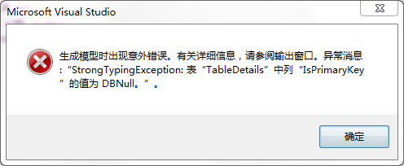

# 初识

EF支持三种开发模式： Code First、Database First和Model First。

## 方式一：Code First

创建两个类：Book（书）和BookReview（书评）。一本书可以有多条书评，因此，它们是一对多的关系：

```
public class Book
{
    public virtual int Id {get; set;}
    public virtual string Name { get; set; }
    public virtual List<BookReview> Reviews { get; set; }
}
public class BookReview
{
    public int Id{get; set;}
    public int BookId { get; set; }
    public virtual string Content { get; set; }
    public virtual Book AssoicationWithBook { get; set; }
}

```

好了，现在创建一个派生自DbContext的子类：

```
public class BookDb : DbContext
{
    public DbSet<Book> Books { get; set; }
    public DbSet<BookReview> Reviews { get; set; }
}

```

现在可以在程序中随意写几行代码从数据库中提取数据：

```
static void Main(string[] args)
{
    using (var context = new BookDb())
    {
        Console.WriteLine("数据库中有{0}本书",context.Books.Count());
    }
}


```

运行一下，如果计算机上安装有SqlExpress，那么或者是在应用程序文件夹，或者是打开SQL Server Management Studio（SSME）查看本机SQLServer，你就会发现，数据库己经创建好，其中的表及表的关联也帮助你完成了：

## 方式二：Database First

这是EF从1.0开始就支持的特性，其思路是：先设计并建好数据库，然后使用Visual Studio的向导创建EF数据模型并生成实体类代码。 这是最成熟稳定的方式，其设计器相当地完善，基本上能满足实际开发中的各种需求。 我个人认为这是开发正式项目最合适的方式。

# 使用EntityFramework6连接MySQL

## 安装库

用nuget

[](http://127.0.0.1/?attachment_id=3919)

## 通过向导来连接MySQL数据库

按照习惯，我先在项目中建立了一个Modules文件夹，用于保存所有生成的数据模型文件。之后右击，新建项。

之后选择**ADO.NET实体数据模型**，我取名为DBModel。之后连接数据库。如果出现如下错误

[](http://127.0.0.1/?attachment_id=3920)

解决方式：

```
use `test`;	  /*你的数据库名*/
set global optimizer_switch='derived_merge=OFF';
```

## 分析生成的代码

回到解决方案资源管理器，这时我们的项目下就应当多了两个文件，一个是DBModel数据库上下文（到时都是通过它来操作数据库），一个是student数据模型。

打开DBModel.cs

[](http://127.0.0.1/?attachment_id=3921)

student数据模型中对数据做了些描述（你不用代码优先CodeFirst这些一般都不用管）

[](http://127.0.0.1/?attachment_id=3922)

## 使用EF进行增删改查

到这一步EF连接MySQL就已经完成了，之后你就可以像操作SQL Server一样使用EF操作MySQL了。不过我还是演示下如何使用EF操作数据库。

```
class Program
    {
        static void Main(string[] args)
        {
            using (var db = new DBModel())
            {
                var student = (from t in db.students     //查询张三
                              where t.name == "张三"
                              select t).First();

                Console.WriteLine("张三的年龄是：" + student.age);    //输出：张三的年龄是：15


                db.students.Remove(student);    //删除张三
                //db.Entry(student).State = System.Data.Entity.EntityState.Deleted;   //或者这样删除张三

                db.students.Add(new student { name = "小明", age = 21 });     //向数据库中添加小明

                student = (from t in db.students     //查询李四
                           where t.name == "李四"
                           select t).First();

                student.age = 999;  //更改李四的年龄

                //db.Database.ExecuteSqlCommand("delete from test.student where true"); //执行普通的SQL,删除全部数据

                //var result = db.Database.SqlQuery<student>("select * from test.student");   //执行普通的SQL,查询所有学生

                db.SaveChanges();   //保存结果

            }

            Console.Read();
        }
    }

```

# 使用EntityFramework6完成增删查改和事务

## 准备工作

为了演示，我在数据库中建了两张表。class表用于表示班级，class\_id是班级编号，class\_name是班级名称。第二张表是学生表student，student\_id为学生编号，name为姓名，age为年龄，class\_id是学生所属班级，student表中的class\_id与class表中的class\_id存在外联关系

[](http://127.0.0.1/?attachment_id=3923)

 

数据库建好后，按照上一节介绍的步骤我们直接通过向导来生成EF代码。

执行完成后VS为我们生成了三个类，分别是DBModel、\_class、student，其中DBModel代表的是数据库，而\_class和student则分别代表班级表和学生表。

先来看看DBModel类，DBModel相当于一个数据库，之后你new一个DBModel就相当于打开了一次数据库，跟数据库建立了一次连接。

[](http://127.0.0.1/?attachment_id=3924)

再来看看student与\_class类。类中的属性上添加很多特性（Attribute），用于描述数据约束。值得注意的是在student类中，EF将我们的外键class\_id分解成了两个属性，其中\_class前面使用了virtual关键字，使用了virtual关键字描述的属性在查询时并不会马上从数据库中读取数据，而是当你真正需要用到它的值时再单独从数据库中查询出来。

[](http://127.0.0.1/?attachment_id=3925)

[](http://127.0.0.1/?attachment_id=3926)

## 使用EF读取数据

```
class Program
{
    static void Main(string[] args)
    {
        using (var db = new DBModel())
        {
            var result = from i in db.students  //使用LINQ查询年龄大于10岁的学生
                         where i.age > 10
                         select i;
            foreach (var student in result)
            {
                Console.WriteLine("学号:" + student.Student_id + "  姓名:" + student.name
                                  + "  年龄:" + student.age + "  班级名称:" + student._class.class_name);
            }
            Console.Read();
        }
    }
}

```

## 使用EF添加数据

```
class Program
{
    static void Main(string[] args)
    {
        using (var db = new DBModel())
        {
            var s = new student();

            //因为数据库中的student_id是自动增长的所以可以不用赋值

            s.name = "张三";
            s.age = 15;
            s.class_id = 1;

            db.students.Add(s);

            db.SaveChanges();   //将修改保存到数据库中
        }
    }
}

```

## 使用EF修改数据

```
class Program
{
    static void Main(string[] args)
    {
        using (var db = new DBModel())
        {
            var student = db.students.FirstOrDefault(s => s.name == "萝莉");
            student.age = 13;   //将萝莉的年龄改为13岁

            db.SaveChanges();
        }
    }
}

```

## 使用EF删除数据

```
class Program
{
    static void Main(string[] args)
    {
        using (var db = new DBModel())
        {
            var student = db.students.FirstOrDefault(s => s.name == "萝莉");	//查找萝莉
            db.students.Remove(student);    //删除萝莉
            db.SaveChanges();
        }
    }
}

```

## 在EF使用事务

事务就是确保一次数据库操作，所有步骤都成功，如果哪一步出错了，整个操作都将回滚。

在EF使用事务有两种方案，一种是EF自带的.BeginTransaction()方法，另一种是使用TransactionScope类。

```
class Program
{
    static void Main(string[] args)
    {
        using (var db = new DBModel())
        {
            var tran = db.Database.BeginTransaction();  //开启事务

            try
            {
                var student = db.students.FirstOrDefault(s => s.name == "萝莉");
                db.students.Remove(student);    //删除萝莉

                db.SaveChanges();

                tran.Commit();  //必须调用Commit()，不然数据不会保存
            }
            catch (Exception ex)
            {
                tran.Rollback();    //出错就回滚
            }
        }
    }
}

```

 

```
class Program
{
    static void Main(string[] args)
    {
        using (var db = new DBModel())
        {
            using (var tran = new TransactionScope())   //开启事务
            {
                var student = db.students.FirstOrDefault(s => s.name == "萝莉");
                db.students.Remove(student);    //删除萝莉

                db.SaveChanges();

                tran.Complete();  //必须调用.Complete()，不然数据不会保存
            }   //出了using代码块如果还没调用Complete()，所有操作就会自动回滚
        }
    }
}

```

# 在EntityFramework6中执行SQL语句

在上一节中我介绍了如何使用EF6对数据库实现CRDU以及事务，我们没有写一句SQL就完成了所有操作。这一节我来介绍一下如何使用在EF6中执行SQL语句。

你可能要问，我用EF不就为了避免写SQL吗？如果要写SQL我不如直接用ADO.NET得了。话虽然这么说没错，可有些时候使用EF操作数据还是有一些不方便，例如让你根据条件删除一组记录，如果按照正常的流程来走，你就得先把这些数据查出来，然后再一条一条地删除它们，这样不仅麻烦而且性能也比较低。这种情况下SQL就显示出它的威力了。

而使用EF执行SQL又比ADO.NET方便，特别是在执行查询语句的时候，EF会把查询到的数据自动保存到数据实体中，省去了使用DataReader的麻烦。同时查询出来的数据还会进行跟踪，如果你修改了查询出的值，之后就可以很方便的使用.SaveChanges()直接更新到数据库了。

**ExecuteSqlCommand与SqlQuery**

在数据上下文DBModel的实例中有个Database属性，其中有两组方法.ExecuteSqlCommand()和.SqlQuery()。它们都可以执行SQL语句，只不过.ExecuteSqlCommand()是不返回结果的，只返回受影响的行数，所以.ExecuteSqlCommand()更适合执行创建、更新、删除操作。.SqlQuery()则会返回查询到的结果，并将结果保存在数据实体中，所以更适合执行查询操作。

## 使用.ExecuteSqlCommand()实现创建、更新、删除

.ExecuteSqlCommand()的使用方法也很简单，直接传入SQL语句就可以了，执行完成后会返回受影响的行数。

```
using (var db = new DBModel())  //创建数据库上下文
{
    //同步的方式执行SQL，并返回受影响的行数
    int result = db.Database.ExecuteSqlCommand(@"CREATE TABLE `test`.`test` (
                 `id` INT NOT NULL,
                 PRIMARY KEY(`id`)); ");

    //使用SqlParameter传值可以避免SQL注入
    var p_name = new SqlParameter("@name", "萝莉");
    var p_age = new SqlParameter("@age", 13);

    //如果使用的是MySql数据库 需要SqlParameter把替换为MySqlParameter
    //var p_name = new MySqlParameter("@name", "萝莉");
    //var p_age = new MySqlParameter("@age", 13);

    //更改学生年龄
    result = db.Database.ExecuteSqlCommand(@"UPDATE `test`.`student`
                                           SET `age` = @age
                                           WHERE `name` = @name;", p_age, p_name);

    //异步的方式执行SQL，并返回受影响的行数
    Task<int> result2 = db.Database.ExecuteSqlCommandAsync("DROP TABLE `test`.`test`;");
}

```

## 使用.SqlQuery()查询数据

从名字就看的出来.SqlQuery()是用来执行查询的。.SqlQuery()使用前需指定返回值的数据类型，比如我查询寻一条学生的完整信息，类型就可以指定为student类型。如果是统计有多少个学生，返回值是个整数，就以设置为int。

注意：不仅返回值的个数必须与传入类型中属性值的个数相同，而且名称还必须一样，不然会出错。那么如果我只想获取姓名和年龄，那就得单独定义一个类（其中包含一个string类型的name和int类型的age），来保存数据了。

```
class temp
{
    public string name { get; set; }

    public int age { get; set; }
}

static void Main(string[] args)
{
    using (var db = new DBModel())  //创建数据库上下文
    {
        //查询叫萝莉的学生信息，并指定返回值类型为student
        DbRawSqlQuery<student> result1 = db.Database.SqlQuery<student>("SELECT  * FROM test.student WHERE name = '萝莉'");
        //也可以这样指定返回值类型
        //DbRawSqlQuery result1 = db.Database.SqlQuery(typeof(student), "SELECT  * FROM test.student WHERE name = '萝莉'");
        Console.WriteLine(result1.FirstOrDefault().name); //打印姓名

        DbRawSqlQuery<int> result2 = db.Database.SqlQuery<int>("SELECT  count(*) FROM test.student");
        Console.WriteLine(result2.FirstOrDefault());    //打印有多少学生

        //只查询学生的年龄与姓名
        var result3 = db.Database.SqlQuery<temp>("SELECT `name`,`age` FROM test.student;");
        foreach (temp item in result3)
        {
            Console.WriteLine(item.name + ":" + item.age);
        }
    }

```

## 使用DbSet<T>下的.SqlQuery()

在每个数据实体集合DbSet<T>下也有一个.SqlQuery()，功能与上面介绍的一样，只不过DbSet<T>下的.SqlQuery()只能返回DbSet<T>中包含的类型。但DbSet<T>下的.SqlQuery()在返回数据的同时还会让数据库上下文（DBModel）跟踪返回数据的状态，如果返回的数据发生了修改，就可以使用.SaveChanges()将结果直接保存回数据库。而.Database.SqlQuery()查出的结果则是做不到的。

```
using (var db = new DBModel())  //创建数据库上下文
{
    //查询叫萝莉的学生信息，并修改她的年龄
    student result1 = db.students.SqlQuery("SELECT  * FROM test.student WHERE name = '萝莉'").FirstOrDefault();
    result1.age = 13;   //通过实体集合下.SqlQuery查询到的数据，修改之后是可以保存到数据库的

    student result2 = db.Database.SqlQuery<student>("SELECT  * FROM test.student WHERE name = '旺财'").FirstOrDefault();
    result2.age = 21;   //因为使用的是.Database.SqlQuery查询到的，所以这里的修改不会保存到数据库

    //如果希望.Database.SqlQuery下查出的数据在修改后也能保存到数据库
    student result3 = db.DbSet.SqlQuery<student>("SELECT  * FROM test.student WHERE name = '小明'").FirstOrDefault();
    result3.age = 36;
    db.Entry<student>(result3).State = System.Data.Entity.EntityState.Modified; //通知数据上下文，这条记录也被修改了

    db.SaveChanges();
}

```
