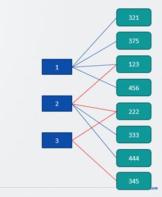

【hihocoder #1643】最小换乘

http://hihocoder.com/problemset/problem/1643

 

时间限制:10000ms

单点时限:1000ms

内存限制:256MB

**描述**

小Ho居住的城市有N条公交车线路，其中第i条线路上有Ki个车站。

某些线路之间会有公共的车站，小Ho可以在这些车站从一条线路换乘到另一条线路。

现在给定N条公交车线路以及两个车站S和E，你能帮助小Ho计算从S到E最少换乘几次公交车吗？

**输入**

第一行包含三个整数N，S和E。

以下N行每行描述一条线路。第一个整数Ki代表该条线路包含的车站数。之后Ki个整数代表车站的编号。

注意车站编号不一定连续。

对于50%的数据，1 ≤ N ≤ 1000,  1 ≤ Ki ≤ 100

对于100%的数据，1 ≤ N ≤ 50000， 1 ≤ Ki ≤ 80000，1 ≤ 所有Ki之和 ≤ 500000, 1 ≤ 车站编号 ≤ 5000000。

**输出**

输出最少换乘次数。如果S到E不可达，输出-1。

样例输入

3 123 345

4 321 375 123 456

4 222 333 123 444

2 222 345

样例输出

1

# 题解：

这个暂且叫换乘问题吧。开始误解题意是把题目当成了求最短路径的问题，毕竟两个站之间不就是一次换乘嘛。结果并不是这样。同一条路线内是不用换乘的。。。所以只有切换了路线之后才算一次换乘。

问题的难度在规模和建图上，但是如果建好了图好像也就直接解决了规模的问题。题目的解法是新增N个虚拟的站点代表路线, 它们分别跟路线内的节点相连。最后的结果就是个二部图。

看规模猜测，N <= 5 \* 10^4, K <= 8 \* 10^4, 如果路线间几乎没有交点，那么就最多有大约4 \* 10^9这么多条边了。结果其实K的总和<=5\*10^5，不用考虑那么多路。如果按照

_路线1：A->B->C, 路线2: D->E->F->G_这样建立边确实就要N \* K条 <= 4 \* 10^9这么多了。并且这样好像也没什么用。反而，我们设路线1为S1 和 所有跟S1相连的边, S1-A, S1-B, S1-C… 建好图以后我们就直接求得最短路径, 在二部图里，换乘次数的结果可以推算出来。

[](http://127.0.0.1/?attachment_id=4172)[](http://127.0.0.1/?attachment_id=4173)

建图中N个路线标号为0-N-1, 其余的标号为N - (N + nodem)。nodem为车站节点总数。

```
#include<iostream>
#include<queue>
#include<string.h>
#include<map>
#include<vector>
#include<stdio.h>
using namespace std;
#define INF 2e9
struct Edge {
    int v, w;
    bool operator<(const Edge a)const {
        return this->w > a.w;
    }
    Edge(int _v, int _w):v(_v), w(_w) {}
};
#define MAXN 500100
int dis[MAXN];
int N;
int nodem = 0;
int shortest(int st, int ed, vector<Edge> G[]) {
    priority_queue<Edge, vector<Edge> > q;
    if (G[st].size() == 0) return -1;
    for (int i = 0; i < nodem; i++) {
        dis[i] = INF;
    }
    dis[st] = 0;
    q.push(Edge(st, 0));
    int u;
    while (!q.empty()) {
        Edge front = q.top();
        q.pop();
        // printf("the front is %d\n", front.v);
        u = front.v;
        int size = G[u].size();
        for (int i = 0; i < size; i++) {
            Edge e = G[u][i];
            int v = e.v;
            if (G[u][i].w + dis[u] < dis[v]) {
                dis[v] = G[u][i].w + dis[u];
                // printf("relax %d... d=%d\n", v, dis[v]);
                q.push(Edge(v, dis[v]));
            }
        }
    }
    // for (int i = 0; i < nodem; i++) {
    //     printf("(%d = %d\n", i, dis[i]);
    // }
    return dis[ed] / 2 - 1;
}
map<int, int> mp;
int getct(int ct) {
    if (mp.count(ct)) {
        return mp[ct];
    } else {
        int count = mp.size() + N;
        mp[ct] = count;
        return mp[ct];
    }
}
int main() {
    int M;
    int st, ed;
    ios::sync_with_stdio(false);
    while (cin >> N >> st >> ed) {
        mp.clear();
        int od1, od2, k;
        vector<int>* vc = new vector<int>[N];
        for (int i = 0; i < N; i++) {
            // k stations
            cin >> k;
            for (int j = 0; j < k; j++) {
                cin >> od1;
                od1 = getct(od1);
                vc[i].push_back(od1);
            }
        }
        nodem = N + mp.size();
        // for (map<int, int>::iterator it = mp.begin(); it != mp.end(); ++it) {
        //     cout << it->first << " " << it->second << endl;
        // }
        vector<Edge>* G = new vector<Edge>[nodem];
        nodem = mp.size() + N;
        for (int k = 0; k < N; k++) {
            for (int i = 0; i < vc[k].size(); i++) {
                od1 = vc[k][i];
                G[k].push_back(Edge(od1, 1));
                G[od1].push_back(Edge(k, 1));
            }
        }
        if (st == ed) {
            cout << "0\n";
            continue;
        }
        int k1, k2;
        k1 = getct(st), k2 = getct(ed);
        cout << shortest(k1, k2, G) << endl;
    }
    return 0;
}
```
