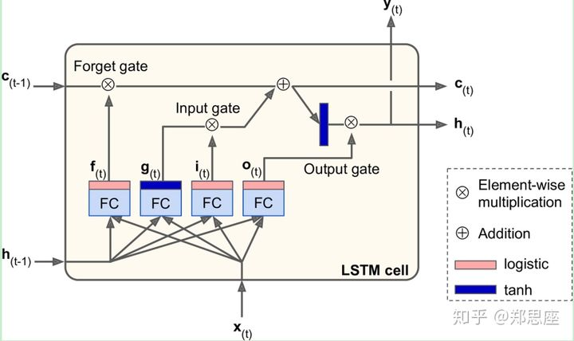

LSTM既能记忆长期状态，也能记忆短期状态，分别用$latex c\_t $ 和$latex h\_t $ 表示，对于一个LSTM单元来说，输入为$latex c\_{t-1}, h\_{t-1}, x\_t $ , 输出是$latex c\_{t}, h\_{t}, y\_t $.

但LSTM的真正巧妙之处在于它盒子里面的结构，也是它思想的核心，即三个门结构：输入门（Input gate）、遗忘门（Forget gate）、输出门（Output gate）。各个门由经过logistic函数处理过的信号量控制，0表示关闭，1表示开启，在图中 $latex f\_t$ 控制遗忘门，$latex i\_t$ 控制输入门， $latex o\_t$ 控制输出门。举个例子，当 $latex f\_t=0$ 的时候遗忘门关闭，过去的状态 $latex c\_{t-1} $ 不能参与这次运算，即被遗忘
