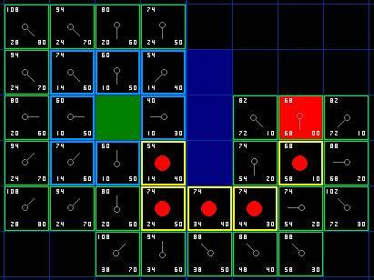

# 算法步骤

1. 把起点加入open list
2. 重复如下的过程
    1. 遍历open list，查找F值最小的节点，把它当作当前要处理的节点。
    2. 把这个节点移到close list
    3. 对当前方格的8个相邻方格进行操作
        1. 如果它是不可抵达或者在close lise中，忽略。
        2. 如果不在open list中，把它加入到open list，并设置当前方格为这个方格的父亲，记录该方格的F，G和H值。
        3. 如果已经在open list中，就检查这条路径是否更好，以G值作为参考，并重新计算F和G值。
    4. 停止
        1. 如果终点加入到open list中，表示找到路径了。
        2. open list为空，表示查找失败。

# 要点

F = G + H

- G是从起点 A 移动到指定方格的移动代价
- H是指定的方格移动到终点 B 的估算成本，这里其中一个估算的算法是Manhattan ，算从当前方格横向或纵向移动到达目标所经过的方格数，忽略对角移动，然后把总数乘以 10

 

# 例子

 

# 引用

- [A\*算法详解(个人认为最详细,最通俗易懂的一个版本)](https://blog.csdn.net/Zhouzi_heng/article/details/115035298)
