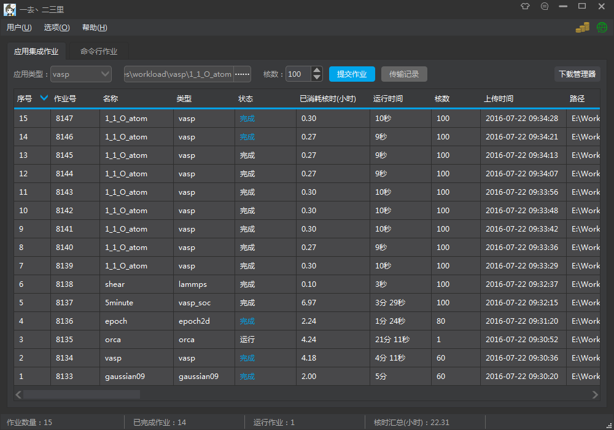
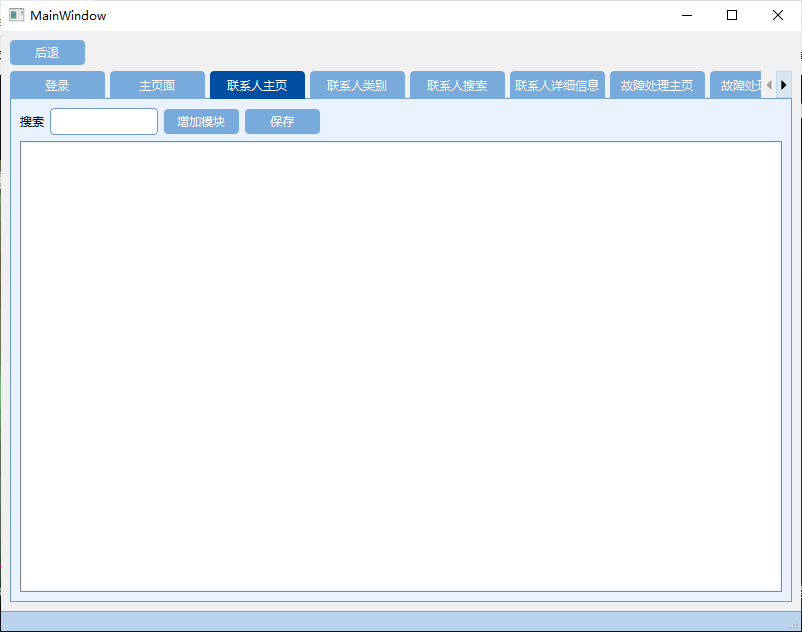
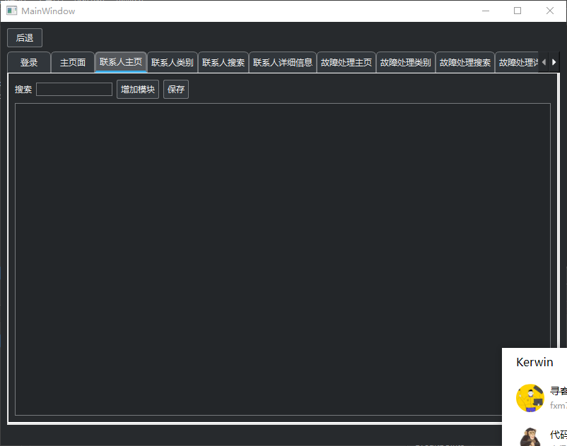
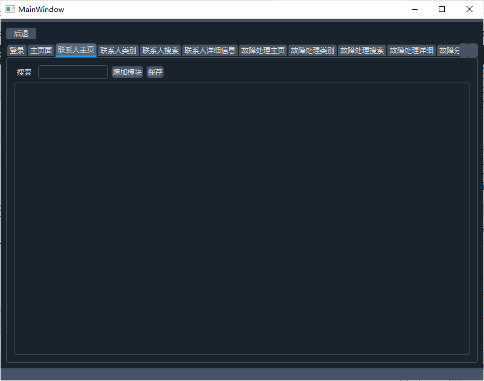

# （黑色炫酷）主题

[](http://127.0.0.1/?attachment_id=5364)

 

```
/*
* The MIT License (MIT)
*
* Copyright : http://blog.csdn.net/liang19890820
*
* Author : 一去丶二三里
*
* Date : 2016/07/22
*
* Description : 黑色炫酷
*
*/

/**********子界面背景**********/
QWidget#customWidget {
        background: rgb(68, 69, 73);
}

/**********子界面中央背景**********/
QWidget#centerWidget {
        background: rgb(50, 50, 50);
}

/**********主界面样式**********/
QWidget#mainWindow {
        border: 1px solid rgb(50, 50, 50);
        background: rgb(50, 50, 50);
}

QWidget#messageWidget {
        background: rgba(68, 69, 73, 50%);
}

QWidget#loadingWidget {
        border: none;
        border-radius: 5px;
        background: rgb(50, 50, 50);
}

QWidget#remoteWidget {
        border-top-right-radius: 10px;
        border-bottom-right-radius: 10px;
        border: 1px solid rgb(45, 45, 45);
        background: rgb(50, 50, 50);
}

StyledWidget {
        qproperty-normalColor: white;
        qproperty-disableColor: gray;
        qproperty-highlightColor: rgb(0, 160, 230);
        qproperty-errorColor: red;
}

QProgressIndicator {
        qproperty-color: rgb(175, 175, 175);
}

/**********提示**********/
QToolTip{
        border: 1px solid rgb(45, 45, 45);
        background: white;
        color: black;
}

/**********菜单栏**********/
QMenuBar {
        background: rgb(57, 58, 60);
        border: none;
}
QMenuBar::item {
        padding: 5px 10px 5px 10px;
        background: transparent;
}
QMenuBar::item:enabled {
        color: rgb(227, 234, 242);
}
QMenuBar::item:!enabled {
        color: rgb(155, 155, 155);
}
QMenuBar::item:enabled:selected {
        background: rgba(255, 255, 255, 40);
}

/**********菜单**********/
QMenu {
        border: 1px solid rgb(100, 100, 100);
        background: rgb(68, 69, 73);
}
QMenu::item {
        height: 22px;
        padding: 0px 25px 0px 20px;
}
QMenu::item:enabled {
        color: rgb(225, 225, 225);
}
QMenu::item:!enabled {
        color: rgb(155, 155, 155);
}
QMenu::item:enabled:selected {
        color: rgb(230, 230, 230);
        background: rgba(255, 255, 255, 40);
}
QMenu::separator {
        height: 1px;
        background: rgb(100, 100, 100);
}
QMenu::indicator {
        width: 13px;
        height: 13px;
}
QMenu::icon {
        padding-left: 2px;
        padding-right: 2px;
}

/**********状态栏**********/
QStatusBar {
        background: rgb(57, 58, 60);
}
QStatusBar::item {
        border: none;
        border-right: 1px solid rgb(100, 100, 100);
}

/**********分组框**********/
QGroupBox {
        font-size: 15px;
        border: 1px solid rgb(80, 80, 80);
        border-radius: 4px;
        margin-top: 10px;
}
QGroupBox::title {
        color: rgb(175, 175, 175);
        top: -12px;
        left: 10px;
}

/**********页签项**********/
QTabWidget::pane {
        border: none;
        border-top: 3px solid rgb(0, 160, 230);
        background: rgb(57, 58, 60);
}
QTabWidget::tab-bar {
        border: none;
}
QTabBar::tab {
        border: none;
        border-top-left-radius: 4px;
        border-top-right-radius: 4px;
        color: rgb(175, 175, 175);
        background: rgb(255, 255, 255, 30);
        height: 28px;
        min-width: 85px;
        margin-right: 5px;
        padding-left: 5px;
        padding-right: 5px;
}
QTabBar::tab:hover {
        background: rgb(255, 255, 255, 40);
}
QTabBar::tab:selected {
        color: white;
        background: rgb(0, 160, 230);
}

QTabWidget#tabWidget::pane {
        border: 1px solid rgb(45, 45, 45);
        background: rgb(57, 58, 60);
        margin-top: -1px;
}

QTabBar#tabBar::tab {
        border: 1px solid rgb(45, 45, 45);
        border-bottom: none;
        background: transparent;
}
QTabBar#tabBar::tab:hover {
        color: white;
}
QTabBar#tabBar::tab:selected {
        color: white;
        background: rgb(57, 58, 60);
}

/**********表头**********/
QHeaderView{
        border: none;
        border-bottom: 3px solid rgb(0, 160, 230);
        background: rgb(57, 58, 60);
        min-height: 30px;
}
QHeaderView::section:horizontal {
        border: none;
        color: white;
        background: transparent;
        padding-left: 5px;
}
QHeaderView::section:horizontal:hover {
        background: rgb(0, 160, 230);
}
QHeaderView::section:horizontal:pressed {
        background: rgb(0, 180, 255);
}
QHeaderView::up-arrow {
        width: 13px;
        height: 11px;
        padding-right: 5px;
        image: url(:/Black/topArrow);
        subcontrol-position: center right;
}
QHeaderView::up-arrow:hover, QHeaderView::up-arrow:pressed {
        image: url(:/Black/topArrowHover);
}
QHeaderView::down-arrow {
        width: 13px;
        height: 11px;
        padding-right: 5px;
        image: url(:/Black/bottomArrow);
        subcontrol-position: center right;
}
QHeaderView::down-arrow:hover, QHeaderView::down-arrow:pressed {
        image: url(:/Black/bottomArrowHover);
}

/**********表格**********/
QTableView {
        border: 1px solid rgb(45, 45, 45);
        background: rgb(57, 58, 60);
        gridline-color: rgb(60, 60, 60);
}
QTableView::item {
        padding-left: 5px;
        padding-right: 5px;
        border: none;
        background: rgb(72, 72, 74);
        border-right: 1px solid rgb(45, 45, 45);
        border-bottom: 1px solid rgb(45, 45, 45);
}
QTableView::item:selected {
        background: rgba(255, 255, 255, 40);
}
QTableView::item:selected:!active {
        color: white;
}
QTableView::indicator {
        width: 20px;
        height: 20px;
}
QTableView::indicator:enabled:unchecked {
        image: url(:/Black/checkBox);
}
QTableView::indicator:enabled:unchecked:hover {
        image: url(:/Black/checkBoxHover);
}
QTableView::indicator:enabled:unchecked:pressed {
        image: url(:/Black/checkBoxPressed);
}
QTableView::indicator:enabled:checked {
        image: url(:/Black/checkBoxChecked);
}
QTableView::indicator:enabled:checked:hover {
        image: url(:/Black/checkBoxCheckedHover);
}
QTableView::indicator:enabled:checked:pressed {
        image: url(:/Black/checkBoxCheckedPressed);
}
QTableView::indicator:enabled:indeterminate {
        image: url(:/Black/checkBoxIndeterminate);
}
QTableView::indicator:enabled:indeterminate:hover {
        image: url(:/Black/checkBoxIndeterminateHover);
}
QTableView::indicator:enabled:indeterminate:pressed {
        image: url(:/Black/checkBoxIndeterminatePressed);
}

/**********滚动条-水平**********/
QScrollBar:horizontal {
        height: 20px;
        background: transparent;
        margin-top: 3px;
        margin-bottom: 3px;
}
QScrollBar::handle:horizontal {
        height: 20px;
        min-width: 30px;
        background: rgb(68, 69, 73);
        margin-left: 15px;
        margin-right: 15px;
}
QScrollBar::handle:horizontal:hover {
        background: rgb(80, 80, 80);
}
QScrollBar::sub-line:horizontal {
        width: 15px;
        background: transparent;
        image: url(:/Black/arrowLeft);
        subcontrol-position: left;
}
QScrollBar::add-line:horizontal {
        width: 15px;
        background: transparent;
        image: url(:/Black/arrowRight);
        subcontrol-position: right;
}
QScrollBar::sub-line:horizontal:hover {
        background: rgb(68, 69, 73);
}
QScrollBar::add-line:horizontal:hover {
        background: rgb(68, 69, 73);
}
QScrollBar::add-page:horizontal,QScrollBar::sub-page:horizontal {
        background: transparent;
}

/**********滚动条-垂直**********/
QScrollBar:vertical {
        width: 20px;
        background: transparent;
        margin-left: 3px;
        margin-right: 3px;
}
QScrollBar::handle:vertical {
        width: 20px;
        min-height: 30px;
        background: rgb(68, 69, 73);
        margin-top: 15px;
        margin-bottom: 15px;
}
QScrollBar::handle:vertical:hover {
        background: rgb(80, 80, 80);
}
QScrollBar::sub-line:vertical {
        height: 15px;
        background: transparent;
        image: url(:/Black/arrowTop);
        subcontrol-position: top;
}
QScrollBar::add-line:vertical {
        height: 15px;
        background: transparent;
        image: url(:/Black/arrowBottom);
        subcontrol-position: bottom;
}
QScrollBar::sub-line:vertical:hover {
        background: rgb(68, 69, 73);
}
QScrollBar::add-line:vertical:hover {
        background: rgb(68, 69, 73);
}
QScrollBar::add-page:vertical, QScrollBar::sub-page:vertical {
        background: transparent;
}

QScrollBar#verticalScrollBar:vertical {
        margin-top: 30px;
}

/**********下拉列表**********/
QComboBox {
        height: 25px;
        border-radius: 4px;
        border: 1px solid rgb(100, 100, 100);
        background: rgb(72, 72, 73);
}
QComboBox:enabled {
        color: rgb(175, 175, 175);
}
QComboBox:!enabled {
        color: rgb(155, 155, 155);
}
QComboBox:enabled:hover, QComboBox:enabled:focus {
        color: rgb(230, 230, 230);
        background: rgb(68, 69, 73);
}
QComboBox::drop-down {
        width: 20px;
        border: none;
        background: transparent;
}
QComboBox::drop-down:hover {
        background: rgba(255, 255, 255, 30);
}
QComboBox::down-arrow {
        image: url(:/Black/arrowBottom);
}
QComboBox::down-arrow:on {
        /**top: 1px;**/
}
QComboBox QAbstractItemView {
        border: 1px solid rgb(100, 100, 100);
        background: rgb(68, 69, 73);
        outline: none;
}
QComboBox QAbstractItemView::item {
        height: 25px;
        color: rgb(175, 175, 175);
}
QComboBox QAbstractItemView::item:selected {
        background: rgba(255, 255, 255, 40);
        color: rgb(230, 230, 230);
}

/**********进度条**********/
QProgressBar{
        border: none;
        text-align: center;
        color: white;
        background: rgb(48, 50, 51);
}
QProgressBar::chunk {
        background: rgb(0, 160, 230);
}

QProgressBar#progressBar {
        border: none;
        text-align: center;
        color: white;
        background-color: transparent;
        background-image: url(":/Black/progressBar");
        background-repeat: repeat-x;
}
QProgressBar#progressBar::chunk {
        border: none;
        background-color: transparent;
        background-image: url(":/Black/progressBarChunk");
        background-repeat: repeat-x;
}

/**********复选框**********/
QCheckBox{
        spacing: 5px;
}
QCheckBox:enabled{
        color: rgb(175, 175, 175);
}
QCheckBox:enabled:hover{
        color: rgb(200, 200, 200);
}
QCheckBox:!enabled{
        color: rgb(155, 155, 155);
}
QCheckBox::indicator {
        width: 20px;
        height: 20px;
}
QCheckBox::indicator:unchecked {
        image: url(:/Black/checkBox);
}
QCheckBox::indicator:unchecked:hover {
        image: url(:/Black/checkBoxHover);
}
QCheckBox::indicator:unchecked:pressed {
        image: url(:/Black/checkBoxPressed);
}
QCheckBox::indicator:checked {
        image: url(:/Black/checkBoxChecked);
}
QCheckBox::indicator:checked:hover {
        image: url(:/Black/checkBoxCheckedHover);
}
QCheckBox::indicator:checked:pressed {
        image: url(:/Black/checkBoxCheckedPressed);
}
QCheckBox::indicator:indeterminate {
        image: url(:/Black/checkBoxIndeterminate);
}
QCheckBox::indicator:indeterminate:hover {
        image: url(:/Black/checkBoxIndeterminateHover);
}
QCheckBox::indicator:indeterminate:pressed {
        image: url(:/Black/checkBoxIndeterminatePressed);
}

/**********单选框**********/
QRadioButton{
        spacing: 5px;
}
QRadioButton:enabled{
        color: rgb(175, 175, 175);
}
QRadioButton:enabled:hover{
        color: rgb(200, 200, 200);
}
QRadioButton:!enabled{
        color: rgb(155, 155, 155);
}
QRadioButton::indicator {
        width: 20px;
        height: 20px;
}
QRadioButton::indicator:unchecked {
        image: url(:/Black/radioButton);
}
QRadioButton::indicator:unchecked:hover {
        image: url(:/Black/radioButtonHover);
}
QRadioButton::indicator:unchecked:pressed {
        image: url(:/Black/radioButtonPressed);
}
QRadioButton::indicator:checked {
        image: url(:/Black/radioButtonChecked);
}
QRadioButton::indicator:checked:hover {
        image: url(:/Black/radioButtonCheckedHover);
}
QRadioButton::indicator:checked:pressed {
        image: url(:/Black/radioButtonCheckedPressed);
}

/**********输入框**********/
QLineEdit {
        border-radius: 4px;
        height: 25px;
        border: 1px solid rgb(100, 100, 100);
        background: rgb(72, 72, 73);
}
QLineEdit:enabled {
        color: rgb(175, 175, 175);
}
QLineEdit:enabled:hover, QLineEdit:enabled:focus {
        color: rgb(230, 230, 230);
}
QLineEdit:!enabled {
        color: rgb(155, 155, 155);
}

/**********文本编辑框**********/
QTextEdit {
        border: 1px solid rgb(45, 45, 45);
        color: rgb(175, 175, 175);
        background: rgb(57, 58, 60);
}

/**********滚动区域**********/
QScrollArea {
        border: 1px solid rgb(45, 45, 45);
        background: rgb(57, 58, 60);
}

/**********滚动区域**********/
QWidget#transparentWidget {
        background: transparent;
}

/**********微调器**********/
QSpinBox {
        border-radius: 4px;
        height: 24px;
        min-width: 40px;
        border: 1px solid rgb(100, 100, 100);
        background: rgb(68, 69, 73);
}
QSpinBox:enabled {
        color: rgb(220, 220, 220);
}
QSpinBox:enabled:hover, QLineEdit:enabled:focus {
        color: rgb(230, 230, 230);
}
QSpinBox:!enabled {
        color: rgb(65, 65, 65);
        background: transparent;
}
QSpinBox::up-button {
        width: 18px;
        height: 12px;
        border-top-right-radius: 4px;
        border-left: 1px solid rgb(100, 100, 100);
        image: url(:/Black/upButton);
        background: rgb(50, 50, 50);
}
QSpinBox::up-button:!enabled {
        border-left: 1px solid gray;
        background: transparent;
}
QSpinBox::up-button:enabled:hover {
        background: rgb(255, 255, 255, 30);
}
QSpinBox::down-button {
        width: 18px;
        height: 12px;
        border-bottom-right-radius: 4px;
        border-left: 1px solid rgb(100, 100, 100);
        image: url(:/Black/downButton);
        background: rgb(50, 50, 50);
}
QSpinBox::down-button:!enabled {
        border-left: 1px solid gray;
        background: transparent;
}
QSpinBox::down-button:enabled:hover {
        background: rgb(255, 255, 255, 30);
}

/**********标签**********/
QLabel#grayLabel {
        color: rgb(175, 175, 175);
}

QLabel#highlightLabel {
        color: rgb(175, 175, 175);
}

QLabel#redLabel {
        color: red;
}

QLabel#grayYaHeiLabel {
        color: rgb(175, 175, 175);
        font-size: 16px;
}

QLabel#blueLabel {
        color: rgb(0, 160, 230);
}

QLabel#listLabel {
        color: rgb(0, 160, 230);
}

QLabel#lineBlueLabel {
        background: rgb(0, 160, 230);
}

QLabel#graySeperateLabel {
        background: rgb(45, 45, 45);
}

QLabel#seperateLabel {
        background: rgb(80, 80, 80);
}

QLabel#radiusBlueLabel {
        border-radius: 15px;
        color: white;
        font-size: 16px;
        background: rgb(0, 160, 230);
}

QLabel#skinLabel[colorProperty="normal"] {
        color: rgb(175, 175, 175);
}
QLabel#skinLabel[colorProperty="highlight"] {
        color: rgb(0, 160, 230);
}

QLabel#informationLabel {
        qproperty-pixmap: url(:/Black/information);
}

QLabel#errorLabel {
        qproperty-pixmap: url(:/Black/error);
}

QLabel#successLabel {
        qproperty-pixmap: url(:/Black/success);
}

QLabel#questionLabel {
        qproperty-pixmap: url(:/Black/question);
}

QLabel#warningLabel {
        qproperty-pixmap: url(:/Black/warning);
}

QLabel#groupLabel {
        color: rgb(0, 160, 230);
        border: 1px solid rgb(0, 160, 230);
        font-size: 15px;
        border-top-color: transparent;
        border-right-color: transparent;
        border-left-color: transparent;
}

/**********按钮**********/
QToolButton#nsccButton{
        border: none;
        color: rgb(175, 175, 175);
        background: transparent;
        padding: 10px;
        qproperty-icon: url(:/Black/nscc);
        qproperty-iconSize: 32px 32px;
        qproperty-toolButtonStyle: ToolButtonTextUnderIcon;
}
QToolButton#nsccButton:hover{
        color: rgb(217, 218, 218);
        background: rgb(255, 255, 255, 20);
}

QToolButton#transferButton{
        border: none;
        color: rgb(175, 175, 175);
        background: transparent;
        padding: 10px;
        qproperty-icon: url(:/Black/transfer);
        qproperty-iconSize: 32px 32px;
        qproperty-toolButtonStyle: ToolButtonTextUnderIcon;
}
QToolButton#transferButton:hover{
        color: rgb(217, 218, 218);
        background: rgb(255, 255, 255, 20);
}

/**********按钮**********/
QPushButton{
        border-radius: 4px;
        border: none;
        width: 75px;
        height: 25px;
}
QPushButton:enabled {
        background: rgb(68, 69, 73);
        color: white;
}
QPushButton:!enabled {
        background: rgb(100, 100, 100);
        color: rgb(200, 200, 200);
}
QPushButton:enabled:hover{
        background: rgb(85, 85, 85);
}
QPushButton:enabled:pressed{
        background: rgb(80, 80, 80);
}

QPushButton#blueButton {
        color: white;
}
QPushButton#blueButton:enabled {
        background: rgb(0, 165, 235);
        color: white;
}
QPushButton#blueButton:!enabled {
        background: gray;
        color: rgb(200, 200, 200);
}
QPushButton#blueButton:enabled:hover {
        background: rgb(0, 180, 255);
}
QPushButton#blueButton:enabled:pressed {
        background: rgb(0, 140, 215);
}

QPushButton#selectButton {
        border: none;
        border-radius: none;
        border-left: 1px solid rgb(100, 100, 100);
        image: url(:/Black/scan);
        background: transparent;
        color: white;
}
QPushButton#selectButton:enabled:hover{
        background: rgb(85, 85, 85);
}
QPushButton#selectButton:enabled:pressed{
        background: rgb(80, 80, 80);
}

QPushButton#linkButton {
        background: transparent;
        color: rgb(0, 160, 230);
        text-align:left;
}
QPushButton#linkButton:hover {
        color: rgb(20, 185, 255);
        text-decoration: underline;
}
QPushButton#linkButton:pressed {
        color: rgb(0, 160, 230);
}

QPushButton#transparentButton {
        background: transparent;
}

/*****************标题栏按钮*******************/
QPushButton#minimizeButton {
        border-radius: none;
        border-bottom-left-radius: 4px;
        border-bottom-right-radius: 4px;
        background: rgb(50, 50, 50);
        image: url(:/Black/minimize);
}
QPushButton#minimizeButton:hover {
        background: rgb(60, 60, 60);
        image: url(:/Black/minimizeHover);
}
QPushButton#minimizeButton:pressed {
        background: rgb(55, 55, 55);
        image: url(:/Black/minimizePressed);
}

QPushButton#maximizeButton[maximizeProperty="maximize"] {
        border-radius: none;
        border-bottom-left-radius: 4px;
        border-bottom-right-radius: 4px;
        background: rgb(50, 50, 50);
        image: url(:/Black/maximize);
}
QPushButton#maximizeButton[maximizeProperty="maximize"]:hover {
        background: rgb(60, 60, 60);
        image: url(:/Black/maximizeHover);
}
QPushButton#maximizeButton[maximizeProperty="maximize"]:pressed {
        background: rgb(55, 55, 55);
        image: url(:/Black/maximizePressed);
}

QPushButton#maximizeButton[maximizeProperty="restore"] {
        border-radius: none;
        border-bottom-left-radius: 4px;
        border-bottom-right-radius: 4px;
        background: rgb(50, 50, 50);
        image: url(:/Black/restore);
}
QPushButton#maximizeButton[maximizeProperty="restore"]:hover {
        background: rgb(60, 60, 60);
        image: url(:/Black/restoreHover);
}
QPushButton#maximizeButton[maximizeProperty="restore"]:pressed {
        background: rgb(55, 55, 55);
        image: url(:/Black/restorePressed);
}

QPushButton#closeButton {
        border-radius: none;
        border-bottom-left-radius: 4px;
        border-bottom-right-radius: 4px;
        background: rgb(50, 50, 50);
        image: url(:/Black/close);
}
QPushButton#closeButton:hover {
        background: rgb(60, 60, 60);
        image: url(:/Black/closeHover);
}
QPushButton#closeButton:pressed {
        background: rgb(55, 55, 55);
        image: url(:/Black/closePressed);
}

QPushButton#skinButton {
        border-radius: none;
        border-bottom-left-radius: 4px;
        border-bottom-right-radius: 4px;
        background: rgb(50, 50, 50);
        image: url(:/Black/skin);
}
QPushButton#skinButton:hover {
        background: rgb(60, 60, 60);
        image: url(:/Black/skinHover);
}
QPushButton#skinButton:pressed {
        background: rgb(55, 55, 55);
        image: url(:/Black/skinPressed);
}

QPushButton#feedbackButton {
        border-radius: none;
        border-bottom-left-radius: 4px;
        border-bottom-right-radius: 4px;
        background: rgb(50, 50, 50);
        image: url(:/Black/feedback);
}
QPushButton#feedbackButton:hover {
        background: rgb(60, 60, 60);
        image: url(:/Black/feedbackHover);
}
QPushButton#feedbackButton:pressed {
        background: rgb(55, 55, 55);
        image: url(:/Black/feedbackPressed);
}

QPushButton#closeTipButton {
        border-radius: none;
        border-image: url(:/Black/close);
        background: transparent;
}
QPushButton#closeTipButton:hover {
        border-image: url(:/Black/closeHover);
}
QPushButton#closeTipButton:pressed {
        border-image: url(:/Black/closePressed);
}

QPushButton#changeSkinButton{
        border-radius: 4px;
        border: 2px solid rgb(41, 41, 41);
        background: rgb(51, 51, 51);
}
QPushButton#changeSkinButton:hover{
        border-color: rgb(45, 45, 45);
}
QPushButton#changeSkinButton:pressed, QPushButton#changeSkinButton:checked{
        border-color: rgb(0, 160, 230);
}

QPushButton#transferButton {
        padding-left: 5px;
        padding-right: 5px;
        color: white;
        background: rgb(0, 165, 235);
}
QPushButton#transferButton:hover {
        background: rgb(0, 180, 255);
}
QPushButton#transferButton:pressed {
        background: rgb(0, 140, 215);
}
QPushButton#transferButton[iconProperty="left"] {
        qproperty-icon: url(:/Black/left);
}
QPushButton#transferButton[iconProperty="right"] {
        qproperty-icon: url(:/Black/right);
}

QPushButton#openButton {
        border-radius: none;
        image: url(:/Black/open);
        background: transparent;
}
QPushButton#openButton:hover {
        image: url(:/Black/openHover);
}
QPushButton#openButton:pressed {
        image: url(:/Black/openPressed);
}

QPushButton#deleteButton {
        border-radius: none;
        image: url(:/Black/delete);
        background: transparent;
}
QPushButton#deleteButton:hover {
        image: url(:/Black/deleteHover);
}
QPushButton#deleteButton:pressed {
        image: url(:/Black/deletePressed);
}

QPushButton#menuButton {
        text-align: left center;
        padding-left: 3px;
        color: rgb(175, 175, 175);
        border: 1px solid rgb(100, 100, 100);
        background: rgb(72, 72, 73);
}
QPushButton#menuButton::menu-indicator{
        subcontrol-position: right center;
        subcontrol-origin: padding;
        image: url(:/Black/arrowBottom);
        padding-right: 3px;
}
```

 

# 白色主题

[](http://127.0.0.1/?attachment_id=5372)

```
/* * The MIT License (MIT) * * Copyright : http://blog.csdn.net/liang19890820 * * Author : 一去丶二三里 * * Date : 2016/07/22 * * Description : 白色靓丽 * */

/**********子界面背景**********/
QWidget#customWidget { background: rgb(173, 202, 232); }

/**********子界面中央背景**********/
QWidget#centerWidget { background: rgb(232, 241, 252); }

/**********主界面样式**********/
QWidget#mainWindow { border: 1px solid rgb(111, 156, 207); background: rgb(232, 241, 252); }

QWidget#messageWidget { background: rgba(173, 202, 232, 50%); }

QWidget#loadingWidget { border: none; border-radius: 5px; background: rgb(187, 212, 238); }

QWidget#remoteWidget { border-top-right-radius: 10px; border-bottom-right-radius: 10px; border: 1px solid rgb(111, 156, 207); border-left: none; background: transparent; }

StyledWidget { qproperty-normalColor: rgb(65, 65, 65); qproperty-disableColor: rgb(180, 180, 180); qproperty-highlightColor: rgb(0, 160, 230); qproperty-errorColor: red; }

QProgressIndicator { qproperty-color: rgb(2, 65, 132); }

/**********提示**********/
QToolTip{ border: 1px solid rgb(111, 156, 207); background: white; color: rgb(51, 51, 51); }

/**********菜单栏**********/
QMenuBar { background: rgb(187, 212, 238); border: 1px solid rgb(111, 156, 207); border-left: none; border-right: none; }
QMenuBar::item { border: 1px solid transparent; padding: 5px 10px 5px 10px; background: transparent; }
QMenuBar::item:enabled { color: rgb(2, 65, 132); }
QMenuBar::item:!enabled { color: rgb(155, 155, 155); }
QMenuBar::item:enabled:selected { border-top-color: rgb(111, 156, 207); border-bottom-color: rgb(111, 156, 207); background: rgb(198, 224, 252); }

/**********菜单**********/
QMenu { border: 1px solid rgb(111, 156, 207); background: rgb(232, 241, 250); }
QMenu::item { height: 22px; padding: 0px 25px 0px 20px; }
QMenu::item:enabled { color: rgb(84, 84, 84); }
QMenu::item:!enabled { color: rgb(155, 155, 155); }
QMenu::item:enabled:selected { color: rgb(2, 65, 132); background: rgba(255, 255, 255, 200); }
QMenu::separator { height: 1px; background: rgb(111, 156, 207); }
QMenu::indicator { width: 13px; height: 13px; }
QMenu::icon { padding-left: 2px; padding-right: 2px; }

/**********状态栏**********/
QStatusBar { background: rgb(187, 212, 238); border: 1px solid rgb(111, 156, 207); border-left: none; border-right: none; border-bottom: none; }
QStatusBar::item { border: none; border-right: 1px solid rgb(111, 156, 207); }

/**********分组框**********/
QGroupBox { font-size: 15px; border: 1px solid rgb(111, 156, 207); border-radius: 4px; margin-top: 10px; }
QGroupBox::title { color: rgb(56, 99, 154); top: -12px; left: 10px; }

/**********页签项**********/
QTabWidget::pane { border: none; border-top: 3px solid rgb(0, 78, 161); background: rgb(187, 212, 238); }
QTabWidget::tab-bar { border: none; }
QTabBar::tab { border: none; border-top-left-radius: 4px; border-top-right-radius: 4px; color: white; background: rgb(120, 170, 220); height: 28px; min-width: 85px; margin-right: 5px; padding-left: 5px; padding-right: 5px; }
QTabBar::tab:hover { background: rgb(0, 78, 161); }
QTabBar::tab:selected { color: white; background: rgb(0, 78, 161); }

QTabWidget#tabWidget::pane { border: 1px solid rgb(111, 156, 207); background: rgb(232, 241, 252); margin-top: -1px; }

QTabBar#tabBar::tab { border: 1px solid rgb(111, 156, 207); border-bottom: none; color: rgb(70, 71, 73); background: transparent; }
QTabBar#tabBar::tab:hover { color: rgb(2, 65, 132); }
QTabBar#tabBar::tab:selected { color: rgb(2, 65, 132); background: rgb(232, 241, 252); }

/**********表头**********/
QHeaderView{ border: none; border-bottom: 3px solid rgb(0, 78, 161); background: transparent; min-height: 30px; }
QHeaderView::section:horizontal { border: none; color: rgb(2, 65, 132); background: transparent; padding-left: 5px; }
QHeaderView::section:horizontal:hover { color: white; background: rgb(0, 78, 161); }
QHeaderView::section:horizontal:pressed { color: white; background: rgb(6, 94, 187); }
QHeaderView::up-arrow { width: 13px; height: 11px; padding-right: 5px; image: url(:/White/topArrow); subcontrol-position: center right; }
QHeaderView::up-arrow:hover, QHeaderView::up-arrow:pressed { image: url(:/White/topArrowHover); }
QHeaderView::down-arrow { width: 13px; height: 11px; padding-right: 5px; image: url(:/White/bottomArrow); subcontrol-position: center right; }
QHeaderView::down-arrow:hover, QHeaderView::down-arrow:pressed { image: url(:/White/bottomArrowHover); }

/**********表格**********/
QTableView { border: 1px solid rgb(111, 156, 207); background: rgb(224, 238, 255); gridline-color: rgb(111, 156, 207); }
QTableView::item { padding-left: 5px; padding-right: 5px; border: none; background: white; border-right: 1px solid rgb(111, 156, 207); border-bottom: 1px solid rgb(111, 156, 207); }
QTableView::item:selected { background: rgba(255, 255, 255, 100); }
QTableView::item:selected:!active { color: rgb(65, 65, 65); }
QTableView::indicator { width: 20px; height: 20px; }
QTableView::indicator:enabled:unchecked { image: url(:/White/checkBox); }
QTableView::indicator:enabled:unchecked:hover { image: url(:/White/checkBoxHover); }
QTableView::indicator:enabled:unchecked:pressed { image: url(:/White/checkBoxPressed); }
QTableView::indicator:enabled:checked { image: url(:/White/checkBoxChecked); }
QTableView::indicator:enabled:checked:hover { image: url(:/White/checkBoxCheckedHover); }
QTableView::indicator:enabled:checked:pressed { image: url(:/White/checkBoxCheckedPressed); }
QTableView::indicator:enabled:indeterminate { image: url(:/White/checkBoxIndeterminate); }
QTableView::indicator:enabled:indeterminate:hover { image: url(:/White/checkBoxIndeterminateHover); }
QTableView::indicator:enabled:indeterminate:pressed { image: url(:/White/checkBoxIndeterminatePressed); }

/**********滚动条-水平**********/
QScrollBar:horizontal { height: 20px; background: transparent; margin-top: 3px; margin-bottom: 3px; }
QScrollBar::handle:horizontal { height: 20px; min-width: 30px; background: rgb(170, 200, 230); margin-left: 15px; margin-right: 15px; }
QScrollBar::handle:horizontal:hover { background: rgb(165, 195, 225); }
QScrollBar::sub-line:horizontal { width: 15px; background: transparent; image: url(:/White/arrowLeft); subcontrol-position: left; }
QScrollBar::add-line:horizontal { width: 15px; background: transparent; image: url(:/White/arrowRight); subcontrol-position: right; }
QScrollBar::sub-line:horizontal:hover { background: rgb(170, 200, 230); }
QScrollBar::add-line:horizontal:hover { background: rgb(170, 200, 230); }
QScrollBar::add-page:horizontal,QScrollBar::sub-page:horizontal { background: transparent; }

/**********滚动条-垂直**********/
QScrollBar:vertical { width: 20px; background: transparent; margin-left: 3px; margin-right: 3px; }
QScrollBar::handle:vertical { width: 20px; min-height: 30px; background: rgb(170, 200, 230); margin-top: 15px; margin-bottom: 15px; }
QScrollBar::handle:vertical:hover { background: rgb(165, 195, 225); }
QScrollBar::sub-line:vertical { height: 15px; background: transparent; image: url(:/White/topArrow); subcontrol-position: top; }
QScrollBar::add-line:vertical { height: 15px; background: transparent; image: url(:/White/bottomArrow); subcontrol-position: bottom; }
QScrollBar::sub-line:vertical:hover { background: rgb(170, 200, 230); }
QScrollBar::add-line:vertical:hover { background: rgb(170, 200, 230); }
QScrollBar::add-page:vertical, QScrollBar::sub-page:vertical { background: transparent; }

QScrollBar#verticalScrollBar:vertical { margin-top: 30px; }

/**********下拉列表**********/
QComboBox { height: 25px; border-radius: 4px; border: 1px solid rgb(111, 156, 207); background: white; }
QComboBox:enabled { color: rgb(84, 84, 84); }
QComboBox:!enabled { color: rgb(80, 80, 80); }
QComboBox:enabled:hover, QComboBox:enabled:focus { color: rgb(51, 51, 51); }
QComboBox::drop-down { width: 20px; border: none; background: transparent; }
QComboBox::drop-down:hover { background: rgba(255, 255, 255, 30); }
QComboBox::down-arrow { image: url(:/White/arrowBottom); }
QComboBox::down-arrow:on { /**top: 1px;**/ }
QComboBox QAbstractItemView { border: 1px solid rgb(111, 156, 207); background: white; outline: none; }
QComboBox QAbstractItemView::item { height: 25px; color: rgb(73, 73, 73); }
QComboBox QAbstractItemView::item:selected { background: rgb(232, 241, 250); color: rgb(2, 65, 132); }

/**********进度条**********/
QProgressBar{ border: none; text-align: center; color: white; background: rgb(173, 202, 232); }
QProgressBar::chunk { background: rgb(16, 135, 209); }

QProgressBar#progressBar { border: none; text-align: center; color: white; background-color: transparent; background-image: url(":/White/progressBar"); background-repeat: repeat-x; }
QProgressBar#progressBar::chunk { border: none; background-color: transparent; background-image: url(":/White/progressBarChunk"); background-repeat: repeat-x; }

/**********复选框**********/
QCheckBox{ spacing: 5px; }
QCheckBox:enabled:checked{ color: rgb(2, 65, 132); }
QCheckBox:enabled:!checked{ color: rgb(70, 71, 73); }
QCheckBox:enabled:hover{ color: rgb(0, 78, 161); }
QCheckBox:!enabled{ color: rgb(80, 80, 80); }
QCheckBox::indicator { width: 20px; height: 20px; }
QCheckBox::indicator:unchecked { image: url(:/White/checkBox); }
QCheckBox::indicator:unchecked:hover { image: url(:/White/checkBoxHover); }
QCheckBox::indicator:unchecked:pressed { image: url(:/White/checkBoxPressed); }
QCheckBox::indicator:checked { image: url(:/White/checkBoxChecked); }
QCheckBox::indicator:checked:hover { image: url(:/White/checkBoxCheckedHover); }
QCheckBox::indicator:checked:pressed { image: url(:/White/checkBoxCheckedPressed); }
QCheckBox::indicator:indeterminate { image: url(:/White/checkBoxIndeterminate); }
QCheckBox::indicator:indeterminate:hover { image: url(:/White/checkBoxIndeterminateHover); }
QCheckBox::indicator:indeterminate:pressed { image: url(:/White/checkBoxIndeterminatePressed); }

/**********单选框**********/
QRadioButton{ spacing: 5px; }
QRadioButton:enabled:checked{ color: rgb(2, 65, 132); }
QRadioButton:enabled:!checked{ color: rgb(70, 71, 73); }
QRadioButton:enabled:hover{ color: rgb(0, 78, 161); }
QRadioButton:!enabled{ color: rgb(80, 80, 80); }
QRadioButton::indicator { width: 20px; height: 20px; }
QRadioButton::indicator:unchecked { image: url(:/White/radioButton); }
QRadioButton::indicator:unchecked:hover { image: url(:/White/radioButtonHover); }
QRadioButton::indicator:unchecked:pressed { image: url(:/White/radioButtonPressed); }
QRadioButton::indicator:checked { image: url(:/White/radioButtonChecked); }
QRadioButton::indicator:checked:hover { image: url(:/White/radioButtonCheckedHover); }
QRadioButton::indicator:checked:pressed { image: url(:/White/radioButtonCheckedPressed); }

/**********输入框**********/
QLineEdit { border-radius: 4px; height: 25px; border: 1px solid rgb(111, 156, 207); background: white; }
QLineEdit:enabled { color: rgb(84, 84, 84); }
QLineEdit:enabled:hover, QLineEdit:enabled:focus { color: rgb(51, 51, 51); }
QLineEdit:!enabled { color: rgb(80, 80, 80); }

/**********文本编辑框**********/
QTextEdit { border: 1px solid rgb(111, 156, 207); color: rgb(70, 71, 73); background: rgb(187, 212, 238); }

/**********滚动区域**********/
QScrollArea { border: 1px solid rgb(111, 156, 207); background: rgb(187, 212, 238); }

/**********滚动区域**********/
QWidget#transparentWidget { background: transparent; }

/**********微调器**********/
QSpinBox { border-radius: 4px; height: 24px; min-width: 40px; border: 1px solid rgb(111, 156, 207); background: white; }
QSpinBox:enabled { color: rgb(60, 60, 60); }
QSpinBox:enabled:hover, QSpinBox:enabled:focus { color: rgb(51, 51, 51); }
QSpinBox:!enabled { color: rgb(210, 210, 210); background: transparent; }
QSpinBox::up-button { border-left: 1px solid rgb(111, 156, 207); width: 18px; height: 12px; border-top-right-radius: 4px; image: url(:/White/upButton); }
QSpinBox::up-button:!enabled { background: transparent; }
QSpinBox::up-button:enabled:hover { background: rgb(255, 255, 255, 30); }
QSpinBox::down-button { border-left: 1px solid rgb(111, 156, 207); width: 18px; height: 12px; border-bottom-right-radius: 4px; image: url(:/White/downButton); }
QSpinBox::down-button:!enabled { background: transparent; }
QSpinBox::down-button:hover { background: rgb(255, 255, 255, 30); }

/**********标签**********/
QLabel#grayLabel { color: rgb(70, 71, 73); }

QLabel#highlightLabel { color: rgb(2, 65, 132); }

QLabel#redLabel { color: red; }

QLabel#grayYaHeiLabel { color: rgb(175, 175, 175); font-size: 16px; }

QLabel#blueLabel { color: rgb(0, 160, 230); }

QLabel#listLabel { color: rgb(51, 51, 51); }

QLabel#lineBlueLabel { background: rgb(0, 78, 161); }

QLabel#graySeperateLabel { background: rgb(200, 220, 230); }

QLabel#seperateLabel { background: rgb(112, 153, 194); }

QLabel#radiusBlueLabel { border-radius: 15px; color: white; font-size: 16px; background: rgb(0, 78, 161); }

QLabel#skinLabel[colorProperty="normal"] { color: rgb(56, 99, 154); }
QLabel#skinLabel[colorProperty="highlight"] { color: rgb(0, 160, 230); }

QLabel#informationLabel { qproperty-pixmap: url(:/White/information); }

QLabel#errorLabel { qproperty-pixmap: url(:/White/error); }

QLabel#successLabel { qproperty-pixmap: url(:/White/success); }

QLabel#questionLabel { qproperty-pixmap: url(:/White/question); }

QLabel#warningLabel { qproperty-pixmap: url(:/White/warning); }

QLabel#groupLabel { color: rgb(56, 99, 154); border: 1px solid rgb(111, 156, 207); font-size: 15px; border-top-color: transparent; border-right-color: transparent; border-left-color: transparent; }

/**********按钮**********/
QToolButton#nsccButton { border: none; color: rgb(2, 65, 132); background: transparent; padding: 10px; qproperty-icon: url(:/White/nscc); qproperty-iconSize: 32px 32px; qproperty-toolButtonStyle: ToolButtonTextUnderIcon; }
QToolButton#nsccButton:hover { background: rgb(187, 212, 238); }

QToolButton#transferButton { border: none; color: rgb(2, 65, 132); background: transparent; padding: 10px; qproperty-icon: url(:/White/transfer); qproperty-iconSize: 32px 32px; qproperty-toolButtonStyle: ToolButtonTextUnderIcon; }
QToolButton#transferButton:hover { background: rgb(187, 212, 238); }

/**********按钮**********/
QPushButton{ border-radius: 4px; border: none; width: 75px; height: 25px; }
QPushButton:enabled { background: rgb(120, 170, 220); color: white; }
QPushButton:!enabled { background: rgb(180, 180, 180); color: white; }
QPushButton:enabled:hover{ background: rgb(100, 160, 220); }
QPushButton:enabled:pressed{ background: rgb(0, 78, 161); }

QPushButton#blueButton { color: white; }
QPushButton#blueButton:enabled { background: rgb(0, 78, 161); color: white; }
QPushButton:!enabled { background: rgb(180, 180, 180); color: white; }
QPushButton#blueButton:enabled:hover { background: rgb(2, 65, 132); }
QPushButton#blueButton:enabled:pressed { background: rgb(6, 94, 187); }

QPushButton#selectButton { border: none; border-radius: none; border-left: 1px solid rgb(111, 156, 207); background: transparent; image: url(:/White/scan); color: rgb(51, 51, 51); }
QPushButton#selectButton:enabled:hover{ background: rgb(187, 212, 238); }
QPushButton#selectButton:enabled:pressed{ background: rgb(120, 170, 220); }

QPushButton#linkButton { background: transparent; color: rgb(0, 160, 230); text-align:left; }
QPushButton#linkButton:hover { color: rgb(20, 185, 255); text-decoration: underline; }
QPushButton#linkButton:pressed { color: rgb(0, 160, 230); }

QPushButton#transparentButton { background: transparent; }

/*****************标题栏按钮*******************/
QPushButton#minimizeButton { border-radius: none; border-bottom-left-radius: 4px; border-bottom-right-radius: 4px; background: rgb(120, 170, 220); image: url(:/White/minimizeHover); }
QPushButton#minimizeButton:hover { image: url(:/White/minimize); }
QPushButton#minimizeButton:pressed { image: url(:/White/minimizePressed); }

QPushButton#maximizeButton[maximizeProperty="maximize"] { border-radius: none; border-bottom-left-radius: 4px; border-bottom-right-radius: 4px; background: rgb(120, 170, 220); image: url(:/White/maximizeHover); }
QPushButton#maximizeButton[maximizeProperty="maximize"]:hover { image: url(:/White/maximize); }
QPushButton#maximizeButton[maximizeProperty="maximize"]:pressed { image: url(:/White/maximizePressed); }

QPushButton#maximizeButton[maximizeProperty="restore"] { border-radius: none; border-bottom-left-radius: 4px; border-bottom-right-radius: 4px; background: rgb(120, 170, 220); image: url(:/White/restoreHover); }
QPushButton#maximizeButton[maximizeProperty="restore"]:hover { image: url(:/White/restore); }
QPushButton#maximizeButton[maximizeProperty="restore"]:pressed { image: url(:/White/restorePressed); }

QPushButton#closeButton { border-radius: none; border-bottom-left-radius: 4px; border-bottom-right-radius: 4px; background: rgb(120, 170, 220); image: url(:/White/closeHover); }
QPushButton#closeButton:hover { image: url(:/White/close); }
QPushButton#closeButton:pressed { image: url(:/White/closePressed); }

QPushButton#skinButton { border-radius: none; border-bottom-left-radius: 4px; border-bottom-right-radius: 4px; background: rgb(120, 170, 220); image: url(:/White/skinHover); }
QPushButton#skinButton:hover { image: url(:/White/skin); }
QPushButton#skinButton:pressed { image: url(:/White/skinPressed); }

QPushButton#feedbackButton { border-radius: none; border-bottom-left-radius: 4px; border-bottom-right-radius: 4px; background: rgb(120, 170, 220); image: url(:/White/feedbackHover); }
QPushButton#feedbackButton:hover { image: url(:/White/feedback); }
QPushButton#feedbackButton:pressed { image: url(:/White/feedbackPressed); }

QPushButton#closeTipButton { border-radius: none; border-image: url(:/White/close); background: transparent; }
QPushButton#closeTipButton:hover { border-image: url(:/White/closeHover); }
QPushButton#closeTipButton:pressed { border-image: url(:/White/closePressed); }

QPushButton#changeSkinButton{ border-radius: 4px; border: 2px solid rgb(111, 156, 207); background: rgb(204, 227, 252); }
QPushButton#changeSkinButton:hover{ border-color: rgb(60, 150, 200); }
QPushButton#changeSkinButton:pressed, QPushButton#changeSkinButton:checked{ border-color: rgb(0, 160, 230); }

QPushButton#transferButton { padding-left: 5px; padding-right: 5px; color: white; background: rgb(0, 78, 161); }
QPushButton#transferButton:hover { background: rgb(2, 65, 132); }
QPushButton#transferButton:pressed { background: rgb(6, 94, 187); }
QPushButton#transferButton[iconProperty="left"] { qproperty-icon: url(:/White/left); }
QPushButton#transferButton[iconProperty="right"] { qproperty-icon: url(:/White/right); }

QPushButton#openButton { border-radius: none; image: url(:/White/open); background: transparent; }
QPushButton#openButton:hover { image: url(:/White/openHover); }
QPushButton#openButton:pressed { image: url(:/White/openPressed); }

QPushButton#deleteButton { border-radius: none; image: url(:/White/delete); background: transparent; }
QPushButton#deleteButton:hover { image: url(:/White/deleteHover); }
QPushButton#deleteButton:pressed { image: url(:/White/deletePressed); }

QPushButton#menuButton { text-align: left center; padding-left: 3px; color: rgb(84, 84, 84); border: 1px solid rgb(111, 156, 207); background: white; }
QPushButton#menuButton::menu-indicator{ subcontrol-position: right center; subcontrol-origin: padding; image: url(:/White/arrowBottom); padding-right: 3px; }
```

 

# 黑色主题

这个比第一个黑色主题完全

[](http://127.0.0.1/?attachment_id=5371)

```
/*
Colour scheme used:
- White (text): #eff0f1
- Dark black (main bg): #272a2d
- Lighter dark black (menu bar): #373b3f
- Dark blue: #18465d
- Gray: #76797C
- Red (accents): #db1c49

Useful reference on QSS:
 - http://doc.qt.io/qt-5/stylesheet-reference.html#alternate-background-color-prop

Be sure to change all image urls to the appropriate folder on your system.
*/


QPushButton#btn_serial:enabled {
        border-image: url(:/qss/icon/btn_serial.png);
        background: rgb(120, 170, 220);
        color: white;
        margin-left: 10;
        margin-top:5;
}
QPushButton#btn_serial:!enabled {
        background: rgb(180, 180, 180);
        color: white;
}

QPushButton#btn_serial:enabled:hover{
        background: rgb(100, 160, 220);
}
QPushButton#btn_serial:enabled:pressed{
        background: rgb(0, 78, 161);
}


QPushButton#btn_process:enabled {
        background: rgb(120, 170, 220);
        color: white;
        margin-left: 5;
        margin-top:5;
}
QPushButton#btn_process:!enabled {
        background: rgb(180, 180, 180);
        color: white;
}
QPushButton#btn_process:enabled:hover{
        background: rgb(100, 160, 220);
}
QPushButton#btn_process:enabled:pressed{
        background: rgb(0, 78, 161);
}

/*================================================================
QWidget
================================================================*/
QWidget {
        color: #eff0f1;
        background-color: #272a2d;
        selection-background-color: #db1c49;
        selection-color: #eff0f1;
}

QWidget::item:hover {
        background-color: #18465d;
        color: #eff0f1;
}

QWidget::item:selected {
        background-color: #18465d;
}

/*================================================================
QCheckBox/QGroupBox
================================================================*/
QCheckBox {
        spacing: 5px;
        outline: none;
        color: #eff0f1;
        margin-bottom: 2px;
}

QCheckBox:disabled {
        color: #76797C;
}

QCheckBox::indicator,
QGroupBox::indicator {
        width: 18px;
        height: 18px;
}

QGroupBox::indicator {
        margin-left: 2px;
}

QCheckBox::indicator:unchecked {
        image: url(C:/Users/user/AppData/Roaming/TeXstudio/rc/checkbox_unchecked.png);
}

QCheckBox::indicator:unchecked:hover,
QCheckBox::indicator:unchecked:focus,
QCheckBox::indicator:unchecked:pressed,
QGroupBox::indicator:unchecked:hover,
QGroupBox::indicator:unchecked:focus,
QGroupBox::indicator:unchecked:pressed {
        border: none;
        image: url(C:/Users/user/AppData/Roaming/TeXstudio/rc/checkbox_unchecked_focus.png);
}

QCheckBox::indicator:checked {
        image: url(C:/Users/user/AppData/Roaming/TeXstudio/rc/checkbox_checked.png);
}

QCheckBox::indicator:checked:hover,
QCheckBox::indicator:checked:focus,
QCheckBox::indicator:checked:pressed,
QGroupBox::indicator:checked:hover,
QGroupBox::indicator:checked:focus,
QGroupBox::indicator:checked:pressed {
        border: none;
        image: url(C:/Users/user/AppData/Roaming/TeXstudio/rc/checkbox_checked_focus.png);
}

QCheckBox::indicator:indeterminate {
        image: url(C:/Users/user/AppData/Roaming/TeXstudio/rc/checkbox_indeterminate.png);
}

QCheckBox::indicator:indeterminate:focus,
QCheckBox::indicator:indeterminate:hover,
QCheckBox::indicator:indeterminate:pressed {
        image: url(C:/Users/franc/AppData/Roaming/TeXstudio/rc/checkbox_indeterminate_focus.png);
}

QCheckBox::indicator:checked:disabled,
QGroupBox::indicator:checked:disabled {
        image: url(C:/Users/user/AppData/Roaming/TeXstudio/rc/checkbox_checked_disabled.png);
}

QCheckBox::indicator:unchecked:disabled,
QGroupBox::indicator:unchecked:disabled {
        image: url(C:/Users/user/AppData/Roaming/TeXstudio/rc/checkbox_unchecked_disabled.png);
}

/*================================================================
QMenuBar - e.g. Main toolbar (file/edit/idefix etc.)
================================================================*/
QMenuBar {
        color: #eff0f1;
        background-color: #373b3f;
}

QMenuBar::item {
        background: transparent;
}

/*================================================================
QMenu
================================================================*/
QMenu {
        border: 1px solid #76797C;
        color: #eff0f1;
        margin: 2px;
}

QMenu::separator {
        height: 2px;
        background: #76797C;
        margin-left: 5px;
        margin-right: 5px;
}

/*================================================================
QToolbar
================================================================*/
QToolBar {
        border: 1px solid #393838;
        background: 1px solid #272a2d;
        font-weight: bold;
}

QToolBar::handle:horizontal {
        image: url(C:/Users/user/AppData/Roaming/TeXstudio/rc/Hmovetoolbar.png);
}

QToolBar::handle:vertical {
        image: url(C:/Users/user/AppData/Roaming/TeXstudio/rc/Vmovetoolbar.png);
}

QToolBar::separator:horizontal {
        width: 2px;
        margin: 3px 10px;
        background-color: #76797C;
}

QToolBar::separator:vertical {
        height: 2px;
        margin: 10px 3px;
        background-color: #76797C;
}

/*================================================================
QScrollBar - e.g. Scrollbar in internal PDFviewer, editor window etc.
================================================================*/
QScrollBar:horizontal {
        height: 25px;
        margin: 3px 27px 3px 27px;
        border: 1px transparent #2A2929;
        border-radius: 4px;
        background-color: #000000;
}

QScrollBar::handle:horizontal {
        background-color: #76797C;
        min-width: 15px;
        border-radius: 4px;
}

QScrollBar::add-line:horizontal {
        margin: 0px 3px 0px 3px;
        border-image: url(C:/Users/user/AppData/Roaming/TeXstudio/rc/right_arrow_disabled.png);
        width: 20px;
        height: 20px;
        subcontrol-position: right;
        subcontrol-origin: margin;
}

QScrollBar::sub-line:horizontal {
        margin: 0px 3px 0px 3px;
        border-image: url(C:/Users/user/AppData/Roaming/TeXstudio/rc/left_arrow_disabled.png);
        height: 20px;
        width: 20px;
        subcontrol-position: left;
        subcontrol-origin: margin;
}

QScrollBar::add-line:horizontal:hover,
QScrollBar::add-line:horizontal:on {
        border-image: url(C:/Users/user/AppData/Roaming/TeXstudio/rc/right_arrow.png);
        height: 20px;
        width: 20px;
        subcontrol-position: right;
        subcontrol-origin: margin;
}

QScrollBar::sub-line:horizontal:hover,
QScrollBar::sub-line:horizontal:on {
        border-image: url(C:/Users/user/AppData/Roaming/TeXstudio/rc/left_arrow.png);
        height: 20px;
        width: 20px;
        subcontrol-position: left;
        subcontrol-origin: margin;
}

QScrollBar::up-arrow:horizontal,
QScrollBar::down-arrow:horizontal {
        background: none;
}

QScrollBar::add-page:horizontal,
QScrollBar::sub-page:horizontal {
        background: none;
}

QScrollBar:vertical {
        background-color: #000000;
        width: 25px;
        margin: 27px 3px 27px 3px;
        border: 1px solid #2A2929;
        border-radius: 4px;
}

QScrollBar::handle:vertical {
        background-color: #76797C;
        min-height: 15px;
        border-radius: 4px;
}

QScrollBar::sub-line:vertical {
        margin: 3px 0px 3px 0px;
        border-image: url(C:/Users/user/AppData/Roaming/TeXstudio/rc/up_arrow_disabled.png);
        height: 20px;
        width: 20px;
        subcontrol-position: top;
        subcontrol-origin: margin;
}

QScrollBar::add-line:vertical {
        margin: 3px 0px 3px 0px;
        border-image: url(C:/Users/user/AppData/Roaming/TeXstudio/rc/down_arrow_disabled.png);
        height: 20px;
        width: 20px;
        subcontrol-position: bottom;
        subcontrol-origin: margin;
}

QScrollBar::sub-line:vertical:hover,
QScrollBar::sub-line:vertical:on {
        border-image: url(C:/Users/user/AppData/Roaming/TeXstudio/rc/up_arrow.png);
        height: 20px;
        width: 20px;
        subcontrol-position: top;
        subcontrol-origin: margin;
}

QScrollBar::add-line:vertical:hover,
QScrollBar::add-line:vertical:on {
        border-image: url(C:/Users/user/AppData/Roaming/TeXstudio/rc/down_arrow.png);
        height: 20px;
        width: 20px;
        subcontrol-position: bottom;
        subcontrol-origin: margin;
}

QScrollBar::up-arrow:vertical,
QScrollBar::down-arrow:vertical {
        background: none;
}

QScrollBar::add-page:vertical,
QScrollBar::sub-page:vertical {
        background: none;
}

/*================================================================
QTabBar - e.g. File tabs (top), Bottom panel tabs (top), Autocompleter window tabs (bottom)
================================================================*/
QTabBar {
        qproperty-drawBase: 0; /* important */
        background-color: transparent;
}

/* <FIX> Workaround for QTabBars created from docked QDockWidgets which don't draw the border if not set and reseted as follows: */
QTabBar {
        border-top: 1px transparent #76797C;  /* set color for all QTabBars */
}
QDialog QTabBar {
        border-color: transparent; /* set color for QTabBars inside Preferences dialog */
}
/* </FIX> */

QTabBar::close-button {
        image: url(C:/Users/user/AppData/Roaming/TeXstudio/rc/close.png);
        background: transparent;
        margin-top: 6px;
        margin-bottom: 6px;
}

QTabBar::close-button:hover {
        image: url(C:/Users/user/AppData/Roaming/TeXstudio/rc/close-hover.png);
        background: transparent;
        margin-top: 6px;
        margin-bottom: 6px;
}

QTabBar::close-button:pressed {
        image: url(C:/Users/user/AppData/Roaming/TeXstudio/rc/close-pressed.png);
        background: transparent;
        margin-top: 6px;
        margin-bottom: 6px;
}

/* TOP TABS */

QTabBar::tab:top {
        color: #eff0f1;
        border: 1px solid #76797C;
        border-bottom: 1px transparent black;
        background-color: #31363b;
        padding: 5px;
        min-width: 50px;
        border-top-left-radius: 6px;
        border-top-right-radius: 6px;
}

QTabBar::tab:top:selected {
        color: #eff0f1;
        background-color: #54575B;
        border: 2px solid #76797C;
        border-bottom: 3px solid #3daee9;
        border-top-left-radius: 6px;
        border-top-right-radius: 6px;
}

QTabBar::tab:top:!selected:hover {
        background-color: #18465d;
}

/* BOTTOM TABS */

QTabBar::tab:bottom {
        color: #eff0f1;
        border: 1px solid #76797C;
        border-top: 1px transparent black;
        background-color: #31363b;
        padding: 5px;
        border-bottom-left-radius: 6px;
        border-bottom-right-radius: 6px;
        min-width: 50px;
}

QTabBar::tab:bottom:selected {
        color: #eff0f1;
        background-color: #54575B;
        border: 2px solid #76797C;
        border-top: 3px solid #3daee9;
        border-bottom-left-radius: 6px;
        border-bottom-right-radius: 6px;
}

QTabBar::tab:bottom:!selected:hover {
        background-color: #18465d;
}

/*================================================================
QDockWidget - e.g. "Search" header in internal PDF viewer
================================================================*/
QDockWidget {
        titlebar-close-icon: url(C:/Users/user/AppData/Roaming/TeXstudio/rc/transparent.png);
        titlebar-normal-icon: url(C:/Users/user/AppData/Roaming/TeXstudio/rc/transparent.png);
}

QDockWidget::title {
        background: #373b3f;
        color: transparent;
        border: 1px transparent;
        text-align: left;
}

QDockWidget::close-button,
QDockWidget::float-button {
        border: transparent;
        padding: 0px;
        icon-size: 25px;
        background: transparent;
}

QDockWidget::float-button {
        image: url(C:/Users/user/AppData/Roaming/TeXstudio/rc/undock.png);
        subcontrol-position: right center;
        left: -50px;
}

QDockWidget::close-button {
        image: url(C:/Users/user/AppData/Roaming/TeXstudio/rc/close.png);
        subcontrol-position: right center;
        left: -10px;
}

QDockWidget::float-button:hover {
        image: url(C:/Users/user/AppData/Roaming/TeXstudio/rc/undock-pressed.png);
        subcontrol-position: right center;
        left: -50px;
}

QDockWidget::close-button:hover {
        image: url(C:/Users/user/AppData/Roaming/TeXstudio/rc/close-pressed.png);
        subcontrol-position: right center;
        left: -10px;
}

QDockWidget::close-button:pressed {
        padding: 2px -2px -2px 2px;
        image: url(C:/Users/user/AppData/Roaming/TeXstudio/rc/close-pressed.png);
}

QDockWidget::float-button:pressed {
        padding: 2px -2px -2px 2px;
        image: url(C:/Users/user/AppData/Roaming/TeXstudio/rc/undock-pressed.png);
}

QDockWidget QListView {
        outline: 0;
        background: #272a2d;
        alternate-background-color: #373b3f;
        color: #eff0f1;
}

/*================================================================
QTreeView, QListView
================================================================*/
QTreeView,
QListView {
        border: 1px solid #76797C;
        background-color: #232629;
}

QTreeView:branch:selected,
QTreeView:branch:hover {
        background: url(C:/Users/user/AppData/Roaming/TeXstudio/rc/transparent.png);
}

QTreeView::branch:has-siblings:!adjoins-item {
        border-image: url(C:/Users/user/AppData/Roaming/TeXstudio/rc/transparent.png);
}

QTreeView::branch:has-siblings:adjoins-item {
        border-image: url(C:/Users/user/AppData/Roaming/TeXstudio/rc/transparent.png);
}

QTreeView::branch:!has-children:!has-siblings:adjoins-item {
        border-image: url(C:/Users/user/AppData/Roaming/TeXstudio/rc/transparent.png);
}

QTreeView::branch:has-children:!has-siblings:closed,
QTreeView::branch:closed:has-children:has-siblings {
        image: url(C:/Users/user/AppData/Roaming/TeXstudio/rc/branch_closed.png);
}

QTreeView::branch:open:has-children:!has-siblings,
QTreeView::branch:open:has-children:has-siblings {
        image: url(C:/Users/user/AppData/Roaming/TeXstudio/rc/branch_open.png);
}

QTreeView::branch:has-children:!has-siblings:closed:hover,
QTreeView::branch:closed:has-children:has-siblings:hover {
        image: url(C:/Users/user/AppData/Roaming/TeXstudio/rc/branch_closed-on.png);
}

QTreeView::branch:open:has-children:!has-siblings:hover,
QTreeView::branch:open:has-children:has-siblings:hover {
        image: url(C:/Users/user/AppData/Roaming/TeXstudio/rc/branch_open-on.png);
}

QListView::item:!selected:hover,
QTreeView::item:!selected:hover {
        background: #18465d;
        outline: 0;
        color: #eff0f1;
}

QListView::item:selected:hover,
QTreeView::item:selected:hover {
        background: #287399;
        color: #eff0f1;
}

QTreeView::indicator:checked,
QListView::indicator:checked {
        image: url(C:/Users/user/AppData/Roaming/TeXstudio/rc/checkbox_checked.png);
}

QTreeView::indicator:unchecked,
QListView::indicator:unchecked {
        image: url(C:/Users/user/AppData/Roaming/TeXstudio/rc/checkbox_unchecked.png);
}

QTreeView::indicator:checked:hover,
QTreeView::indicator:checked:focus,
QTreeView::indicator:checked:pressed,
QListView::indicator:checked:hover,
QListView::indicator:checked:focus,
QListView::indicator:checked:pressed {
        image: url(C:/Users/user/AppData/Roaming/TeXstudio/rc/checkbox_checked_focus.png);
}

QTreeView::indicator:unchecked:hover,
QTreeView::indicator:unchecked:focus,
QTreeView::indicator:unchecked:pressed,
QListView::indicator:unchecked:hover,
QListView::indicator:unchecked:focus,
QListView::indicator:unchecked:pressed {
        image: url(C:/Users/user/AppData/Roaming/TeXstudio/rc/checkbox_unchecked_focus.png);
}

/*================================================================
QPushButton
================================================================*/
QPushButton {
        color: #eff0f1;
        background-color: #31363b;
        border-width: 1px;
        border-color: #76797C;
        border-style: solid;
        padding: 5px;
        border-radius: 2px;
        outline: none;
}

QPushButton:disabled {
        background-color: #31363b;
        border-width: 1px;
        border-color: #454545;
        border-style: solid;
        padding-top: 5px;
        padding-bottom: 5px;
        padding-left: 10px;
        padding-right: 10px;
        border-radius: 2px;
        color: #454545;
}

QPushButton:hover,
QPushButton:focus {
        background-color: #18465d;
        color: #ffffff;
}

QPushButton:pressed {
        background-color: #18465d;
        padding-top: -15px;
        padding-bottom: -17px;
}

QPushButton:checked {
        background-color: #76797C;
        border-color: #6A6969;
}

/*================================================================
QToolButton - e.g. Reset pushbutton in GUI scaling, toolbar buttons
================================================================*/
QToolButton {
        text-align: center;
}

/*================================================================
QComboBox
================================================================*/
QComboBox {
        selection-background-color: #db1c49;
        border: 1px solid #76797C;
        border-radius: 2px;
        padding: 5px;
        min-width: 75px;
}

QComboBox:hover,
QPushButton:hover,
QAbstractSpinBox:hover,
QLineEdit:hover,
QTextEdit:hover,
QPlainTextEdit:hover,
QAbstractView:hover,
QTreeView:hover {
        border: 1px solid #3daee9;
        color: #eff0f1;
}

QComboBox:on {
        padding-top: 3px;
        padding-left: 4px;
        selection-background-color: #4a4a4a;
}

QComboBox QAbstractItemView {
        background-color: #232629;
        border-radius: 2px;
        border: 1px solid #76797C;
        selection-background-color: #18465d;
}

QComboBox::drop-down {
        subcontrol-origin: padding;
        subcontrol-position: top right;
        width: 35px;
        border-left-width: 0px;
        border-left-color: darkgray;
        border-left-style: solid;
        border-top-right-radius: 3px;
        border-bottom-right-radius: 3px;
}

QComboBox::down-arrow {
        image: url(C:/Users/user/AppData/Roaming/TeXstudio/rc/down_arrow_disabled.png);
}

QComboBox::down-arrow:on,
QComboBox::down-arrow:hover,
QComboBox::down-arrow:focus {
        image: url(C:/Users/user/AppData/Roaming/TeXstudio/rc/down_arrow.png);
}

/*================================================================
QLineEdit - e.g. Search textbox in internal pdf viewer
================================================================*/
QLineEdit {
        selection-background-color: #db1c49;
        border: 1px solid #76797C;
}

/*================================================================
QHeaderView
================================================================*/
QHeaderView {
        background-color: #31363b;
        border: 1px transparent;
        border-radius: 0px;
        margin: 0px;
        padding: 0px;
}

QHeaderView::section {
        background-color: #31363b;
        color: #eff0f1;
        padding: 5px;
        border: 1px solid #76797C;
        border-radius: 0px;
        text-align: center;
}

QHeaderView::section::vertical::first,
QHeaderView::section::vertical::only-one {
        border-top: 1px solid #76797C;
}

QHeaderView::section::vertical {
        border-top: transparent;
}

QHeaderView::section::horizontal::first,
QHeaderView::section::horizontal::only-one {
        border-left: 1px solid #76797C;
}

QHeaderView::section::horizontal {
        border-left: transparent;
}

QHeaderView::section:checked {
        color: #ffffff;
        background-color: #31363B;
}

/*================================================================
QTableWidget
================================================================*/
QTableWidget {
        background-color: #373b3f; /*#232629;*/
        gridline-color: yellow; /*#31363b;*/
}

QTableWidget::item {
        outline-style: none;
        color: #eff0f1;
        background: #31363b;
        border: none;
        border-bottom: 1px solid #31363b;
}

/*================================================================
QTableView - e.g. configMenu()->Syntax highlighting table
================================================================*/
QTableView {
        border: 1px solid #76797C;
        gridline-color: #31363b;
        background-color: #232629;
}

QTableView,
QHeaderView {
        border-radius: 0px;
}

QTableView::item:hover {
        background: #18465d;
}

QTableView::item:pressed,
QListView::item:pressed,
QTreeView::item:pressed {
        background: #18465d;
        color: #eff0f1;
}

QTableView::item:selected:active,
QTreeView::item:selected:active,
QListView::item:selected:active {
        background: #287399;
        color: #eff0f1;
}

QTableCornerButton::section {
        background-color: #31363b;
        border: 1px transparent #76797C;
        border-radius: 0px;
}

/*================================================================
QDialog - e.g. config menu, About TXS window, Wizards
================================================================*/
QDialog {
        background-color: #373b3f;
}

QDialog QCheckBox,
QDialog QLabel {
        background-color: transparent;
}

QDialog QToolButton { /*Same as QPushButton*/
        color: #eff0f1;
        background-color: #31363b;
        border-width: 1px;
        border-color: #76797C;
        border-style: solid;
        padding: 5px;
        border-radius: 2px;
        outline: none;
}

QDialog QToolButton:hover,
QDialog QToolButton:focus { /*Same as QPushButton*/
        background-color: #18465d;
        color: #ffffff;
}

QDialog QToolButton:pressed { /*Same as QPushButton*/
        background-color: #18465d;
        padding-top: -15px;
        padding-bottom: -17px;
}

/* <FIX> Specific to table in "configMenu->Syntax highlighting" (hopefully) */

QDialog QTableWidget::item,
QDialog QTableView::item:hover { /* Turn off hover colour for cells -- it's distracting */
        background-color: #31363b;
}

/* </FIX> */

/*================================================================
QSlider - e.g. GUI scaling settings
================================================================*/
QSlider,
QSlider:active,
QSlider:!active {
        border: none;
        background-color: transparent;
}

QSlider::groove:horizontal {
        height: 12px;
}

QSlider::groove:vertical {
        width: 12px;
}

QSlider::handle:horizontal,
QSlider::handle:vertical {
        background-color: #db1c49;
        border: 1px solid #db1c49;
        width: 10px;
        height: 15px;
        border-radius: 8px;
}

QSlider::handle:horizontal:hover,
QSlider::handle:vertical:hover,
QSlider::handle:horizontal:pressed,
QSlider::handle:vertical:pressed {
        border: 1px solid #A21538;
        background-color: #A21538;
}

/*================================================================
QToolTip - e.g. popup upon hovering on filename tabs
================================================================*/
QToolTip {
    border: 1px solid #272a2d;
    background-color: #373b3f;
    color: white;
    padding: 0px;                /*remove padding, for fix combobox tooltip.*/
}

```

 

# 黑暗主题

摘自：QDarkStyleSheet

[](http://127.0.0.1/?attachment_id=5374)

```
/* ---------------------------------------------------------------------------

    WARNING! File created programmatically. All changes made in this file will be lost!

    Created by the qtsass compiler v0.4.0

    The definitions are in the "qdarkstyle.qss._styles.scss" module

--------------------------------------------------------------------------- */
/* Light Style - QDarkStyleSheet ------------------------------------------ */
/*

See Qt documentation:

  - https://doc.qt.io/qt-5/stylesheet.html
  - https://doc.qt.io/qt-5/stylesheet-reference.html
  - https://doc.qt.io/qt-5/stylesheet-examples.html

--------------------------------------------------------------------------- */
/* Reset elements ------------------------------------------------------------

Resetting everything helps to unify styles across different operating systems

--------------------------------------------------------------------------- */
* {
  padding: 0px;
  margin: 0px;
  border: 0px;
  border-style: none;
  border-image: none;
  outline: 0;
}

/* specific reset for elements inside QToolBar */
QToolBar * {
  margin: 0px;
  padding: 0px;
}

/* QWidget ----------------------------------------------------------------

--------------------------------------------------------------------------- */
QWidget {
  background-color: #19232D;
  border: 0px solid #455364;
  padding: 0px;
  color: #DFE1E2;
  selection-background-color: #346792;
  selection-color: #DFE1E2;
}

QWidget:disabled {
  background-color: #19232D;
  color: #788D9C;
  selection-background-color: #26486B;
  selection-color: #788D9C;
}

QWidget::item:selected {
  background-color: #346792;
}

QWidget::item:hover:!selected {
  background-color: #1A72BB;
}

/* QMainWindow ------------------------------------------------------------

This adjusts the splitter in the dock widget, not qsplitter
https://doc.qt.io/qt-5/stylesheet-examples.html#customizing-qmainwindow

--------------------------------------------------------------------------- */
QMainWindow::separator {
  background-color: #455364;
  border: 0px solid #19232D;
  spacing: 0px;
  padding: 2px;
}

QMainWindow::separator:hover {
  background-color: #60798B;
  border: 0px solid #1A72BB;
}

QMainWindow::separator:horizontal {
  width: 5px;
  margin-top: 2px;
  margin-bottom: 2px;
  image: url(":/qss_icons/dark/rc/toolbar_separator_vertical.png");
}

QMainWindow::separator:vertical {
  height: 5px;
  margin-left: 2px;
  margin-right: 2px;
  image: url(":/qss_icons/dark/rc/toolbar_separator_horizontal.png");
}

/* QToolTip ---------------------------------------------------------------

https://doc.qt.io/qt-5/stylesheet-examples.html#customizing-qtooltip

--------------------------------------------------------------------------- */
QToolTip {
  background-color: #346792;
  color: #DFE1E2;
  /* If you remove the border property, background stops working on Windows */
  border: none;
  /* Remove padding, for fix combo box tooltip */
  padding: 0px;
  /* Remove opacity, fix #174 - may need to use RGBA */
}

/* QStatusBar -------------------------------------------------------------

https://doc.qt.io/qt-5/stylesheet-examples.html#customizing-qstatusbar

--------------------------------------------------------------------------- */
QStatusBar {
  border: 1px solid #455364;
  /* Fixes Spyder #9120, #9121 */
  background: #455364;
  /* Fixes #205, white vertical borders separating items */
}

QStatusBar::item {
  border: none;
}

QStatusBar QToolTip {
  background-color: #1A72BB;
  border: 1px solid #19232D;
  color: #19232D;
  /* Remove padding, for fix combo box tooltip */
  padding: 0px;
  /* Reducing transparency to read better */
  opacity: 230;
}

QStatusBar QLabel {
  /* Fixes Spyder #9120, #9121 */
  background: transparent;
}

/* QCheckBox --------------------------------------------------------------

https://doc.qt.io/qt-5/stylesheet-examples.html#customizing-qcheckbox

--------------------------------------------------------------------------- */
QCheckBox {
  background-color: #19232D;
  color: #DFE1E2;
  spacing: 4px;
  outline: none;
  padding-top: 4px;
  padding-bottom: 4px;
}

QCheckBox:focus {
  border: none;
}

QCheckBox QWidget:disabled {
  background-color: #19232D;
  color: #788D9C;
}

QCheckBox::indicator {
  margin-left: 2px;
  height: 14px;
  width: 14px;
}

QCheckBox::indicator:unchecked {
  image: url(":/qss_icons/dark/rc/checkbox_unchecked.png");
}

QCheckBox::indicator:unchecked:hover, QCheckBox::indicator:unchecked:focus, QCheckBox::indicator:unchecked:pressed {
  border: none;
  image: url(":/qss_icons/dark/rc/checkbox_unchecked_focus.png");
}

QCheckBox::indicator:unchecked:disabled {
  image: url(":/qss_icons/dark/rc/checkbox_unchecked_disabled.png");
}

QCheckBox::indicator:checked {
  image: url(":/qss_icons/dark/rc/checkbox_checked.png");
}

QCheckBox::indicator:checked:hover, QCheckBox::indicator:checked:focus, QCheckBox::indicator:checked:pressed {
  border: none;
  image: url(":/qss_icons/dark/rc/checkbox_checked_focus.png");
}

QCheckBox::indicator:checked:disabled {
  image: url(":/qss_icons/dark/rc/checkbox_checked_disabled.png");
}

QCheckBox::indicator:indeterminate {
  image: url(":/qss_icons/dark/rc/checkbox_indeterminate.png");
}

QCheckBox::indicator:indeterminate:disabled {
  image: url(":/qss_icons/dark/rc/checkbox_indeterminate_disabled.png");
}

QCheckBox::indicator:indeterminate:focus, QCheckBox::indicator:indeterminate:hover, QCheckBox::indicator:indeterminate:pressed {
  image: url(":/qss_icons/dark/rc/checkbox_indeterminate_focus.png");
}

/* QGroupBox --------------------------------------------------------------

https://doc.qt.io/qt-5/stylesheet-examples.html#customizing-qgroupbox

--------------------------------------------------------------------------- */
QGroupBox {
  font-weight: bold;
  border: 1px solid #455364;
  border-radius: 4px;
  padding: 2px;
  margin-top: 6px;
  margin-bottom: 4px;
}

QGroupBox::title {
  subcontrol-origin: margin;
  subcontrol-position: top left;
  left: 4px;
  padding-left: 2px;
  padding-right: 4px;
  padding-top: -4px;
}

QGroupBox::indicator {
  margin-left: 2px;
  margin-top: 2px;
  padding: 0;
  height: 14px;
  width: 14px;
}

QGroupBox::indicator:unchecked {
  border: none;
  image: url(":/qss_icons/dark/rc/checkbox_unchecked.png");
}

QGroupBox::indicator:unchecked:hover, QGroupBox::indicator:unchecked:focus, QGroupBox::indicator:unchecked:pressed {
  border: none;
  image: url(":/qss_icons/dark/rc/checkbox_unchecked_focus.png");
}

QGroupBox::indicator:unchecked:disabled {
  image: url(":/qss_icons/dark/rc/checkbox_unchecked_disabled.png");
}

QGroupBox::indicator:checked {
  border: none;
  image: url(":/qss_icons/dark/rc/checkbox_checked.png");
}

QGroupBox::indicator:checked:hover, QGroupBox::indicator:checked:focus, QGroupBox::indicator:checked:pressed {
  border: none;
  image: url(":/qss_icons/dark/rc/checkbox_checked_focus.png");
}

QGroupBox::indicator:checked:disabled {
  image: url(":/qss_icons/dark/rc/checkbox_checked_disabled.png");
}

/* QRadioButton -----------------------------------------------------------

https://doc.qt.io/qt-5/stylesheet-examples.html#customizing-qradiobutton

--------------------------------------------------------------------------- */
QRadioButton {
  background-color: #19232D;
  color: #DFE1E2;
  spacing: 4px;
  padding-top: 4px;
  padding-bottom: 4px;
  border: none;
  outline: none;
}

QRadioButton:focus {
  border: none;
}

QRadioButton:disabled {
  background-color: #19232D;
  color: #788D9C;
  border: none;
  outline: none;
}

QRadioButton QWidget {
  background-color: #19232D;
  color: #DFE1E2;
  spacing: 0px;
  padding: 0px;
  outline: none;
  border: none;
}

QRadioButton::indicator {
  border: none;
  outline: none;
  margin-left: 2px;
  height: 14px;
  width: 14px;
}

QRadioButton::indicator:unchecked {
  image: url(":/qss_icons/dark/rc/radio_unchecked.png");
}

QRadioButton::indicator:unchecked:hover, QRadioButton::indicator:unchecked:focus, QRadioButton::indicator:unchecked:pressed {
  border: none;
  outline: none;
  image: url(":/qss_icons/dark/rc/radio_unchecked_focus.png");
}

QRadioButton::indicator:unchecked:disabled {
  image: url(":/qss_icons/dark/rc/radio_unchecked_disabled.png");
}

QRadioButton::indicator:checked {
  border: none;
  outline: none;
  image: url(":/qss_icons/dark/rc/radio_checked.png");
}

QRadioButton::indicator:checked:hover, QRadioButton::indicator:checked:focus, QRadioButton::indicator:checked:pressed {
  border: none;
  outline: none;
  image: url(":/qss_icons/dark/rc/radio_checked_focus.png");
}

QRadioButton::indicator:checked:disabled {
  outline: none;
  image: url(":/qss_icons/dark/rc/radio_checked_disabled.png");
}

/* QMenuBar ---------------------------------------------------------------

https://doc.qt.io/qt-5/stylesheet-examples.html#customizing-qmenubar

--------------------------------------------------------------------------- */
QMenuBar {
  background-color: #455364;
  padding: 2px;
  border: 1px solid #19232D;
  color: #DFE1E2;
  selection-background-color: #1A72BB;
}

QMenuBar:focus {
  border: 1px solid #346792;
}

QMenuBar::item {
  background: transparent;
  padding: 4px;
}

QMenuBar::item:selected {
  padding: 4px;
  background: transparent;
  border: 0px solid #455364;
  background-color: #1A72BB;
}

QMenuBar::item:pressed {
  padding: 4px;
  border: 0px solid #455364;
  background-color: #1A72BB;
  color: #DFE1E2;
  margin-bottom: 0px;
  padding-bottom: 0px;
}

/* QMenu ------------------------------------------------------------------

https://doc.qt.io/qt-5/stylesheet-examples.html#customizing-qmenu

--------------------------------------------------------------------------- */
QMenu {
  border: 0px solid #455364;
  color: #DFE1E2;
  margin: 0px;
  background-color: #37414F;
  selection-background-color: #1A72BB;
}

QMenu::separator {
  height: 1px;
  background-color: #60798B;
  color: #DFE1E2;
}

QMenu::item {
  background-color: #37414F;
  padding: 4px 24px 4px 28px;
  /* Reserve space for selection border */
  border: 1px transparent #455364;
}

QMenu::item:selected {
  color: #DFE1E2;
  background-color: #1A72BB;
}

QMenu::item:pressed {
  background-color: #1A72BB;
}

QMenu::icon {
  padding-left: 10px;
  width: 14px;
  height: 14px;
}

QMenu::indicator {
  padding-left: 8px;
  width: 12px;
  height: 12px;
  /* non-exclusive indicator = check box style indicator (see QActionGroup::setExclusive) */
  /* exclusive indicator = radio button style indicator (see QActionGroup::setExclusive) */
}

QMenu::indicator:non-exclusive:unchecked {
  image: url(":/qss_icons/dark/rc/checkbox_unchecked.png");
}

QMenu::indicator:non-exclusive:unchecked:hover, QMenu::indicator:non-exclusive:unchecked:focus, QMenu::indicator:non-exclusive:unchecked:pressed {
  border: none;
  image: url(":/qss_icons/dark/rc/checkbox_unchecked_focus.png");
}

QMenu::indicator:non-exclusive:unchecked:disabled {
  image: url(":/qss_icons/dark/rc/checkbox_unchecked_disabled.png");
}

QMenu::indicator:non-exclusive:checked {
  image: url(":/qss_icons/dark/rc/checkbox_checked.png");
}

QMenu::indicator:non-exclusive:checked:hover, QMenu::indicator:non-exclusive:checked:focus, QMenu::indicator:non-exclusive:checked:pressed {
  border: none;
  image: url(":/qss_icons/dark/rc/checkbox_checked_focus.png");
}

QMenu::indicator:non-exclusive:checked:disabled {
  image: url(":/qss_icons/dark/rc/checkbox_checked_disabled.png");
}

QMenu::indicator:non-exclusive:indeterminate {
  image: url(":/qss_icons/dark/rc/checkbox_indeterminate.png");
}

QMenu::indicator:non-exclusive:indeterminate:disabled {
  image: url(":/qss_icons/dark/rc/checkbox_indeterminate_disabled.png");
}

QMenu::indicator:non-exclusive:indeterminate:focus, QMenu::indicator:non-exclusive:indeterminate:hover, QMenu::indicator:non-exclusive:indeterminate:pressed {
  image: url(":/qss_icons/dark/rc/checkbox_indeterminate_focus.png");
}

QMenu::indicator:exclusive:unchecked {
  image: url(":/qss_icons/dark/rc/radio_unchecked.png");
}

QMenu::indicator:exclusive:unchecked:hover, QMenu::indicator:exclusive:unchecked:focus, QMenu::indicator:exclusive:unchecked:pressed {
  border: none;
  outline: none;
  image: url(":/qss_icons/dark/rc/radio_unchecked_focus.png");
}

QMenu::indicator:exclusive:unchecked:disabled {
  image: url(":/qss_icons/dark/rc/radio_unchecked_disabled.png");
}

QMenu::indicator:exclusive:checked {
  border: none;
  outline: none;
  image: url(":/qss_icons/dark/rc/radio_checked.png");
}

QMenu::indicator:exclusive:checked:hover, QMenu::indicator:exclusive:checked:focus, QMenu::indicator:exclusive:checked:pressed {
  border: none;
  outline: none;
  image: url(":/qss_icons/dark/rc/radio_checked_focus.png");
}

QMenu::indicator:exclusive:checked:disabled {
  outline: none;
  image: url(":/qss_icons/dark/rc/radio_checked_disabled.png");
}

QMenu::right-arrow {
  margin: 5px;
  padding-left: 12px;
  image: url(":/qss_icons/dark/rc/arrow_right.png");
  height: 12px;
  width: 12px;
}

/* QAbstractItemView ------------------------------------------------------

https://doc.qt.io/qt-5/stylesheet-examples.html#customizing-qcombobox

--------------------------------------------------------------------------- */
QAbstractItemView {
  alternate-background-color: #19232D;
  color: #DFE1E2;
  border: 1px solid #455364;
  border-radius: 4px;
}

QAbstractItemView QLineEdit {
  padding: 2px;
}

/* QAbstractScrollArea ----------------------------------------------------

https://doc.qt.io/qt-5/stylesheet-examples.html#customizing-qabstractscrollarea

--------------------------------------------------------------------------- */
QAbstractScrollArea {
  background-color: #19232D;
  border: 1px solid #455364;
  border-radius: 4px;
  /* fix #159 */
  padding: 2px;
  /* remove min-height to fix #244 */
  color: #DFE1E2;
}

QAbstractScrollArea:disabled {
  color: #788D9C;
}

/* QScrollArea ------------------------------------------------------------

--------------------------------------------------------------------------- */
QScrollArea QWidget QWidget:disabled {
  background-color: #19232D;
}

/* QScrollBar -------------------------------------------------------------

https://doc.qt.io/qt-5/stylesheet-examples.html#customizing-qscrollbar

--------------------------------------------------------------------------- */
QScrollBar:horizontal {
  height: 16px;
  margin: 2px 16px 2px 16px;
  border: 1px solid #455364;
  border-radius: 4px;
  background-color: #19232D;
}

QScrollBar:vertical {
  background-color: #19232D;
  width: 16px;
  margin: 16px 2px 16px 2px;
  border: 1px solid #455364;
  border-radius: 4px;
}

QScrollBar::handle:horizontal {
  background-color: #60798B;
  border: 1px solid #455364;
  border-radius: 4px;
  min-width: 8px;
}

QScrollBar::handle:horizontal:hover {
  background-color: #346792;
  border: #346792;
  border-radius: 4px;
  min-width: 8px;
}

QScrollBar::handle:horizontal:focus {
  border: 1px solid #1A72BB;
}

QScrollBar::handle:vertical {
  background-color: #60798B;
  border: 1px solid #455364;
  min-height: 8px;
  border-radius: 4px;
}

QScrollBar::handle:vertical:hover {
  background-color: #346792;
  border: #346792;
  border-radius: 4px;
  min-height: 8px;
}

QScrollBar::handle:vertical:focus {
  border: 1px solid #1A72BB;
}

QScrollBar::add-line:horizontal {
  margin: 0px 0px 0px 0px;
  border-image: url(":/qss_icons/dark/rc/arrow_right_disabled.png");
  height: 12px;
  width: 12px;
  subcontrol-position: right;
  subcontrol-origin: margin;
}

QScrollBar::add-line:horizontal:hover, QScrollBar::add-line:horizontal:on {
  border-image: url(":/qss_icons/dark/rc/arrow_right.png");
  height: 12px;
  width: 12px;
  subcontrol-position: right;
  subcontrol-origin: margin;
}

QScrollBar::add-line:vertical {
  margin: 3px 0px 3px 0px;
  border-image: url(":/qss_icons/dark/rc/arrow_down_disabled.png");
  height: 12px;
  width: 12px;
  subcontrol-position: bottom;
  subcontrol-origin: margin;
}

QScrollBar::add-line:vertical:hover, QScrollBar::add-line:vertical:on {
  border-image: url(":/qss_icons/dark/rc/arrow_down.png");
  height: 12px;
  width: 12px;
  subcontrol-position: bottom;
  subcontrol-origin: margin;
}

QScrollBar::sub-line:horizontal {
  margin: 0px 3px 0px 3px;
  border-image: url(":/qss_icons/dark/rc/arrow_left_disabled.png");
  height: 12px;
  width: 12px;
  subcontrol-position: left;
  subcontrol-origin: margin;
}

QScrollBar::sub-line:horizontal:hover, QScrollBar::sub-line:horizontal:on {
  border-image: url(":/qss_icons/dark/rc/arrow_left.png");
  height: 12px;
  width: 12px;
  subcontrol-position: left;
  subcontrol-origin: margin;
}

QScrollBar::sub-line:vertical {
  margin: 3px 0px 3px 0px;
  border-image: url(":/qss_icons/dark/rc/arrow_up_disabled.png");
  height: 12px;
  width: 12px;
  subcontrol-position: top;
  subcontrol-origin: margin;
}

QScrollBar::sub-line:vertical:hover, QScrollBar::sub-line:vertical:on {
  border-image: url(":/qss_icons/dark/rc/arrow_up.png");
  height: 12px;
  width: 12px;
  subcontrol-position: top;
  subcontrol-origin: margin;
}

QScrollBar::up-arrow:horizontal, QScrollBar::down-arrow:horizontal {
  background: none;
}

QScrollBar::up-arrow:vertical, QScrollBar::down-arrow:vertical {
  background: none;
}

QScrollBar::add-page:horizontal, QScrollBar::sub-page:horizontal {
  background: none;
}

QScrollBar::add-page:vertical, QScrollBar::sub-page:vertical {
  background: none;
}

/* QTextEdit --------------------------------------------------------------

https://doc.qt.io/qt-5/stylesheet-examples.html#customizing-specific-widgets

--------------------------------------------------------------------------- */
QTextEdit {
  background-color: #19232D;
  color: #DFE1E2;
  border-radius: 4px;
  border: 1px solid #455364;
}

QTextEdit:focus {
  border: 1px solid #1A72BB;
}

QTextEdit:selected {
  background: #346792;
  color: #455364;
}

/* QPlainTextEdit ---------------------------------------------------------

--------------------------------------------------------------------------- */
QPlainTextEdit {
  background-color: #19232D;
  color: #DFE1E2;
  border-radius: 4px;
  border: 1px solid #455364;
}

QPlainTextEdit:focus {
  border: 1px solid #1A72BB;
}

QPlainTextEdit:selected {
  background: #346792;
  color: #455364;
}

/* QSizeGrip --------------------------------------------------------------

https://doc.qt.io/qt-5/stylesheet-examples.html#customizing-qsizegrip

--------------------------------------------------------------------------- */
QSizeGrip {
  background: transparent;
  width: 12px;
  height: 12px;
  image: url(":/qss_icons/dark/rc/window_grip.png");
}

/* QStackedWidget ---------------------------------------------------------

--------------------------------------------------------------------------- */
QStackedWidget {
  padding: 2px;
  border: 1px solid #455364;
  border: 1px solid #19232D;
}

/* QToolBar ---------------------------------------------------------------

https://doc.qt.io/qt-5/stylesheet-examples.html#customizing-qtoolbar

--------------------------------------------------------------------------- */
QToolBar {
  background-color: #455364;
  border-bottom: 1px solid #19232D;
  padding: 1px;
  font-weight: bold;
  spacing: 2px;
}

QToolBar:disabled {
  /* Fixes #272 */
  background-color: #455364;
}

QToolBar::handle:horizontal {
  width: 16px;
  image: url(":/qss_icons/dark/rc/toolbar_move_horizontal.png");
}

QToolBar::handle:vertical {
  height: 16px;
  image: url(":/qss_icons/dark/rc/toolbar_move_vertical.png");
}

QToolBar::separator:horizontal {
  width: 16px;
  image: url(":/qss_icons/dark/rc/toolbar_separator_horizontal.png");
}

QToolBar::separator:vertical {
  height: 16px;
  image: url(":/qss_icons/dark/rc/toolbar_separator_vertical.png");
}

QToolButton#qt_toolbar_ext_button {
  background: #455364;
  border: 0px;
  color: #DFE1E2;
  image: url(":/qss_icons/dark/rc/arrow_right.png");
}

/* QAbstractSpinBox -------------------------------------------------------

--------------------------------------------------------------------------- */
QAbstractSpinBox {
  background-color: #19232D;
  border: 1px solid #455364;
  color: #DFE1E2;
  /* This fixes 103, 111 */
  padding-top: 2px;
  /* This fixes 103, 111 */
  padding-bottom: 2px;
  padding-left: 4px;
  padding-right: 4px;
  border-radius: 4px;
  /* min-width: 5px; removed to fix 109 */
}

QAbstractSpinBox:up-button {
  background-color: transparent #19232D;
  subcontrol-origin: border;
  subcontrol-position: top right;
  border-left: 1px solid #455364;
  border-bottom: 1px solid #455364;
  border-top-left-radius: 0;
  border-bottom-left-radius: 0;
  margin: 1px;
  width: 12px;
  margin-bottom: -1px;
}

QAbstractSpinBox::up-arrow, QAbstractSpinBox::up-arrow:disabled, QAbstractSpinBox::up-arrow:off {
  image: url(":/qss_icons/dark/rc/arrow_up_disabled.png");
  height: 8px;
  width: 8px;
}

QAbstractSpinBox::up-arrow:hover {
  image: url(":/qss_icons/dark/rc/arrow_up.png");
}

QAbstractSpinBox:down-button {
  background-color: transparent #19232D;
  subcontrol-origin: border;
  subcontrol-position: bottom right;
  border-left: 1px solid #455364;
  border-top: 1px solid #455364;
  border-top-left-radius: 0;
  border-bottom-left-radius: 0;
  margin: 1px;
  width: 12px;
  margin-top: -1px;
}

QAbstractSpinBox::down-arrow, QAbstractSpinBox::down-arrow:disabled, QAbstractSpinBox::down-arrow:off {
  image: url(":/qss_icons/dark/rc/arrow_down_disabled.png");
  height: 8px;
  width: 8px;
}

QAbstractSpinBox::down-arrow:hover {
  image: url(":/qss_icons/dark/rc/arrow_down.png");
}

QAbstractSpinBox:hover {
  border: 1px solid #346792;
  color: #DFE1E2;
}

QAbstractSpinBox:focus {
  border: 1px solid #1A72BB;
}

QAbstractSpinBox:selected {
  background: #346792;
  color: #455364;
}

/* ------------------------------------------------------------------------ */
/* DISPLAYS --------------------------------------------------------------- */
/* ------------------------------------------------------------------------ */
/* QLabel -----------------------------------------------------------------

https://doc.qt.io/qt-5/stylesheet-examples.html#customizing-qframe

--------------------------------------------------------------------------- */
QLabel {
  background-color: #19232D;
  border: 0px solid #455364;
  padding: 2px;
  margin: 0px;
  color: #DFE1E2;
}

QLabel:disabled {
  background-color: #19232D;
  border: 0px solid #455364;
  color: #788D9C;
}

/* QTextBrowser -----------------------------------------------------------

https://doc.qt.io/qt-5/stylesheet-examples.html#customizing-qabstractscrollarea

--------------------------------------------------------------------------- */
QTextBrowser {
  background-color: #19232D;
  border: 1px solid #455364;
  color: #DFE1E2;
  border-radius: 4px;
}

QTextBrowser:disabled {
  background-color: #19232D;
  border: 1px solid #455364;
  color: #788D9C;
  border-radius: 4px;
}

QTextBrowser:hover, QTextBrowser:!hover, QTextBrowser:selected, QTextBrowser:pressed {
  border: 1px solid #455364;
}

/* QGraphicsView ----------------------------------------------------------

--------------------------------------------------------------------------- */
QGraphicsView {
  background-color: #19232D;
  border: 1px solid #455364;
  color: #DFE1E2;
  border-radius: 4px;
}

QGraphicsView:disabled {
  background-color: #19232D;
  border: 1px solid #455364;
  color: #788D9C;
  border-radius: 4px;
}

QGraphicsView:hover, QGraphicsView:!hover, QGraphicsView:selected, QGraphicsView:pressed {
  border: 1px solid #455364;
}

/* QCalendarWidget --------------------------------------------------------

--------------------------------------------------------------------------- */
QCalendarWidget {
  border: 1px solid #455364;
  border-radius: 4px;
}

QCalendarWidget:disabled {
  background-color: #19232D;
  color: #788D9C;
}

/* QLCDNumber -------------------------------------------------------------

--------------------------------------------------------------------------- */
QLCDNumber {
  background-color: #19232D;
  color: #DFE1E2;
}

QLCDNumber:disabled {
  background-color: #19232D;
  color: #788D9C;
}

/* QProgressBar -----------------------------------------------------------

https://doc.qt.io/qt-5/stylesheet-examples.html#customizing-qprogressbar

--------------------------------------------------------------------------- */
QProgressBar {
  background-color: #19232D;
  border: 1px solid #455364;
  color: #DFE1E2;
  border-radius: 4px;
  text-align: center;
}

QProgressBar:disabled {
  background-color: #19232D;
  border: 1px solid #455364;
  color: #788D9C;
  border-radius: 4px;
  text-align: center;
}

QProgressBar::chunk {
  background-color: #346792;
  color: #19232D;
  border-radius: 4px;
}

QProgressBar::chunk:disabled {
  background-color: #26486B;
  color: #788D9C;
  border-radius: 4px;
}

/* ------------------------------------------------------------------------ */
/* BUTTONS ---------------------------------------------------------------- */
/* ------------------------------------------------------------------------ */
/* QPushButton ------------------------------------------------------------

https://doc.qt.io/qt-5/stylesheet-examples.html#customizing-qpushbutton

--------------------------------------------------------------------------- */
QPushButton {
  background-color: #455364;
  color: #DFE1E2;
  border-radius: 4px;
  padding: 2px;
  outline: none;
  border: none;
}

QPushButton:disabled {
  background-color: #455364;
  color: #788D9C;
  border-radius: 4px;
  padding: 2px;
}

QPushButton:checked {
  background-color: #60798B;
  border-radius: 4px;
  padding: 2px;
  outline: none;
}

QPushButton:checked:disabled {
  background-color: #60798B;
  color: #788D9C;
  border-radius: 4px;
  padding: 2px;
  outline: none;
}

QPushButton:checked:selected {
  background: #60798B;
}

QPushButton:hover {
  background-color: #54687A;
  color: #DFE1E2;
}

QPushButton:pressed {
  background-color: #60798B;
}

QPushButton:selected {
  background: #60798B;
  color: #DFE1E2;
}

QPushButton::menu-indicator {
  subcontrol-origin: padding;
  subcontrol-position: bottom right;
  bottom: 4px;
}

QDialogButtonBox QPushButton {
  /* Issue #194 #248 - Special case of QPushButton inside dialogs, for better UI */
  min-width: 80px;
}

/* QToolButton ------------------------------------------------------------

https://doc.qt.io/qt-5/stylesheet-examples.html#customizing-qtoolbutton

--------------------------------------------------------------------------- */
QToolButton {
  background-color: #455364;
  color: #DFE1E2;
  border-radius: 4px;
  padding: 2px;
  outline: none;
  border: none;
  /* The subcontrols below are used only in the DelayedPopup mode */
  /* The subcontrols below are used only in the MenuButtonPopup mode */
  /* The subcontrol below is used only in the InstantPopup or DelayedPopup mode */
}

QToolButton:disabled {
  background-color: #455364;
  color: #788D9C;
  border-radius: 4px;
  padding: 2px;
}

QToolButton:checked {
  background-color: #60798B;
  border-radius: 4px;
  padding: 2px;
  outline: none;
}

QToolButton:checked:disabled {
  background-color: #60798B;
  color: #788D9C;
  border-radius: 4px;
  padding: 2px;
  outline: none;
}

QToolButton:checked:hover {
  background-color: #54687A;
  color: #DFE1E2;
}

QToolButton:checked:pressed {
  background-color: #60798B;
}

QToolButton:checked:selected {
  background: #60798B;
  color: #DFE1E2;
}

QToolButton:hover {
  background-color: #54687A;
  color: #DFE1E2;
}

QToolButton:pressed {
  background-color: #60798B;
}

QToolButton:selected {
  background: #60798B;
  color: #DFE1E2;
}

QToolButton[popupMode="0"] {
  /* Only for DelayedPopup */
  padding-right: 2px;
}

QToolButton[popupMode="1"] {
  /* Only for MenuButtonPopup */
  padding-right: 20px;
}

QToolButton[popupMode="1"]::menu-button {
  border: none;
}

QToolButton[popupMode="1"]::menu-button:hover {
  border: none;
  border-left: 1px solid #455364;
  border-radius: 0;
}

QToolButton[popupMode="2"] {
  /* Only for InstantPopup */
  padding-right: 2px;
}

QToolButton::menu-button {
  padding: 2px;
  border-radius: 4px;
  width: 12px;
  border: none;
  outline: none;
}

QToolButton::menu-button:hover {
  border: 1px solid #346792;
}

QToolButton::menu-button:checked:hover {
  border: 1px solid #346792;
}

QToolButton::menu-indicator {
  image: url(":/qss_icons/dark/rc/arrow_down.png");
  height: 8px;
  width: 8px;
  top: 0;
  /* Exclude a shift for better image */
  left: -2px;
  /* Shift it a bit */
}

QToolButton::menu-arrow {
  image: url(":/qss_icons/dark/rc/arrow_down.png");
  height: 8px;
  width: 8px;
}

QToolButton::menu-arrow:hover {
  image: url(":/qss_icons/dark/rc/arrow_down_focus.png");
}

/* QCommandLinkButton -----------------------------------------------------

--------------------------------------------------------------------------- */
QCommandLinkButton {
  background-color: transparent;
  border: 1px solid #455364;
  color: #DFE1E2;
  border-radius: 4px;
  padding: 0px;
  margin: 0px;
}

QCommandLinkButton:disabled {
  background-color: transparent;
  color: #788D9C;
}

/* ------------------------------------------------------------------------ */
/* INPUTS - NO FIELDS ----------------------------------------------------- */
/* ------------------------------------------------------------------------ */
/* QComboBox --------------------------------------------------------------

https://doc.qt.io/qt-5/stylesheet-examples.html#customizing-qcombobox

--------------------------------------------------------------------------- */
QComboBox {
  border: 1px solid #455364;
  border-radius: 4px;
  selection-background-color: #346792;
  padding-left: 4px;
  padding-right: 4px;
  /* padding-right = 36; 4 + 16*2 See scrollbar size */
  /* changed to 4px to fix #239 */
  /* Fixes #103, #111 */
  min-height: 1.5em;
  /* padding-top: 2px;     removed to fix #132 */
  /* padding-bottom: 2px;  removed to fix #132 */
  /* min-width: 75px;      removed to fix #109 */
  /* Needed to remove indicator - fix #132 */
}

QComboBox QAbstractItemView {
  border: 1px solid #455364;
  border-radius: 0;
  background-color: #19232D;
  selection-background-color: #346792;
}

QComboBox QAbstractItemView:hover {
  background-color: #19232D;
  color: #DFE1E2;
}

QComboBox QAbstractItemView:selected {
  background: #346792;
  color: #455364;
}

QComboBox QAbstractItemView:alternate {
  background: #19232D;
}

QComboBox:disabled {
  background-color: #19232D;
  color: #788D9C;
}

QComboBox:hover {
  border: 1px solid #346792;
}

QComboBox:focus {
  border: 1px solid #1A72BB;
}

QComboBox:on {
  selection-background-color: #346792;
}

QComboBox::indicator {
  border: none;
  border-radius: 0;
  background-color: transparent;
  selection-background-color: transparent;
  color: transparent;
  selection-color: transparent;
  /* Needed to remove indicator - fix #132 */
}

QComboBox::indicator:alternate {
  background: #19232D;
}

QComboBox::item {
  /* Remove to fix #282, #285 and MR #288*/
  /*&:checked {
            font-weight: bold;
        }

        &:selected {
            border: 0px solid transparent;
        }
        */
}

QComboBox::item:alternate {
  background: #19232D;
}

QComboBox::drop-down {
  subcontrol-origin: padding;
  subcontrol-position: top right;
  width: 12px;
  border-left: 1px solid #455364;
}

QComboBox::down-arrow {
  image: url(":/qss_icons/dark/rc/arrow_down_disabled.png");
  height: 8px;
  width: 8px;
}

QComboBox::down-arrow:on, QComboBox::down-arrow:hover, QComboBox::down-arrow:focus {
  image: url(":/qss_icons/dark/rc/arrow_down.png");
}

/* QSlider ----------------------------------------------------------------

https://doc.qt.io/qt-5/stylesheet-examples.html#customizing-qslider

--------------------------------------------------------------------------- */
QSlider:disabled {
  background: #19232D;
}

QSlider:focus {
  border: none;
}

QSlider::groove:horizontal {
  background: #455364;
  border: 1px solid #455364;
  height: 4px;
  margin: 0px;
  border-radius: 4px;
}

QSlider::groove:vertical {
  background: #455364;
  border: 1px solid #455364;
  width: 4px;
  margin: 0px;
  border-radius: 4px;
}

QSlider::add-page:vertical {
  background: #346792;
  border: 1px solid #455364;
  width: 4px;
  margin: 0px;
  border-radius: 4px;
}

QSlider::add-page:vertical :disabled {
  background: #26486B;
}

QSlider::sub-page:horizontal {
  background: #346792;
  border: 1px solid #455364;
  height: 4px;
  margin: 0px;
  border-radius: 4px;
}

QSlider::sub-page:horizontal:disabled {
  background: #26486B;
}

QSlider::handle:horizontal {
  background: #9DA9B5;
  border: 1px solid #455364;
  width: 8px;
  height: 8px;
  margin: -8px 0px;
  border-radius: 4px;
}

QSlider::handle:horizontal:hover {
  background: #346792;
  border: 1px solid #346792;
}

QSlider::handle:horizontal:focus {
  border: 1px solid #1A72BB;
}

QSlider::handle:vertical {
  background: #9DA9B5;
  border: 1px solid #455364;
  width: 8px;
  height: 8px;
  margin: 0 -8px;
  border-radius: 4px;
}

QSlider::handle:vertical:hover {
  background: #346792;
  border: 1px solid #346792;
}

QSlider::handle:vertical:focus {
  border: 1px solid #1A72BB;
}

/* QLineEdit --------------------------------------------------------------

https://doc.qt.io/qt-5/stylesheet-examples.html#customizing-qlineedit

--------------------------------------------------------------------------- */
QLineEdit {
  background-color: #19232D;
  padding-top: 2px;
  /* This QLineEdit fix  103, 111 */
  padding-bottom: 2px;
  /* This QLineEdit fix  103, 111 */
  padding-left: 4px;
  padding-right: 4px;
  border-style: solid;
  border: 1px solid #455364;
  border-radius: 4px;
  color: #DFE1E2;
}

QLineEdit:disabled {
  background-color: #19232D;
  color: #788D9C;
}

QLineEdit:hover {
  border: 1px solid #346792;
  color: #DFE1E2;
}

QLineEdit:focus {
  border: 1px solid #1A72BB;
}

QLineEdit:selected {
  background-color: #346792;
  color: #455364;
}

/* QTabWiget --------------------------------------------------------------

https://doc.qt.io/qt-5/stylesheet-examples.html#customizing-qtabwidget-and-qtabbar

--------------------------------------------------------------------------- */
QTabWidget {
  padding: 2px;
  selection-background-color: #455364;
}

QTabWidget QWidget {
  /* Fixes #189 */
  border-radius: 4px;
}

QTabWidget::pane {
  border: 1px solid #455364;
  border-radius: 4px;
  margin: 0px;
  /* Fixes double border inside pane with pyqt5 */
  padding: 0px;
}

QTabWidget::pane:selected {
  background-color: #455364;
  border: 1px solid #346792;
}

/* QTabBar ----------------------------------------------------------------

https://doc.qt.io/qt-5/stylesheet-examples.html#customizing-qtabwidget-and-qtabbar

--------------------------------------------------------------------------- */
QTabBar, QDockWidget QTabBar {
  qproperty-drawBase: 0;
  border-radius: 4px;
  margin: 0px;
  padding: 2px;
  border: 0;
  /* left: 5px; move to the right by 5px - removed for fix */
}

QTabBar::close-button, QDockWidget QTabBar::close-button {
  border: 0;
  margin: 0;
  padding: 4px;
  image: url(":/qss_icons/dark/rc/window_close.png");
}

QTabBar::close-button:hover, QDockWidget QTabBar::close-button:hover {
  image: url(":/qss_icons/dark/rc/window_close_focus.png");
}

QTabBar::close-button:pressed, QDockWidget QTabBar::close-button:pressed {
  image: url(":/qss_icons/dark/rc/window_close_pressed.png");
}

QTabBar::tab, QDockWidget QTabBar::tab {
  /* !selected and disabled ----------------------------------------- */
  /* selected ------------------------------------------------------- */
}

QTabBar::tab:top:selected:disabled, QDockWidget QTabBar::tab:top:selected:disabled {
  border-bottom: 3px solid #26486B;
  color: #788D9C;
  background-color: #455364;
}

QTabBar::tab:bottom:selected:disabled, QDockWidget QTabBar::tab:bottom:selected:disabled {
  border-top: 3px solid #26486B;
  color: #788D9C;
  background-color: #455364;
}

QTabBar::tab:left:selected:disabled, QDockWidget QTabBar::tab:left:selected:disabled {
  border-right: 3px solid #26486B;
  color: #788D9C;
  background-color: #455364;
}

QTabBar::tab:right:selected:disabled, QDockWidget QTabBar::tab:right:selected:disabled {
  border-left: 3px solid #26486B;
  color: #788D9C;
  background-color: #455364;
}

QTabBar::tab:top:!selected:disabled, QDockWidget QTabBar::tab:top:!selected:disabled {
  border-bottom: 3px solid #19232D;
  color: #788D9C;
  background-color: #19232D;
}

QTabBar::tab:bottom:!selected:disabled, QDockWidget QTabBar::tab:bottom:!selected:disabled {
  border-top: 3px solid #19232D;
  color: #788D9C;
  background-color: #19232D;
}

QTabBar::tab:left:!selected:disabled, QDockWidget QTabBar::tab:left:!selected:disabled {
  border-right: 3px solid #19232D;
  color: #788D9C;
  background-color: #19232D;
}

QTabBar::tab:right:!selected:disabled, QDockWidget QTabBar::tab:right:!selected:disabled {
  border-left: 3px solid #19232D;
  color: #788D9C;
  background-color: #19232D;
}

QTabBar::tab:top:!selected, QDockWidget QTabBar::tab:top:!selected {
  border-bottom: 2px solid #19232D;
  margin-top: 2px;
}

QTabBar::tab:bottom:!selected, QDockWidget QTabBar::tab:bottom:!selected {
  border-top: 2px solid #19232D;
  margin-bottom: 2px;
}

QTabBar::tab:left:!selected, QDockWidget QTabBar::tab:left:!selected {
  border-left: 2px solid #19232D;
  margin-right: 2px;
}

QTabBar::tab:right:!selected, QDockWidget QTabBar::tab:right:!selected {
  border-right: 2px solid #19232D;
  margin-left: 2px;
}

QTabBar::tab:top, QDockWidget QTabBar::tab:top {
  background-color: #455364;
  margin-left: 2px;
  padding-left: 4px;
  padding-right: 4px;
  padding-top: 2px;
  padding-bottom: 2px;
  min-width: 5px;
  border-bottom: 3px solid #455364;
  border-top-left-radius: 4px;
  border-top-right-radius: 4px;
}

QTabBar::tab:top:selected, QDockWidget QTabBar::tab:top:selected {
  background-color: #54687A;
  border-bottom: 3px solid #259AE9;
  border-top-left-radius: 4px;
  border-top-right-radius: 4px;
}

QTabBar::tab:top:!selected:hover, QDockWidget QTabBar::tab:top:!selected:hover {
  border: 1px solid #1A72BB;
  border-bottom: 3px solid #1A72BB;
  /* Fixes spyder-ide/spyder#9766 and #243 */
  padding-left: 3px;
  padding-right: 3px;
}

QTabBar::tab:bottom, QDockWidget QTabBar::tab:bottom {
  border-top: 3px solid #455364;
  background-color: #455364;
  margin-left: 2px;
  padding-left: 4px;
  padding-right: 4px;
  padding-top: 2px;
  padding-bottom: 2px;
  border-bottom-left-radius: 4px;
  border-bottom-right-radius: 4px;
  min-width: 5px;
}

QTabBar::tab:bottom:selected, QDockWidget QTabBar::tab:bottom:selected {
  background-color: #54687A;
  border-top: 3px solid #259AE9;
  border-bottom-left-radius: 4px;
  border-bottom-right-radius: 4px;
}

QTabBar::tab:bottom:!selected:hover, QDockWidget QTabBar::tab:bottom:!selected:hover {
  border: 1px solid #1A72BB;
  border-top: 3px solid #1A72BB;
  /* Fixes spyder-ide/spyder#9766 and #243 */
  padding-left: 3px;
  padding-right: 3px;
}

QTabBar::tab:left, QDockWidget QTabBar::tab:left {
  background-color: #455364;
  margin-top: 2px;
  padding-left: 2px;
  padding-right: 2px;
  padding-top: 4px;
  padding-bottom: 4px;
  border-top-left-radius: 4px;
  border-bottom-left-radius: 4px;
  min-height: 5px;
}

QTabBar::tab:left:selected, QDockWidget QTabBar::tab:left:selected {
  background-color: #54687A;
  border-right: 3px solid #259AE9;
}

QTabBar::tab:left:!selected:hover, QDockWidget QTabBar::tab:left:!selected:hover {
  border: 1px solid #1A72BB;
  border-right: 3px solid #1A72BB;
  /* Fixes different behavior #271 */
  margin-right: 0px;
  padding-right: -1px;
}

QTabBar::tab:right, QDockWidget QTabBar::tab:right {
  background-color: #455364;
  margin-top: 2px;
  padding-left: 2px;
  padding-right: 2px;
  padding-top: 4px;
  padding-bottom: 4px;
  border-top-right-radius: 4px;
  border-bottom-right-radius: 4px;
  min-height: 5px;
}

QTabBar::tab:right:selected, QDockWidget QTabBar::tab:right:selected {
  background-color: #54687A;
  border-left: 3px solid #259AE9;
}

QTabBar::tab:right:!selected:hover, QDockWidget QTabBar::tab:right:!selected:hover {
  border: 1px solid #1A72BB;
  border-left: 3px solid #1A72BB;
  /* Fixes different behavior #271 */
  margin-left: 0px;
  padding-left: 0px;
}

QTabBar QToolButton, QDockWidget QTabBar QToolButton {
  /* Fixes #136 */
  background-color: #455364;
  height: 12px;
  width: 12px;
}

QTabBar QToolButton:pressed, QDockWidget QTabBar QToolButton:pressed {
  background-color: #455364;
}

QTabBar QToolButton:pressed:hover, QDockWidget QTabBar QToolButton:pressed:hover {
  border: 1px solid #346792;
}

QTabBar QToolButton::left-arrow:enabled, QDockWidget QTabBar QToolButton::left-arrow:enabled {
  image: url(":/qss_icons/dark/rc/arrow_left.png");
}

QTabBar QToolButton::left-arrow:disabled, QDockWidget QTabBar QToolButton::left-arrow:disabled {
  image: url(":/qss_icons/dark/rc/arrow_left_disabled.png");
}

QTabBar QToolButton::right-arrow:enabled, QDockWidget QTabBar QToolButton::right-arrow:enabled {
  image: url(":/qss_icons/dark/rc/arrow_right.png");
}

QTabBar QToolButton::right-arrow:disabled, QDockWidget QTabBar QToolButton::right-arrow:disabled {
  image: url(":/qss_icons/dark/rc/arrow_right_disabled.png");
}

/* QDockWiget -------------------------------------------------------------

--------------------------------------------------------------------------- */
QDockWidget {
  outline: 1px solid #455364;
  background-color: #19232D;
  border: 1px solid #455364;
  border-radius: 4px;
  titlebar-close-icon: url(":/qss_icons/dark/rc/transparent.png");
  titlebar-normal-icon: url(":/qss_icons/dark/rc/transparent.png");
}

QDockWidget::title {
  /* Better size for title bar */
  padding: 3px;
  spacing: 4px;
  border: none;
  background-color: #455364;
}

QDockWidget::close-button {
  icon-size: 12px;
  border: none;
  background: transparent;
  background-image: transparent;
  border: 0;
  margin: 0;
  padding: 0;
  image: url(":/qss_icons/dark/rc/window_close.png");
}

QDockWidget::close-button:hover {
  image: url(":/qss_icons/dark/rc/window_close_focus.png");
}

QDockWidget::close-button:pressed {
  image: url(":/qss_icons/dark/rc/window_close_pressed.png");
}

QDockWidget::float-button {
  icon-size: 12px;
  border: none;
  background: transparent;
  background-image: transparent;
  border: 0;
  margin: 0;
  padding: 0;
  image: url(":/qss_icons/dark/rc/window_undock.png");
}

QDockWidget::float-button:hover {
  image: url(":/qss_icons/dark/rc/window_undock_focus.png");
}

QDockWidget::float-button:pressed {
  image: url(":/qss_icons/dark/rc/window_undock_pressed.png");
}

/* QTreeView QListView QTableView -----------------------------------------

https://doc.qt.io/qt-5/stylesheet-examples.html#customizing-qtreeview
https://doc.qt.io/qt-5/stylesheet-examples.html#customizing-qlistview
https://doc.qt.io/qt-5/stylesheet-examples.html#customizing-qtableview

--------------------------------------------------------------------------- */
QTreeView:branch:selected, QTreeView:branch:hover {
  background: url(":/qss_icons/dark/rc/transparent.png");
}

QTreeView:branch:has-siblings:!adjoins-item {
  border-image: url(":/qss_icons/dark/rc/branch_line.png") 0;
}

QTreeView:branch:has-siblings:adjoins-item {
  border-image: url(":/qss_icons/dark/rc/branch_more.png") 0;
}

QTreeView:branch:!has-children:!has-siblings:adjoins-item {
  border-image: url(":/qss_icons/dark/rc/branch_end.png") 0;
}

QTreeView:branch:has-children:!has-siblings:closed, QTreeView:branch:closed:has-children:has-siblings {
  border-image: none;
  image: url(":/qss_icons/dark/rc/branch_closed.png");
}

QTreeView:branch:open:has-children:!has-siblings, QTreeView:branch:open:has-children:has-siblings {
  border-image: none;
  image: url(":/qss_icons/dark/rc/branch_open.png");
}

QTreeView:branch:has-children:!has-siblings:closed:hover, QTreeView:branch:closed:has-children:has-siblings:hover {
  image: url(":/qss_icons/dark/rc/branch_closed_focus.png");
}

QTreeView:branch:open:has-children:!has-siblings:hover, QTreeView:branch:open:has-children:has-siblings:hover {
  image: url(":/qss_icons/dark/rc/branch_open_focus.png");
}

QTreeView::indicator:checked,
QListView::indicator:checked,
QTableView::indicator:checked,
QColumnView::indicator:checked {
  image: url(":/qss_icons/dark/rc/checkbox_checked.png");
}

QTreeView::indicator:checked:hover, QTreeView::indicator:checked:focus, QTreeView::indicator:checked:pressed,
QListView::indicator:checked:hover,
QListView::indicator:checked:focus,
QListView::indicator:checked:pressed,
QTableView::indicator:checked:hover,
QTableView::indicator:checked:focus,
QTableView::indicator:checked:pressed,
QColumnView::indicator:checked:hover,
QColumnView::indicator:checked:focus,
QColumnView::indicator:checked:pressed {
  image: url(":/qss_icons/dark/rc/checkbox_checked_focus.png");
}

QTreeView::indicator:unchecked,
QListView::indicator:unchecked,
QTableView::indicator:unchecked,
QColumnView::indicator:unchecked {
  image: url(":/qss_icons/dark/rc/checkbox_unchecked.png");
}

QTreeView::indicator:unchecked:hover, QTreeView::indicator:unchecked:focus, QTreeView::indicator:unchecked:pressed,
QListView::indicator:unchecked:hover,
QListView::indicator:unchecked:focus,
QListView::indicator:unchecked:pressed,
QTableView::indicator:unchecked:hover,
QTableView::indicator:unchecked:focus,
QTableView::indicator:unchecked:pressed,
QColumnView::indicator:unchecked:hover,
QColumnView::indicator:unchecked:focus,
QColumnView::indicator:unchecked:pressed {
  image: url(":/qss_icons/dark/rc/checkbox_unchecked_focus.png");
}

QTreeView::indicator:indeterminate,
QListView::indicator:indeterminate,
QTableView::indicator:indeterminate,
QColumnView::indicator:indeterminate {
  image: url(":/qss_icons/dark/rc/checkbox_indeterminate.png");
}

QTreeView::indicator:indeterminate:hover, QTreeView::indicator:indeterminate:focus, QTreeView::indicator:indeterminate:pressed,
QListView::indicator:indeterminate:hover,
QListView::indicator:indeterminate:focus,
QListView::indicator:indeterminate:pressed,
QTableView::indicator:indeterminate:hover,
QTableView::indicator:indeterminate:focus,
QTableView::indicator:indeterminate:pressed,
QColumnView::indicator:indeterminate:hover,
QColumnView::indicator:indeterminate:focus,
QColumnView::indicator:indeterminate:pressed {
  image: url(":/qss_icons/dark/rc/checkbox_indeterminate_focus.png");
}

QTreeView,
QListView,
QTableView,
QColumnView {
  background-color: #19232D;
  border: 1px solid #455364;
  color: #DFE1E2;
  gridline-color: #455364;
  border-radius: 4px;
}

QTreeView:disabled,
QListView:disabled,
QTableView:disabled,
QColumnView:disabled {
  background-color: #19232D;
  color: #788D9C;
}

QTreeView:selected,
QListView:selected,
QTableView:selected,
QColumnView:selected {
  background-color: #346792;
  color: #455364;
}

QTreeView:focus,
QListView:focus,
QTableView:focus,
QColumnView:focus {
  border: 1px solid #1A72BB;
}

QTreeView::item:pressed,
QListView::item:pressed,
QTableView::item:pressed,
QColumnView::item:pressed {
  background-color: #346792;
}

QTreeView::item:selected:active,
QListView::item:selected:active,
QTableView::item:selected:active,
QColumnView::item:selected:active {
  background-color: #346792;
}

QTreeView::item:selected:!active,
QListView::item:selected:!active,
QTableView::item:selected:!active,
QColumnView::item:selected:!active {
  color: #DFE1E2;
  background-color: #37414F;
}

QTreeView::item:!selected:hover,
QListView::item:!selected:hover,
QTableView::item:!selected:hover,
QColumnView::item:!selected:hover {
  outline: 0;
  color: #DFE1E2;
  background-color: #37414F;
}

QTableCornerButton::section {
  background-color: #19232D;
  border: 1px transparent #455364;
  border-radius: 0px;
}

/* QHeaderView ------------------------------------------------------------

https://doc.qt.io/qt-5/stylesheet-examples.html#customizing-qheaderview

--------------------------------------------------------------------------- */
QHeaderView {
  background-color: #455364;
  border: 0px transparent #455364;
  padding: 0;
  margin: 0;
  border-radius: 0;
}

QHeaderView:disabled {
  background-color: #455364;
  border: 1px transparent #455364;
}

QHeaderView::section {
  background-color: #455364;
  color: #DFE1E2;
  border-radius: 0;
  text-align: left;
  font-size: 13px;
}

QHeaderView::section::horizontal {
  padding-top: 0;
  padding-bottom: 0;
  padding-left: 4px;
  padding-right: 4px;
  border-left: 1px solid #19232D;
}

QHeaderView::section::horizontal::first, QHeaderView::section::horizontal::only-one {
  border-left: 1px solid #455364;
}

QHeaderView::section::horizontal:disabled {
  color: #788D9C;
}

QHeaderView::section::vertical {
  padding-top: 0;
  padding-bottom: 0;
  padding-left: 4px;
  padding-right: 4px;
  border-top: 1px solid #19232D;
}

QHeaderView::section::vertical::first, QHeaderView::section::vertical::only-one {
  border-top: 1px solid #455364;
}

QHeaderView::section::vertical:disabled {
  color: #788D9C;
}

QHeaderView::down-arrow {
  /* Those settings (border/width/height/background-color) solve bug */
  /* transparent arrow background and size */
  background-color: #455364;
  border: none;
  height: 12px;
  width: 12px;
  padding-left: 2px;
  padding-right: 2px;
  image: url(":/qss_icons/dark/rc/arrow_down.png");
}

QHeaderView::up-arrow {
  background-color: #455364;
  border: none;
  height: 12px;
  width: 12px;
  padding-left: 2px;
  padding-right: 2px;
  image: url(":/qss_icons/dark/rc/arrow_up.png");
}

/* QToolBox --------------------------------------------------------------

https://doc.qt.io/qt-5/stylesheet-examples.html#customizing-qtoolbox

--------------------------------------------------------------------------- */
QToolBox {
  padding: 0px;
  border: 0px;
  border: 1px solid #455364;
}

QToolBox:selected {
  padding: 0px;
  border: 2px solid #346792;
}

QToolBox::tab {
  background-color: #19232D;
  border: 1px solid #455364;
  color: #DFE1E2;
  border-top-left-radius: 4px;
  border-top-right-radius: 4px;
}

QToolBox::tab:disabled {
  color: #788D9C;
}

QToolBox::tab:selected {
  background-color: #60798B;
  border-bottom: 2px solid #346792;
}

QToolBox::tab:selected:disabled {
  background-color: #455364;
  border-bottom: 2px solid #26486B;
}

QToolBox::tab:!selected {
  background-color: #455364;
  border-bottom: 2px solid #455364;
}

QToolBox::tab:!selected:disabled {
  background-color: #19232D;
}

QToolBox::tab:hover {
  border-color: #1A72BB;
  border-bottom: 2px solid #1A72BB;
}

QToolBox QScrollArea {
  padding: 0px;
  border: 0px;
  background-color: #19232D;
}

/* QFrame -----------------------------------------------------------------

https://doc.qt.io/qt-5/stylesheet-examples.html#customizing-qframe
https://doc.qt.io/qt-5/qframe.html#-prop
https://doc.qt.io/qt-5/qframe.html#details
https://stackoverflow.com/questions/14581498/qt-stylesheet-for-hline-vline-color

--------------------------------------------------------------------------- */
/* (dot) .QFrame  fix #141, #126, #123 */
.QFrame {
  border-radius: 4px;
  border: 1px solid #455364;
  /* No frame */
  /* HLine */
  /* HLine */
}

.QFrame[frameShape="0"] {
  border-radius: 4px;
  border: 1px transparent #455364;
}

.QFrame[frameShape="4"] {
  max-height: 2px;
  border: none;
  background-color: #455364;
}

.QFrame[frameShape="5"] {
  max-width: 2px;
  border: none;
  background-color: #455364;
}

/* QSplitter --------------------------------------------------------------

https://doc.qt.io/qt-5/stylesheet-examples.html#customizing-qsplitter

--------------------------------------------------------------------------- */
QSplitter {
  background-color: #455364;
  spacing: 0px;
  padding: 0px;
  margin: 0px;
}

QSplitter::handle {
  background-color: #455364;
  border: 0px solid #19232D;
  spacing: 0px;
  padding: 1px;
  margin: 0px;
}

QSplitter::handle:hover {
  background-color: #9DA9B5;
}

QSplitter::handle:horizontal {
  width: 5px;
  image: url(":/qss_icons/dark/rc/line_vertical.png");
}

QSplitter::handle:vertical {
  height: 5px;
  image: url(":/qss_icons/dark/rc/line_horizontal.png");
}

/* QDateEdit, QDateTimeEdit -----------------------------------------------

--------------------------------------------------------------------------- */
QDateEdit, QDateTimeEdit {
  selection-background-color: #346792;
  border-style: solid;
  border: 1px solid #455364;
  border-radius: 4px;
  /* This fixes 103, 111 */
  padding-top: 2px;
  /* This fixes 103, 111 */
  padding-bottom: 2px;
  padding-left: 4px;
  padding-right: 4px;
  min-width: 10px;
}

QDateEdit:on, QDateTimeEdit:on {
  selection-background-color: #346792;
}

QDateEdit::drop-down, QDateTimeEdit::drop-down {
  subcontrol-origin: padding;
  subcontrol-position: top right;
  width: 12px;
  border-left: 1px solid #455364;
}

QDateEdit::down-arrow, QDateTimeEdit::down-arrow {
  image: url(":/qss_icons/dark/rc/arrow_down_disabled.png");
  height: 8px;
  width: 8px;
}

QDateEdit::down-arrow:on, QDateEdit::down-arrow:hover, QDateEdit::down-arrow:focus, QDateTimeEdit::down-arrow:on, QDateTimeEdit::down-arrow:hover, QDateTimeEdit::down-arrow:focus {
  image: url(":/qss_icons/dark/rc/arrow_down.png");
}

QDateEdit QAbstractItemView, QDateTimeEdit QAbstractItemView {
  background-color: #19232D;
  border-radius: 4px;
  border: 1px solid #455364;
  selection-background-color: #346792;
}

/* QAbstractView ----------------------------------------------------------

--------------------------------------------------------------------------- */
QAbstractView:hover {
  border: 1px solid #346792;
  color: #DFE1E2;
}

QAbstractView:selected {
  background: #346792;
  color: #455364;
}

/* PlotWidget -------------------------------------------------------------

--------------------------------------------------------------------------- */
PlotWidget {
  /* Fix cut labels in plots #134 */
  padding: 0px;
}
```
