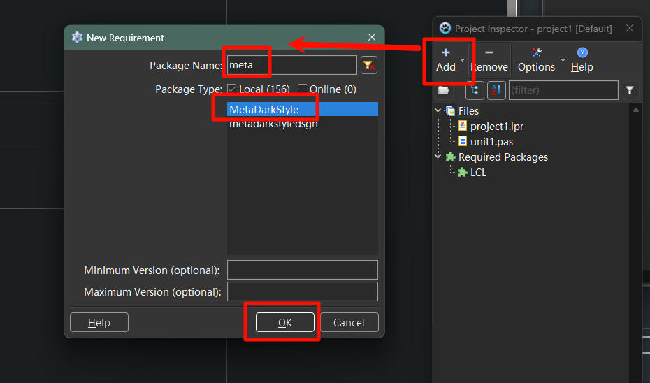

安装包： metadarkstyle

 

编辑器的深色配色

在Lazarus的Tools菜单-Options打开IDE设置，然后搜索Colors，找到Editor->Display->Colors，

ide的深色配色

在Lazarus的Tools菜单-Options打开IDE设置，有个dark style ，可以选择深色。

 

应用程序的深色配色

详情请参考metadarkstyle仓库中examples目录下的例子。

首先给项目添加MetaDarkStyle的Requirement。，[](http://127.0.0.1/?attachment_id=5422)

然后如example/defaultallowdark中展示的那样修改lpr文件中的代码

```
//......
begin
  //BEGIN
  RequireDerivedFormResource:=True;
  Application.Scaled:=True;
  PreferredAppMode:=pamAllowDark;
  uMetaDarkStyle.ApplyMetaDarkStyle(DefaultDark);
  //END
  Application.Initialize;
  Application.CreateForm(TForm1, Form1);
  Application.Run;
end.
```

 

引用

- [为Lazarus IDE及其编写的应用程序启用Windows的深色模式](https://www.iruanp.com/posts/2024/lazarus-enable-dark-mode-for-ide-and-application/)
