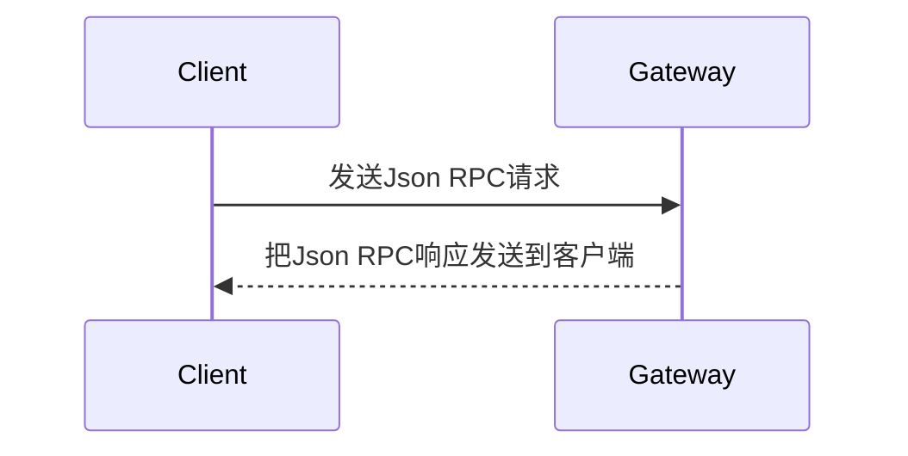
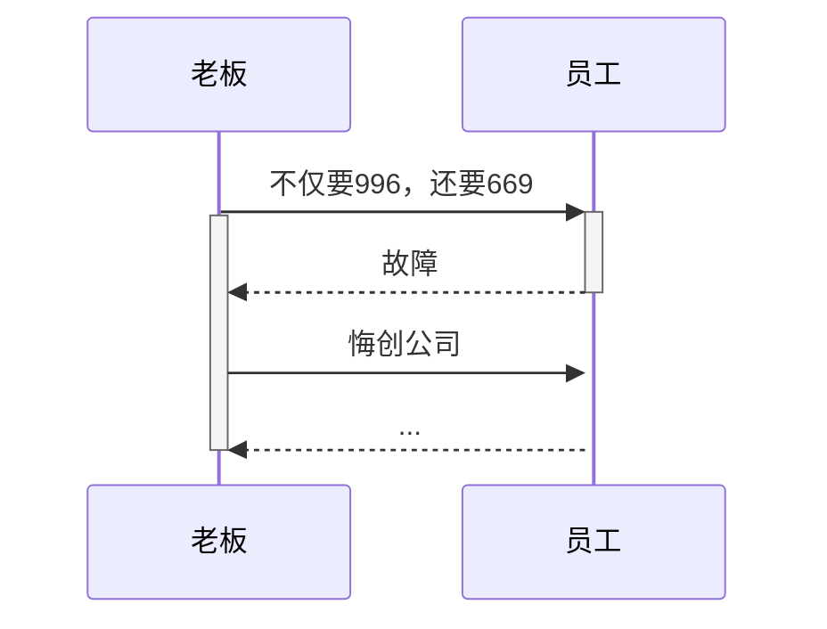
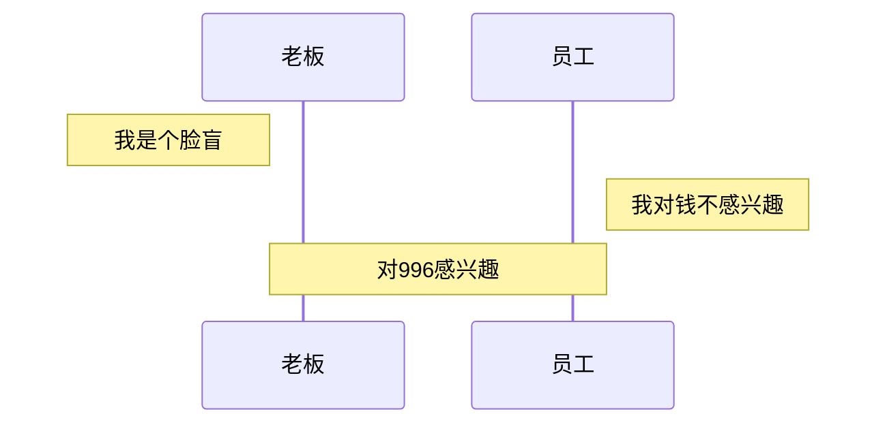
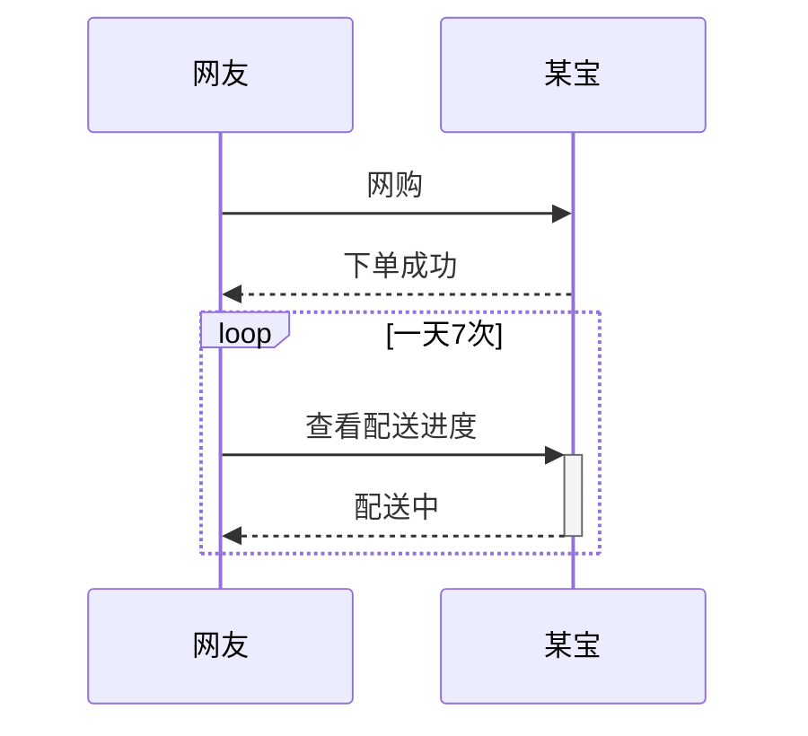
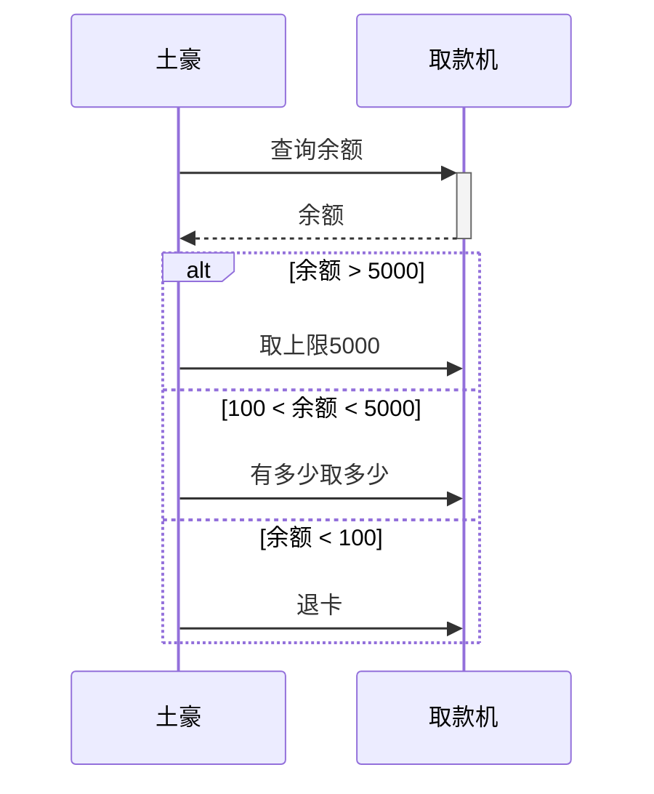
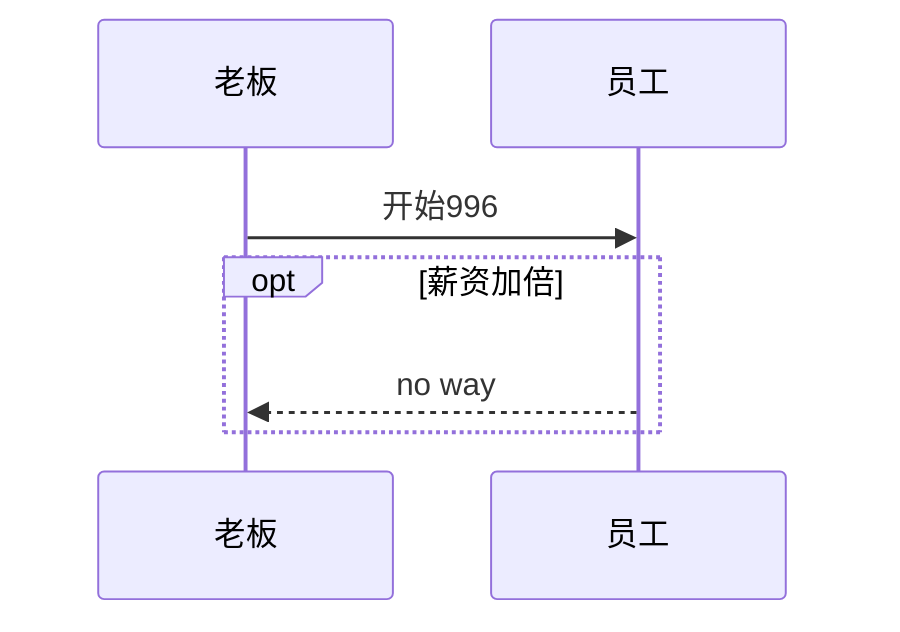
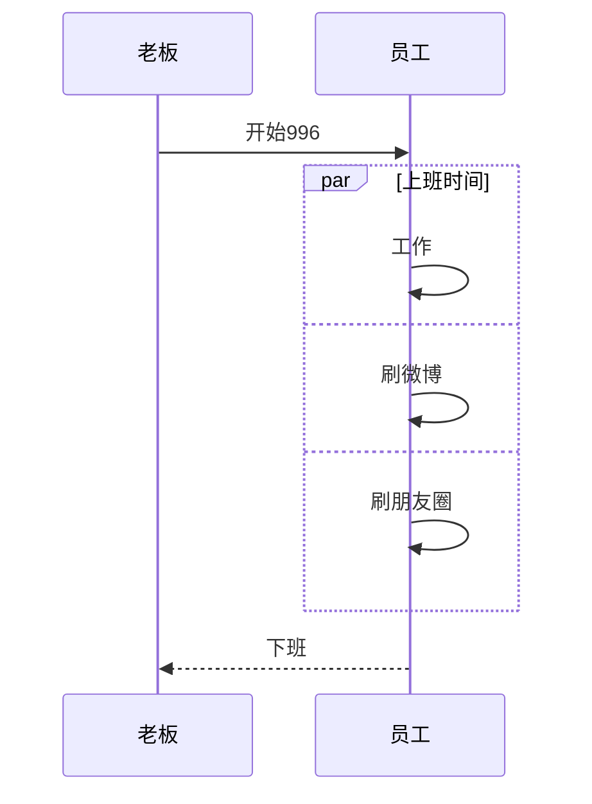
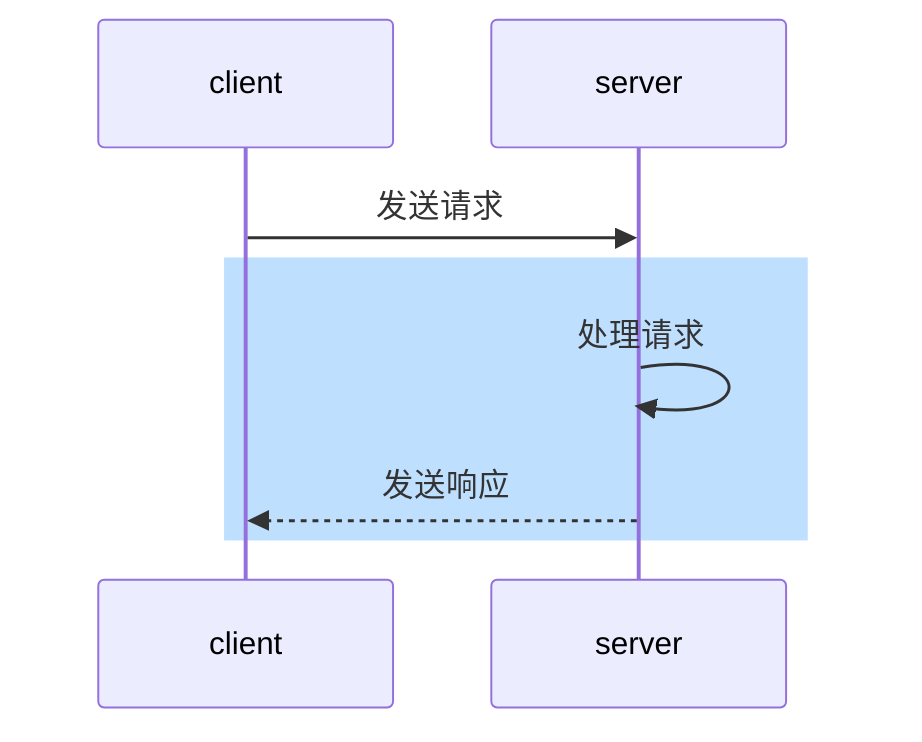
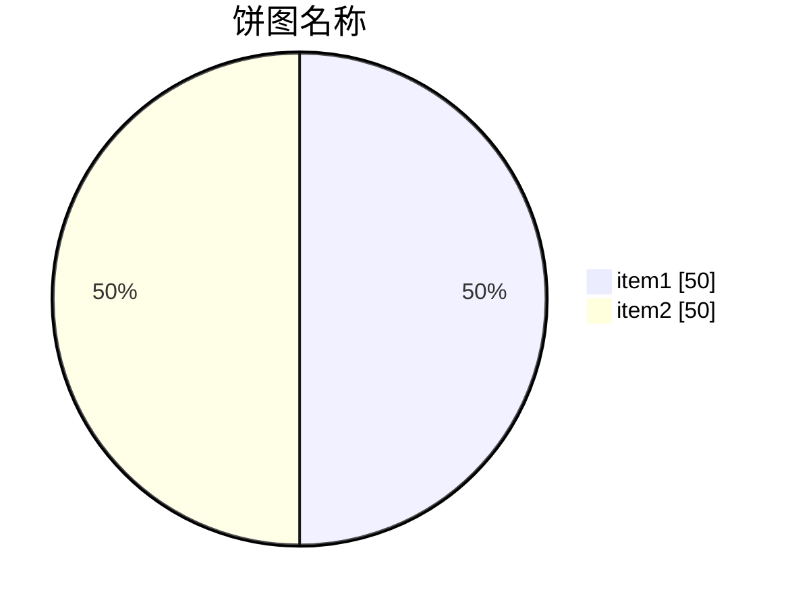

   

# 时序图

- mermaid : 一个图标工具
   - sequenceDiagram : 时序图

   - 冒号 ： 内容
   - participant xx as xx : 别称，昵称，
   - 线
      - -> 无箭头的实线
	  - --> 无箭头的虚线
	  - ->> ：有箭头的实线（主动发送消息）
      - --> ：有箭头的虚线（响应）
	  - -x ： 末尾带x的实体箭头
	  - --x ： 末尾带x的虚线箭头
	  - -) : 实体末端带有一个空心箭头（异步）
	  - --) ： 虚线末端带有一个空心箭头（异步）
   - 激活
      - 直接激活
	     - activate 对象 ： 开始
		 - deactivate 对象 ： 结束
      - 符号激活
	     - + 对象
		 - - 对象
   - 注释 : note [位置] [对象] ： 注释内容
   - 循环 loop

## 不带昵称的画法
用markdown的时序图  

## 带昵称的画法

## 激活框
消息接收方的时间上标记一小段时间，表示对消息进行处理的时间间隔。有两种激活方式  
   - 通过语法实现，会在指定对象的消息中添加。
   - 直接在对象前面增加加减号（开始时用加号+，结束时用减号-）

## 注释
语法 ：note [位置] [对象] ： 注释内容

## 循环
loop 消息说明  
[消息流]  
end

## 选择 alt

## 可选 opt
相当于单个分支的if语句

## 并行 par
将消息序列分成多个片段，并列执行

## 背景颜色

# 饼图

# 引用
   - [Markdown如何画时序图，一篇就够了](https://blog.csdn.net/zhw21w/article/details/125749449)
